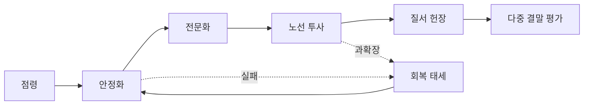

# 캠페인 진행과 위기


캠페인 성장 단계와 위기 영향을 영향권과 연결 그래프로 추적합니다.

진행은 영토 숫자가 아니라 거점의 안정화, 전문화, 연결 투사력과 플레이어가 세운 질서의 정당성으로 측정합니다. 아래 수치는 **설계 가정**입니다.

## 입력과 출력

| 입력 | 범위·기본값 | 출력 |
|---|---:|---|
| 안보 `S_i` | 0~100, 안정 거점 70 | 폭력 억제와 방어 |
| 기능 `F_i` | 0~100, 안정 거점 70 | 시설·생산·피난 서비스 |
| 정통성 `L_i` | 0~100, 안정 거점 60 | 현지 통치 수용 |
| 연결 `K_i` | 0~1 | 구호·교역·증원 가능성 |
| 부족 `x_i` | 0~1 | 회복·산출 감점 |
| 과확장 `O` | 0~2 | 네트워크 전체 부담 |
| 긴장도 `E` | 0~100, 시작 20 | 주간 위기 확률과 강도 |

## 계산 규칙

```text
K_i = clamp(max_path(경로신뢰도), 0, 1)
부족_i = 수요가 0이면 0, 아니면 1 - clamp(가용량 / 수요, 0, 1)
회복 = clamp(10 + 10*위기해결품질, 0, 20)
E' = clamp(E + 시간압력 + 확장충격 + 부족 + 고립 + 과확장 - 회복, 0, 100)
위기확률 = clamp(0.10 + 0.01*(E-50) + 0.15*O + 0.10*평균부족 + 0.10*평균고립, 0.10, 0.75)
```

과확장 `O`와 고립은 [물류와 기반 시설](/world/Logistics-and-Infrastructure)에 정의된 공유 0~2 척도를 그대로 사용하며, `평균부족`과 `평균고립`은 거점 가중치 가중 평균(분모 하한 0.25)입니다. 집계에 쓰는 거점 가중치는 **설계 가정**으로 일반 1.0, 환승 1.5(하한 0.25)이며 과확장 척도 자체는 바꾸지 않습니다. 수요가 0인 항목은 [경제와 생산](/world/Economy-and-Production)의 공유 규칙대로 부족 0으로 처리하고 0으로 나누지 않습니다. `회복`은 그 주에 위기를 해결했을 때만 적용하며(해결 품질 0~1), 해결이 없으면 0입니다. 위기 종류와 대상은 캠페인 시드, 주차와 전용 난수 흐름으로 결정하며 원인 가중치를 원장에 기록합니다. 계열 가중치는 **설계 가정**으로 부족·오염 `1 + 4*평균부족`, 고립·정전·경로 탈취 `1 + 4*평균고립`, 과확장·분열·다면 전선 약탈 `1 + 4*min(O, 1)`, 외부 충격 `1 + E/100`이고, 대상 가중치는 `거점가중치_i * (1 + 2*부족_i + 2*고립_i + (1 - min(S_i, F_i, L_i) / 100))`입니다.

## 기본 수치

| 항목 | 기본값 | 최소 | 최대 |
|---|---:|---:|---:|
| 캠페인 시작 긴장도 | 20 | 0 | 100 |
| 신규 점령 확장 충격 | 5 | 0 | 10 |
| 부족 임계 | 0.25 | 0 | 1 |
| 심각 부족 임계 | 0.75 | 0 | 1 |
| 강제 대응까지 심각 부족 | 3일 | 1일 | 7일 |
| 붕괴 선택까지 심각 부족 | 7일 | 3일 | 14일 |
| 위기 확률 | 10% | 10% | 75% |



## 경계 상황

- 심각 부족 3일은 강제 지역 비상사건, 7일은 철수·배급 강제·항복 협상·지역 붕괴 선택을 엽니다.
- 고립된 거점은 비축으로 버틸 수 있지만 증인·구호·수리 인력이 오지 않아 회복이 느립니다.
- 과확장은 적을 마법처럼 강화하지 않고 모든 거점의 행정·순찰·수리 지연으로 나타납니다.
- 같은 주에 여러 위기가 발생하면 전용 난수 결과를 고정한 뒤 위기 ID 순서로 예약합니다.
- 승리는 서울 통일 하나가 아니라 노선 연합, 독립 역 협약, 교역 질서, 기술 복구 같은 헌장 조건으로 평가합니다.

## 계산 예시

긴장도 58, 과확장 0.5, 평균 부족 0.139, 평균 고립 0.2이면 `위기확률=clamp(0.10+0.08+0.075+0.0139+0.02,0.10,0.75)=0.2889`, 즉 28.89%입니다. 위기가 해결 품질 0.8로 끝나면 그 주의 회복 항은 `회복=clamp(10+10*0.8,0,20)=18`입니다. 이 값은 `E'` 공식에서 차감 항으로만 쓰이며, 같은 주의 시간압력·확장충격·부족·고립·과확장 증가 항이 모두 0일 때만 `E'=E-18`이 됩니다. 성공적인 회복도 캠페인 진행의 실질적 선택이 됩니다.

## 침입과 사건이 세력 그래프를 바꾸는 규칙

세력 그래프의 꼭짓점은 통치자와 공개 종파와 숨은 신앙과 유물 정통성과 소비 의례입니다. 변은 종파 조정과 혼합 밸브와 유물 인정과 의례 공유와 적대와 통행입니다. 진행은 점령 칸이 아니라 이 그래프의 안정과 정통성으로 측정합니다.

침입과 주간 위기는 꼭짓점을 바로 지우지 않습니다. 변을 접거나 숨기거나 만료 주를 당기는 일이 먼저입니다. 통치자가 포획되거나 죽으면 왕조 계승 쟁점을 엽니다. 국가 객체를 삭제하지 않습니다.

한 주에 침입이 그래프를 바꾸는 축은 세 가지입니다. 종파 조정·혼합주의는 교훈 층을 갈라 붙이거나 숨은 신앙을 올립니다. 유물 정통성은 잔해 유물의 보관 역을 옮기거나 인정을 철회합니다. 소비 의례는 배급과 점등과 잔액례를 중단하거나 다른 종파의 의례로 바꿉니다. 같은 주 여러 변형은 전용 난수를 고정한 뒤 위기 ID 순서로 예약합니다.

외부 충격이 거점을 치면 그 거점의 공개 종파가 혼합 밸브를 하나 엽니다. 밸브는 출처 거점의 교훈 한 줄을 기한부 차용합니다. 차용이 만료되면 숨은 신앙 꼭짓점이 생기거나 기존 종파가 갈라집니다. 침입만으로 신앙 가족 이름과 개별 신앙 이름을 바꾸지 않습니다.

유물이 약탈되거나 의례가 끊기면 정통성 `L_i`를 다시 셉니다. 연결 `K_i`는 통행 변이 끊긴 뒤 경로 신뢰도 최댓값을 다시 자릅니다. 긴장도 `E'`와 위기확률 공식은 그대로입니다. 점령 다음의 안정화와 전문화와 노선 투사와 질서 헌장 경로도 그대로입니다. 여섯 단계 루프에 단계를 더하지 않습니다.

