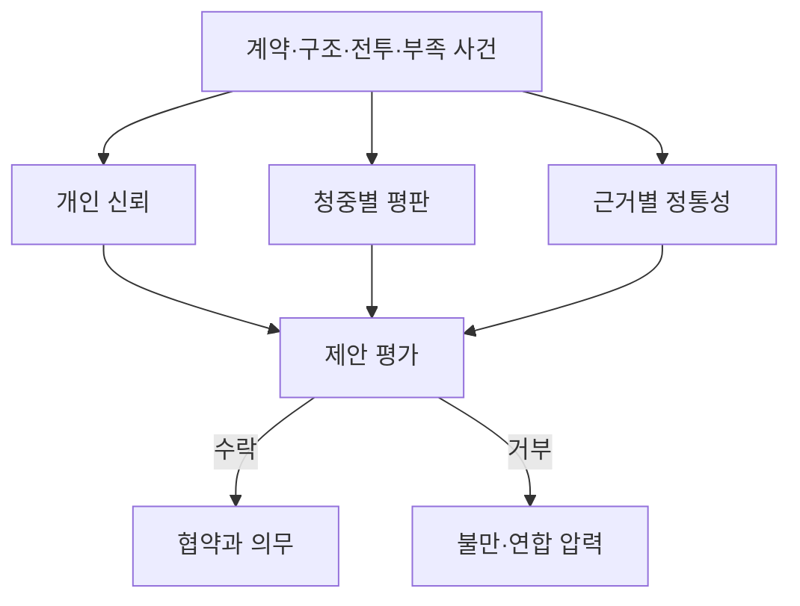

# 세력과 외교


2026-09-07 위키 도표. 위치·방향·시야 칸 그림은 당시 설명이다. 문서용 평면도이며 실제 게임 화면이 아니다.

세력 간 협상과 통행권 부여는 노선과 역 노드의 신뢰·평판·정통성으로 결정한다.

정치는 하나의 호감도가 아니라 개인 신뢰, 대중 평판, 지역별 정통성, 이행 가능한 약속과 집단 불만의 그래프다. 표의 수치는 설계 가정으로 둔다.

## 입력과 출력

| 입력 | 범위·기본값 | 출력 |
|---|---:|---|
| 신뢰 `T[A,B]` | -100~100, 기본 0 | 개인·기관 간 협조 |
| 평판 `R[F,a]` | -100~100, 기본 0 | 청중별 공개 평가 |
| 정통성 `L[F,n,k]` | 0~100, 현지 신규 주장 20 | 식량·전력·안전 등 근거별 승인 |
| 정치 자본 `PC` | 0~100, 기본 0 | 회의·보증·연합 행동 비용 |
| 불만 `G` | 0~100, 기본 0 | 청원·파업·봉쇄·분리 압력 |
| 결속 `C` | 0~100, 기본 0 | 집단 행동을 조직하는 능력 |
| 지렛대 `V` | 0~1, 기본 0 | 상대를 강제할 실질 수단 |
| 이행 신뢰도 `Rel` | 0~1 | 제안 수용과 계약 위험 |

## 계산 규칙

```text
Rel = clamp(1 - 0.50*부족 - 0.30*고립 - 0.40*과확장, 0, 1)
신뢰변화 = clamp(sum(사건영향 * 신빙성), -25, 25)
T' = clamp(T + 신뢰변화 + 기준선이동, -100, 100)
압력 = clamp(0.45*불만 + 0.35*결속 + 0.20*(100*지렛대), 0, 100)
```

압력의 세 입력 중 불만과 결속은 0~100 척도이고, 지렛대는 0~1 척도라서 100을 곱해 같은 척도로 정규화한 뒤 가중합한다. 압력은 0~100 값으로 남는다.

모든 제안은 먼저 실제 경로, 물자, 권한, 배타 계약 충돌을 검사한다. 불가능한 약속은 높은 교섭 능력으로 통과시킬 수 없다.

## 기본 수치

| 항목 | 기본값 | 최소 | 최대 |
|---|---:|---:|---:|
| 일반 회의 비용 | 5 정치 자본 | 0 | 100 |
| 긴급 심의 비용 | 10 정치 자본 | 0 | 100 |
| 연합 전체 안건 | 20 정치 자본 | 0 | 100 |
| 조직화 압력 | 40 | 0 | 100 |
| 위기 압력 | 70 | 0 | 100 |
| 강제 요구 지렛대 | 0.75 | 0 | 1 |
| 일반 협약 재검토 | 3주 | 1주 | 12주 |

정치 자본 지출은 신뢰나 정통성을 직접 바꾸지 못하며, 그 값은 지출이 뒷받침한 행동의 기록된 결과로만 바뀐다.



## 경계 상황

- 관계 임계치는 신뢰 하나가 아니라 실행 가능성, 이익, 정통성과 협약 충돌을 함께 검사한다.
- 압력 70 이상, 지렛대 0.75 이상이 2주 연속일 때만 파업·봉쇄·분리 같은 강제 요구가 열린다.
- 고립은 외부 약속만 약화시키며 현지 통치의 정통성을 자동으로 깎지 않는다.
- 후계자가 바뀌면 개인 약속과 제도 약속을 구분해 재검토한다. 새 후계의 성명은 [후계, 이름 로스터, 세계 원장](/world/Heirs-Names-and-World-Ledger)을 따른다.
- 동시 제안은 같은 주간 스냅샷으로 평가한 뒤 명령 ID 순서로 정산한다.

## 계산 예시

부족 0.30, 고립 0.40, 과확장 0.50이면 감점은 각각 `0.50*0.30=0.15`, `0.30*0.40=0.12`, `0.40*0.50=0.20`이고 `Rel=clamp(1-0.15-0.12-0.20,0,1)=0.53`이다. 불만 80, 결속 60, 지렛대 0.8이면 `압력=clamp(0.45*80+0.35*60+0.20*(100*0.8),0,100)=73`이므로, 지렛대 조건(0.75 이상)과 함께 2주 연속 유지되면 강제 요구가 열린다. 신뢰 60이더라도 실제 배송 성공률이 53%라면 장기 전력 공급 협약은 거부되거나 담보·단계 이행 조건이 붙는다. 실패 원인이 제3자의 봉쇄이고 사전 통보했다면 신빙성 계수로 신뢰 손실을 줄일 수 있다.

## 지역 정체성 권력

세력은 국호만으로 교섭하지 않는다. 후세 서울에서 교섭 상대는 노선 노드와 구 노드와 역 노드다. 개인 신뢰 `T`는 인물 쌍에 붙고, 평판 `R`과 정통성 `L`은 그 노드의 계열과 교리에 붙는다.

신앙은 세 층으로 가른다. 계열은 같은 잔해를 신으로 올리는 가족이고, 신앙은 당집과 사제를 가진 공동체다. 교리와 교훈이 규칙을 고치는 단위로 남는다. 같은 계열끼리도 교리가 다르면 통행권 문장이 달라진다. 국호가 편집 단위가 아니며, 이름은 [신앙](/world/Faith-Culture-Schism)을 쓴다.

계열은 궁정이 심지 않는다. 수문계는 갑문에서 자라고, 제작계는 공방에서 자란다. 안내음성계는 방송실에서, 원장계는 공증 창구에서, 노선도계는 대합실에서, 배전계는 배전실에서 자란다. 동원명부계는 탄약고 당직실에서 자란다.

문화 키는 생활권이며 평면 구획이 아니다. `west-sluice`는 수문과 제작과 방송을 한 회랑으로 묶고, `center-record`는 기록과 환적과 공방을 묶는다. `north-refuge`는 피난과 차륜을, `east-caravan`은 급수와 환승과 약재를, `southeast-ration`은 배급과 계약을 묶는다. 같은 키 안의 세력은 통행 제안을 먼저 듣고, 다른 키면 담보가 붙는다.

| 계열 | 장소 노드 | 교섭이 걸리는 지점 | 정통성 근거 `k` |
|---|---|---|---|
| 노선도계 | 환승역·종점·차량기지 | 환승맹약과 종점안식 | 안전 |
| 수문계 | 수문·펌프·급수 구 | 급수계약과 보호급수 | 물 |
| 배전계 | 배전실·비상등 역 | 점등 당직과 축전 금기 | 전력 |
| 제작계 | 공방·기지 구 | 공개규격과 가문비공개 | 기술 |
| 안내음성계 | 송신탑·방송실 역 | 정시방송과 교차검증 | 법통 |
| 동원명부계 | 탄약고 당직실 | 소집 낭독과 열쇠 제식 | 안전 |
| 원장계 | 공증 창·경매장·제기동 구 | 인준과 경매와 치료 순서 | 교역 |

같은 계열의 세력은 제안을 먼저 읽는다. 이단은 같은 계열 안에서 교리를 고친 쪽으로 읽힌다. 공개규격례가 가문비공개례를 이단으로 부르면 한 장의 통행권으로 묶이지 않고, 역마다 따로 서명을 받는다.

숨은 신앙은 압력 밸브다. 강국이 공개 제사를 강제하면 주민은 축전유물파와 침묵분파와 이중장부례와 노선색분파로 내려간다. 들키면 그 역의 불만 `G`와 평판 `R`만 움직인다. 고립은 외부 약속만 약화하고, 현지 당집의 정통성을 자동으로 깎지 않는다.

불만 `G`는 국호 단위로 쌓이지 않는다. 역 당직이 자기 교훈이 무시됐다고 보면 그 역에서만 올라가고, 결속 `C`도 같다. 숙영 맹세가 한 구에서 모이면 그 구의 결속만 센다. 지렛대 `V`는 장소 자산이다. 수문을 잠글 수 있으면 수문계 앞에서 지렛대가 생기고, 방송을 끊을 수 있으면 안내음성계 앞에서 지렛대가 생긴다. 회수 반이 제사 일정을 내밀면 그 구간의 통행이 막힌다.

압력 공식은 앞과 같다. 입력만 노드별로 자른다. 한 나라가 두 교리를 품으면 같은 주간에 압력 두 줄이 나오고, 강제 요구는 압력이 높은 노드에서만 열린다. 다른 구의 신뢰가 높아도 그 노드를 덮지 못한다.

이행 신뢰도 `Rel`은 경로와 물자와 권한 위에 교리 충돌을 한 번 더 본다. 치료 원칙이 강국 독점 구매를 거부하는 주간에는 제기동의 치료 계약이 막히고, 정시방송례가 한 발표만 사실로 인정하면 상암의 검증 용역이 막힌다. 조약 인준은 기록청 도장과 상암 교차검증과 수서 중재 가운데 무엇을 필수로 둘지 교리가 정한다. 불가능한 약속은 높은 교섭 능력으로 통과시킬 수 없다.

