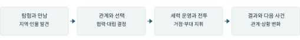
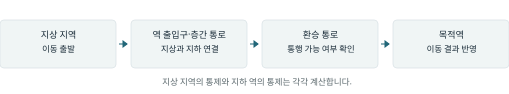
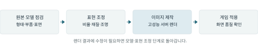

# 서울:전국 사업계획서

2026년 2차 가상융합산업허브 가상융합랩 1인 개발자 인프라·공간 지원

## 서울 전역을 무대로, 인물의 관계가 역사가 되는 4X

《서울:전국》은 붕괴 이후 서울에서 인물을 모으고 세력을 키우는 PC 전략 RPG입니다. 탐험·확장·개발·경쟁이라는 4X의 재미 위에 인물 관계에서 이어지는 이야기를 담습니다. 어느 지역을 차지했는지와 함께 누구와 협력하고 대립했는지가 다음 사건과 세력의 운명을 바꾸는 게임입니다.

| 명칭 / 범주 | 서울:전국 / 인물 관계와 서사를 중심으로 한 PC 4X 전략 RPG |
| --- | --- |
| 수행기간 | 2026년 11월~2027년 4월, 6개월 |
| 정식 출시 범위 | 서울 전역의 이동·거점 운영·세력 경쟁, 지역별 고유 사건·인물 서사 |
| 고객 / 판매 방식 | 국내 4X 이용자 중심 / Steam 패키지 판매 / 국내 정상가 29,000원 |
| 개발·판매 목표 | 2026년 상점·공개 데모 → 2027년 4월 정식 게임 1종 출시·판매 → 출시 후 6개월간 1만 장 판매 |

## 플레이어가 경험하는 서울

게임의 무대는 2126년 서울입니다. 지하철역과 노선은 거점과 세력을 연결하는 기반입니다. 플레이어는 소규모 파티에서 출발해 지역을 탐험하고 인물과 관계를 맺으며 영향력을 넓힙니다. 실제 서울의 지리 위에 지역별 생활과 갈등을 배치해, 익숙한 장소를 새로운 이야기의 무대로 경험하게 합니다.

그림 1. 목표 플레이 흐름. 지역에서 만난 인물과의 관계가 전략적 선택에 영향을 주고, 선택의 결과가 다음 이야기로 이어집니다.

지도를 넓히는 동안 인물의 사연과 세력 간 이해관계가 드러납니다. 플레이어는 누구와 함께할지, 어느 거점에 힘을 쏟을지 결정하며 자기 세력의 이야기를 만듭니다. 같은 서울에서도 관계와 선택이 달라지면 다른 사건과 전략 상황을 경험하도록 구성합니다.

| 전략과 전투 | 3D 지도에서 이동·거점 운영·세력 경쟁을 진행합니다. 전투에서는 부대의 이동·공격·진형·철수를 지휘합니다. |
| --- | --- |
| 지역과 인물 | 서울 전역에 지역별 고유 사건과 인물 서사를 제공합니다. 관계의 변화와 사건의 결과를 이후 플레이에 반영합니다. |
| 제품 사양 | Unity 기반 PC 게임. 정식 버전은 캠페인, 저장·재개와 기본 조작 안내를 포함합니다. 최소 실행 사양은 출시 전 성능 시험으로 정합니다. |

## 지원 필요성

주된 병목은 아트 제작입니다. 서울 전역과 인물의 이야기를 표현할 이미지·모델을 일정한 품질로 완성해야 합니다. 고성능 서버에서 반복 렌더를 수행하는 동안 개발 장비에서 게임 구현을 진행해 제작 대기를 줄이고, 지원기간 내 정식 출시를 추진합니다.

---

# 현재 개발 수준과 남은 과제

자체 개발자료 기준: 2026년 9월 20일

현재 일부 지역에서 이동·교섭·전투와 결과 반영을 진행하는 시제품이 있습니다. 서울 전역의 지역·역·인물 설정을 정리했으며, 최근에는 지상과 지하를 연결하는 이동 규칙과 건물·지역·역의 통제 규칙을 추가했습니다. 정식 제품에서는 이 기반에 서울 전역의 사건·인물 서사와 부대 지휘 전투를 연결합니다.

그림 2. 자체 개발한 웹 시제품의 지역·목적지 선택 화면. 현재 지역을 확인하고 이동 대상을 선택할 수 있습니다. 정식 제품의 Unity 3D 지도와 구분되는 초기 시제품입니다.

| 분야 | 현재 확인할 수 있는 개발 성과 | 정식 출시까지 남은 작업 |
| --- | --- | --- |
| 지역과 이동 | 서울 지역 자료·지도 열람 화면, 일부 지역의 이동·조우 시제품, 지상·지하·환승 경로 처리 | 서울 전역의 플레이 지도와 이동·거점 운영 연결 |
| 세력과 전투 | 건물 점유와 지역·역 통제 계산, 기존 전투의 결과 반영 | 전역 캠페인·세력 경쟁과 목표 부대 지휘 전투 구현 |
| 인물과 아트 | 인물 설정, 3D 모델 가공·이미지 제작 도구 | 인물 관계·지역별 사건을 게임에 적용하고 모델의 형태·표면 품질 보완 |

## 최근 구현한 이동·통제 규칙

그림 3. 구현된 이동·통제 규칙을 정리한 설명도. 실제 게임 화면이 아닙니다. 연결된 경로를 따라 이동하고, 경로가 막힌 경우 잘못된 이동 결과가 반영되지 않도록 처리합니다.

자체 개발 시험에서는 지상에서 역으로 이동하는 경로 처리, 통로 차단 시 이동 상태 유지, 건물 점유와 역 통제의 분리 계산을 확인했습니다. 현재 전투 시제품은 기존 카드 규칙을 사용하며, 목표 부대 지휘 전투와 지역별 서사는 추가 개발 과제입니다.

---

# 목표시장과 판매 계획

국내 4X 이용자를 대상으로 정상가 29,000원, 출시 후 6개월간 1만 장 판매

## 목표 고객과 시장 근거

첫 고객은 세력 운영과 장기 캠페인을 즐기는 국내 4X 이용자입니다. 그중 인물의 관계와 선택에서 발생하는 이야기를 선호하는 이용자에게 집중합니다. 서울의 실제 지리와 지역별 사건을 결합해 해외 역사·가상 대륙 중심의 전략 게임과 구별되는 배경과 서사를 제공합니다.

한국콘텐츠진흥원에 따르면 2024년 국내 PC 게임 매출은 6조 94억 원으로 전년 대비 2.0% 증가했습니다.[1] 인물 중심 전략 게임인 「Crusader Kings III」는 2020년 9월 출시 후 약 1년 반 만인 2022년 3월 PC 누적 판매 200만 장을 기록했습니다.[2] 국내 PC 시장과 인물 서사를 결합한 전략 게임의 수요를 보여주는 참고 지표입니다.

## 경쟁 작품과 가격

| 작품 | 비교할 경험 | 국내 정상가 |
| --- | --- | --- |
| Old World | 4X와 인물·가문 관계의 결합 | 39,900원 |
| Crusader Kings III | 세력 운영과 인물 관계 중심 서사 | 55,000원 |
| Kenshi | 자유로운 탐험과 분대·거점 운영 | 31,000원 |
| RimWorld | 운영과 인물 관계에서 발생하는 이야기 | 37,500원 |

자료: Steam 한국 지역 기본 게임 정상가, DLC 제외, 2026.9.20 확인.[3]

기존 작품은 축적된 콘텐츠와 팬층을 보유하고 할인 판매도 진행합니다. 《서울:전국》은 정상가를 29,000원으로 정해 신규 작품의 구매 부담을 낮추고, 서울이라는 배경과 관계 중심 서사로 선택받고자 합니다. 장르의 반복 플레이 수요를 바탕으로 출시 후에도 판매를 이어가되, 구매 의향과 가격에 대한 반응은 공개 데모에서 확인합니다.

## 고객 확보와 판매 목표

| 출시 전 | SNS에서 실제 플레이와 지역·인물 이야기를 소개해 Steam 상점으로 연결합니다. 2026년 공개 데모의 조작 이해도, 이탈 지점과 의견을 확인해 개선합니다. |
| --- | --- |
| 출시 시점 | 정식 버전의 서울 전역 콘텐츠와 데모 이후 개선점을 영상·게시물로 알립니다. 상점에 출시일·가격·제공 기능을 명확하게 안내합니다. |
| 출시 후 6개월 | 수정·업데이트와 이용자 반응을 Steam·SNS에 지속적으로 소개합니다. 상점 방문·위시리스트·판매·환불·후기를 월별로 비교해 홍보와 개선 순서를 정합니다. |

출시 후 6개월간 1만 장 판매를 목표로 합니다. 정상가 기준 판매액은 2억 9,000만 원이며 할인·환불·세금·플랫폼 수수료 반영 전 금액입니다. 실제 판매액과 정산액은 구분합니다. 데모 공개 이후 고객 반응을 축적하고 판매 목표 대비 실적을 월별로 확인합니다.

[1] [한국콘텐츠진흥원, 2025 대한민국 게임백서 발표 자료(2026.3.26 게시)](https://welcon.kocca.kr/ko/info/business/1957374) [2] [Paradox, Crusader Kings III Hits Two Million Sales Mark(2022.3.16)](https://www.paradoxinteractive.com/media/press-releases/paradox-interactive/crusader-kings-iii-hits-two-million-sales-mark) [3] Steam: [Old World](https://store.steampowered.com/app/597180/?cc=kr) · [Crusader Kings III](https://store.steampowered.com/app/1158310/?cc=kr) · [Kenshi](https://store.steampowered.com/app/233860/?cc=kr) · [RimWorld](https://store.steampowered.com/app/294100/?cc=kr)

---

# 개발·출시 일정과 수행 체계

2026년 공개 데모, 2027년 4월 정식 출시

기존 지역·인물 자료와 제작 도구를 활용해 게임 구현과 콘텐츠 제작을 병행합니다. 먼저 서울 전역에 공통으로 쓰이는 이동·거점·전투 기능을 연결하고, 지역별 사건과 인물 이미지를 순차적으로 적용합니다. 공개 데모에서 조작과 서사의 전달력을 확인한 뒤 정식 버전의 완성도를 높입니다.

| 기간 | 주요 작업 | 완료 기준 |
| --- | --- | --- |
| 2026.11 | 지역별 사건·아트 제작 목록 확정. 전략·전투 기능 연결, 인물 모델 보완, Steam 상점 준비. | 출시 콘텐츠 목록, 핵심 기능 시험 버전, 아트 제작 기준 |
| 2026.12 | 핵심 전략·서사 흐름을 공개 데모로 제작. 상점 공개와 SNS 소개, 고객 의견 수집. | 다운로드 가능한 공개 데모, Steam 상점, 이용자 의견 |
| 2027.1 | 서울 전역 이동·거점·세력 운영 연결. 지역별 사건과 인물 콘텐츠·아트 적용. | 전역 캠페인 시험 버전, 지역별 적용 현황 |
| 2027.2 | 출시 범위의 기능·지역별 사건·서사 연결. 저장·재개·조작 안내와 성능 보완. | 전체 콘텐츠를 연결한 시험 버전, 외부 플레이 결과 |
| 2027.3 | 지역별 사건과 진행 경로 점검, 오류 수정, Steam 심사와 출시 안내 준비. | 출시 전 최종 점검 버전, 심사 결과, 상점·영상 |
| 2027.4 | Steam 정식 출시와 유료 판매. 초기 오류 대응, 고객 반응과 판매 실적 확인. | 구매·설치·플레이 가능한 정식 게임 1종, 판매 기록 |

## 1인 개발과 협업

기획·개발·콘텐츠 검수·판매 준비는 1인 개발을 중심으로 진행하고 필요한 작업은 협업합니다. 협업 작업은 사용할 파일 형식과 완료 기준을 정한 뒤 전달합니다. 지역별 사건·아트의 제작, 게임 적용, 검수 상태를 함께 기록해 빠진 콘텐츠와 지연 작업을 확인합니다.

## 출시 일정과 품질 관리

2월까지 출시 범위의 기능과 콘텐츠를 연결하고 3월은 점검과 수정에 집중합니다. 아트 제작 지연은 공통 모델·재질의 재사용과 필요한 협업으로 대응합니다. 지역별 고유 사건·서사는 출시 범위로 유지하고, 추가 기능은 출시 이후 과제로 분리합니다.

## 성과 발생 시점

| 2026년 | Steam 상점과 공개 데모 공개, 고객 반응 수집 |
| --- | --- |
| 지원 종료까지 | 2027년 4월 정식 출시와 첫 유료 판매 |
| 출시 후 6개월 | 누적 1만 장 판매 목표, 판매·환불·이용자 반응 집계 |

---

# 지원 활용 계획

아트 제작의 반복 작업을 줄이고 서울 전역의 출시 콘텐츠 완성

## 지원으로 해결할 작업

고성능 인프라는 아트 제작과 렌더링에 활용하고, 개발 장비에서는 게임 기능과 콘텐츠를 구현해 두 작업을 병행합니다.

그림 4. 현재 채택한 인물 이미지 제작 공정과 지원 서버 활용 단계. 제작 도구는 마련했으며, 인물별 모델의 품질 보완과 게임 적용을 진행합니다.

| 지원 항목 | 구체적인 사용 계획 | 출시에 필요한 결과 |
| --- | --- | --- |
| 고성능 서버 A6000 48GB | Blender에서 3D 모델을 렌더해 게임용 인물 이미지 제작. 같은 장면·해상도로 기존 작업 환경과 비교. | 게임에 사용할 이미지 제작. 렌더 시간·메모리와 이미지 완성까지의 수정시간 기록. |
| 개인용 개발 장비 | RTX 5080 워크스테이션 등으로 게임 구현, 모델·이미지 적용, 실행 파일 제작과 점검. | 서울 전역 기능·콘텐츠 연결, 월별 시험 버전과 정식 출시 제품. |
| 콘텐츠 경량화 및 아키텍처 최적화 | 3D 모델·이미지 용량을 조정하고 불러오는 방식과 메모리 사용을 개선. | 로딩 지연과 화면 끊김 개선. 용량·성능 비교와 최소 실행 사양 확정. |
| 개인 개발 공간 | 집중 개발, 장비 이용, 아트 검수와 필요한 협업. 주기적인 작업·일정 점검. | 안정적인 제작 환경과 지역별 콘텐츠 제작·적용·수정 기록. |

## 제작 품질과 지원 효과 확인

캐릭터 모델은 인체 비율, 부품의 위치, 표면 이미지의 어긋남을 먼저 수정합니다. 제작 기준이 되는 모델을 완성한 뒤 같은 공정으로 후속 이미지를 제작하고, 실제 게임 화면에서 인물의 식별성과 표현의 일관성을 확인합니다. 원본 모델과 이미지의 출처·사용 권리도 함께 점검합니다.

지원 효과는 렌더 속도와 게임에 사용할 이미지 한 장을 완성하는 데 걸린 시간으로 확인합니다. 모델·이미지 용량과 게임의 로딩·메모리 사용도 함께 비교합니다. 지원기간에 제작 공정을 정리해 출시 후 추가 콘텐츠에도 사용할 수 있도록 합니다.

이 과업은 공고의 고해상도 렌더링, 3D 콘텐츠 경량화와 콘텐츠 기술 최적화 지원을 활용합니다. 공용 인프라와 개발 공간을 아트 제작부터 게임 적용·출시까지 이어 사용하고, 종료 시 정식 게임과 실제 판매·고객 반응을 성과로 제시합니다.

### 평가항목 참조

기술 부합도·지원 활용도: 5쪽 / 기획·설계: 1·4쪽 / 현재 개발 수준: 2쪽 상용화: 1·4쪽 / 시장·사업성: 3쪽
