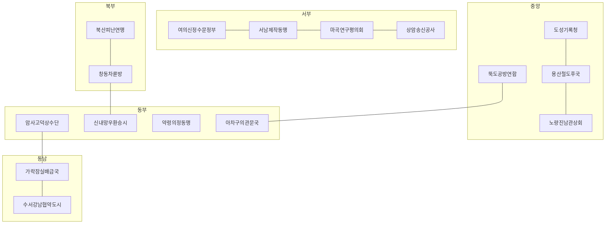

# 서울 십육국

서울에는 총 16개 국가가 존재합니다. 이 가운데 강국은 5개이고 약소국은 11개입니다. 강국은 단순히 병력이 많은 나라가 아니라 물, 수리, 철도, 외부 연결 가운데 둘 이상을 자력으로 유지하고 주변 국가에 영향력을 투사할 수 있는 나라입니다.

각 국가의 정책을 실제로 움직이는 인물은 [십육국 핵심 인물](/world/Core-Characters), 인물 사이의 승인·배신·계승 규칙은 [야망과 관계가 움직이는 정치](/world/Ambitions-and-Relations), 개막 이후 사건은 [시나리오 타임라인](/world/Scenario-Timeline)에 정리합니다.

`오호십육국`은 국가 이름이나 민족 구성을 옮기는 자료가 아니라, 여러 정치체가 동시에 생기고 사라지며 일부 강국이 패권을 다투는 구조적 참고점입니다. 캠페인이 진행되면 16개 영토 슬롯은 유지되더라도 국호, 지도자, 정통성과 동맹은 바뀔 수 있습니다.

## 권역 배치

16국은 서울의 평면 구획이 아니라 정수, 차량기지, 시장, 환승, 산성 회랑을 묶은 생활권입니다. 아래 배치는 개막 시점의 창작 통제권이며, 공개된 시설 위치만 실측으로 표시합니다.

## 공개 시설과 창작 가정

붕괴 이전 공개 자료에서 확인한 위치·기능은 `실측`, 재난 이후 가동률·소유·배관 통제는 `창작`입니다. 정상시 급수구역을 붕괴 이후 영토로 그대로 옮기지 않습니다.

| 공개 시설 | 출처 상태 | 개막 시점 창작 배치 | 설정 함의 |
|---|---|---|---|
| 영등포아리수정수센터 | 실측 위치. 공개 급수구역은 강서·구로·금천·양천 | 여의신정수문정부가 부지와 수문을 장악 | 여의도·영등포구 일대 옛 배관은 암사 급수권과 겹쳐 분쟁 구간이 된다 |
| 뚝도아리수정수센터 | 실측 위치. 공개 급수구역은 성동·중구·용산 | 뚝도공방연합이 펌프와 공방을 장악 | 도성·용산의 물이 뚝도 후계 공백에 직접 묶인다 |
| 구의아리수정수센터 | 실측 위치. 공개 급수구역은 광진·중랑·동대문 | 아차구의관문국이 제한 급수만 유지 | 신내·약령은 구의 물을 빌리지만 생산 주권은 없다 |
| 암사아리수정수센터 | 실측 위치. 공개 급수구역은 강남·강동·관악·동작·서초·영등포 | 암사고덕상수단이 동부 정수와 고덕 기지를 군사 감독 | 수서·가락·노량진까지 보호권을 주장할 실측 근거가 생긴다 |
| 강북아리수정수센터 | 실측 위치는 남양주. 공개 급수구역은 노원·도봉·성북·종로·은평·마포·서대문·강북 | 개막 시 시외 단절로 오프라인 | 북산·창동·도성·상암이 약한 이유는 북부 대량 정수가 서울 밖에 있었기 때문이다 |
| 광암아리수정수센터 | 실측 위치는 하남. 공개 급수구역은 송파 | 개막 시 동부 외곽 쟁탈 자산 | 가락은 시장은 크지만 자체 정수가 없고, 광암 재가동이 킹메이커 사건이 된다 |
| 신정·천왕·방화·군자·고덕·창동·신내·수서 차량기지 | 실측 위치 | 각각 여의신정·서남제작·마곡·뚝도·암사·창동·신내·수서에 대응 | 기지 면적과 유치 용량은 정상시 참고값이며 붕괴 후 가동 량은 창작 |
| 지축·도봉·모란·김포 차량기지 | 실측 위치는 고양·의정부·성남·강서 외곽 | 개막 시 외부 세력 또는 방치 | 서울 16국 슬롯 밖의 압력이 된다 |
| 가락시장 | 실측 위치 송파, 청과·수산 도매 | 가락잠실배급국 | 가격 발견 허브이지 생산지가 아니다 |
| 강서시장·양곡시장 | 실측 위치 강서·서초 | 개막 시 부분 가동 또는 쟁탈 | 여의신정·마곡·수서가 식량 허브 독점에 도전할 수 있다 |
| 노량진 수산시장 | 실측 위치 동작 | 노량진남관상회 | 냉동·얼음 신용에 의존하며 전력 단절에 취약하다 |

## 강국 5개

### 국가 01. 여의신정수문정부

- 등급: 강국
- 권역: 영등포·양천·여의도 서부 수변축
- 핵심 인프라: 영등포 정수 기능, 신정 차량기지권, 철도와 한강 교량 접근
- 통치: 급수총재와 배급구역 대표가 함께 승인하는 이원 집정
- 경제: 정수, 배급 계약, 수상 운송, 철도 통행세
- 군사: 수문 경비대와 장갑 보수열차
- 정통성: 끊기지 않는 물 공급과 계약 이행
- 국가적 야망: 현 총재 한재목이 서부 약소국을 장기 급수계약으로 묶어 수문동맹을 만들려 한다.
- 복합 모티프: 조선의 구휼 장부, 중국 분열기의 유민 등록, 일본 자치도시의 계약 정치
- 핵심 인물: 한재목
- 취약점: 광범위한 급수 의무 때문에 한 구역의 재난이 전체 배급 위기로 번진다.

### 국가 02. 서남제작동맹

- 등급: 강국
- 권역: 구로·금천 산업축
- 핵심 인프라: 제조·전자·수리 인력, 천왕 차량기지권, 남서부 외곽 연결
- 통치: 노동조합, 건물조합, 경비대가 대표를 내는 제작평의회
- 경제: 철도 부품, 전력 장치, 공구, 방호복과 수리 표준
- 군사: 작업반을 전환한 공병대와 차단문 전투조
- 정통성: 누구나 쓸 수 있는 부품 규격과 복구 노동의 시민권
- 국가적 야망: 중재자 강민서가 서울 전역의 수리 규격을 통일해 무력 정복 없이 모든 국가를 제작동맹에 의존시키려 한다.
- 복합 모티프: 삼국기의 둔전형 생산군, 후삼국 호족 연합, 근현대 개발 관료제
- 핵심 인물: 강민서
- 취약점: 자체 식량과 원수가 부족하고 노동조합과 경비대의 권력 균형이 불안하다.

### 국가 03. 마곡연구평의회

- 등급: 강국
- 권역: 강서·마곡·방화 서부 관문축
- 핵심 인프라: 연구 인력, 방화 차량기지권, 서부 외부 교통과 항공 접근 기억
- 통치: 연구책임자, 안전심사관, 주민대표의 삼원 심의
- 경제: 수질 검사, 의약·통신 지식, 종자 보존, 기술 인증
- 군사: 방재대, 무인 감시기와 시설 봉쇄조
- 정통성: 검증 가능한 지식과 재난 예측
- 국가적 야망: 연구책임자 서이안이 기술자를 인질로 교환하는 관행을 폐지하고 서울 공동 기술원장을 세우려 한다.
- 복합 모티프: 학술 관료국, 전국시대 외교 선물과 기술 교환, 조선의 관청별 직임 분리
- 핵심 인물: 서이안
- 취약점: 연구시설이 실제 생산능력을 보장하지 않으며 원수와 대량 식량을 외부에 의존한다.

### 국가 04. 뚝도공방연합

- 등급: 강국
- 권역: 성동·뚝도·성수·군자축
- 핵심 인프라: 정수 기능, 성수 공방 생태계, 군자 차량기지권, 동부 교량 접근
- 통치: 기술총관과 공방평의회의 상호 거부권
- 경제: 물, 펌프, 신발·가죽, 소형 기계, 차량 보수
- 군사: 펌프수비대, 공방 민병과 기동 정비조
- 정통성: 물과 부품을 함께 공급하는 생활 복구 능력
- 국가적 야망: 실종된 총관 임하준의 후계자가 물·부품 공동규격을 완성하면 중앙권역의 사실상 표준국이 된다.
- 복합 모티프: 성곽도시의 공방 밀집, 호족과 기술가문의 연합, 명목 직위와 실권의 분리
- 핵심 인물: 임하준
- 취약점: 총관 실종 뒤 기술가문과 공방평의회가 서로 다른 후계자를 지지한다.

### 국가 05. 암사고덕상수단

- 등급: 강국
- 권역: 강동·암사·고덕 동부 시계축
- 핵심 인프라: 암사 정수권, 고덕 차량기지권, 동부 교량과 외곽 진입로
- 통치: 상수행정청 위에 군사 호위단이 비상감독권을 행사
- 경제: 광역 급수, 열차 정비, 동부 관문세와 보호계약
- 군사: 상수호위단, 교량 봉쇄대와 동부 순찰열차
- 정통성: 물 공급의 안정과 외곽 위협 차단
- 국가적 야망: 호위사령 배우진이 급수 불안을 명분으로 동부 약소국에 보호정부를 세우려 한다.
- 복합 모티프: 군사 엘리트와 현지 행정의 이중통치, 사병 중앙화, 개발 실적을 앞세운 비상통치
- 핵심 인물: 배우진
- 취약점: 군사조직이 상수행정을 장악하면서 쿠데타와 강제복무 위험이 커진다.

## 약소국 11개

### 국가 06. 도성기록청

- 등급: 약소국
- 권역: 종로·중구·서울역 도성축
- 핵심 인프라: 행정기록, 도성 상징, 중앙 재난의료 조정망
- 통치: 기록관 선거와 의료책임자 추대가 병존
- 경제: 계약 공증, 지도, 기록 복구, 의료 이송 조정
- 군사: 문서고 수비대와 소규모 의전경비
- 정통성: 옛 행정의 연속성과 조약 인준
- 국가적 야망: 기록청장 윤서린이 모든 국가의 계승과 조약을 기록청 인준 아래 두려 한다.
- 복합 모티프: 국가 편찬 사서, 쇠퇴한 명목 권위, 공신록과 관제 개편
- 핵심 인물: 윤서린
- 취약점: 물·식량·전력·대규모 수리 능력을 외부에 의존한다.

### 국가 07. 용산철도후국

- 등급: 약소국
- 권역: 용산 철도와 한강 북안 연결축
- 핵심 인프라: 중앙 철도 접속, 창고, 강변 물류 기억
- 통치: 철도조정관과 선로 가문들의 후국회의
- 경제: 환적, 창고 임대, 열차 배차와 폐전자 회수
- 군사: 선로 봉쇄대와 장갑 화물차
- 정통성: 어느 진영에도 열차를 보내는 중계 능력
- 국가적 야망: 조정관 박태겸이 양자 기술자를 후계로 세워 혈연 선로가문을 제압하려 한다.
- 복합 모티프: 보호체류 후계자, 해상·철도 호족, 명목 복속과 실제 독립
- 핵심 인물: 박태겸
- 취약점: 사방의 강국이 탐내며 자체 급수와 생산 기반이 약하다.

### 국가 08. 노량진남관상회

- 등급: 약소국
- 권역: 동작·관악 북부와 노량진 시장축
- 핵심 인프라: 수산 도매, 냉동·얼음 설비, 남부 관문과 의료 접근
- 통치: 상인대표와 운송선주가 표를 거래하는 상회정
- 경제: 단기 식량 재고, 얼음, 경매, 중립 교역
- 군사: 호송선단과 시장 자경대
- 정통성: 가격 공개와 중립시장
- 국가적 야망: 대표 오해린이 강국들의 물·전력 경쟁을 이용해 서울 공통 결제권을 발행하려 한다.
- 복합 모티프: 상인 자치도시, 한강 나루 상업, 양다리 외교
- 핵심 인물: 오해린
- 취약점: 전력과 외부 어획·생산이 끊기면 초기 재고의 가치가 급락한다.

### 국가 09. 상암송신공사

- 등급: 약소국
- 권역: 상암·마포·서대문 정보축
- 핵심 인프라: 방송·통신 설비, 기록 저장소, 서북 관문
- 통치: 방송검증관과 채널 길드의 편성회의
- 경제: 통신 중계, 소문 검증, 지도 갱신과 암호 서비스
- 군사: 송신탑 경비와 전파추적조
- 정통성: 누구의 말이 사실인지 판정하는 신뢰
- 국가적 야망: 검증관 문가람이 모든 국가의 공식 발표를 교차검증하는 공개 방송망을 세우려 한다.
- 복합 모티프: 사관의 기록 경쟁, 첩보망, 성하도시의 외교 접대
- 핵심 인물: 문가람
- 취약점: 신뢰가 한 번 무너지면 정보 자산이 선전 도구로 전락한다.

### 국가 10. 북산피난연맹

- 등급: 약소국
- 권역: 은평·성북·강북의 북한산·탕춘대 회랑
- 핵심 인프라: 산악 피난로, 창고 흔적, 방어 고지와 난민 정착지
- 통치: 구호조직, 민병대, 산간 공동체의 연방회의
- 경제: 피난 숙영, 약초, 산악 운송과 통행 안내
- 군사: 산악 정찰대와 회랑 매복대
- 정통성: 추방당한 사람에게 피난처를 제공한다는 맹세
- 국가적 야망: 난민대표 백온이 강국의 군사호적에서 가족을 빼내 독립 시민권을 만들려 한다.
- 복합 모티프: 산성 피난국, 유민 호적, 종교·구호 기반 주민연맹
- 핵심 인물: 백온
- 취약점: 식량, 난방 연료와 의료를 외부에 의존한다.

### 국가 11. 창동차륜방

- 등급: 약소국
- 권역: 도봉·노원 북부 관문축
- 핵심 인프라: 창동 차량기지권, 북부 철도, 대규모 주거 쉘
- 통치: 기술자 연공회의와 주거공동체 선거의 혼합
- 경제: 차륜, 제동장치, 철재 회수와 북부 교역
- 군사: 궤도기병대와 북문 순찰대
- 정통성: 멈춘 열차를 다시 움직이는 기술
- 국가적 야망: 원로 김도윤이 후계자를 기술시험으로 뽑아 가문 승계를 끝내려 한다.
- 복합 모티프: 직능 길드 승계, 변방 기동군, 가신 포트폴리오
- 핵심 인물: 김도윤
- 취약점: 물 계약이 끊기면 주거 인구를 유지할 수 없다.

### 국가 12. 신내망우환승시

- 등급: 약소국
- 권역: 중랑·신내·망우 동북 환승축
- 핵심 인프라: 말단 환승과 차량기지권, 의료 접근, 동북 외곽로
- 통치: 배차조와 의료조가 계절마다 교대 집정
- 경제: 환승 중계, 환자 이송, 북동부 중립시장
- 군사: 경량 호송대와 의료열차 수비대
- 정통성: 누구든 환승과 응급 이송을 허용하는 중립
- 국가적 야망: 배차의무관 장세화가 중립을 지키면서도 강국의 보호비를 끝낼 공동호송조약을 만들려 한다.
- 복합 모티프: 관문도시, 의료중립, 대등동맹에서 종속동맹으로 변하는 위험
- 핵심 인물: 장세화
- 취약점: 노선 말단이고 군사·생산의 깊이가 얕다.

### 국가 13. 약령의정동맹

- 등급: 약소국
- 권역: 동대문·청량리 약령시장축
- 핵심 인프라: 약재시장, 동부 의료망, 철도 접속
- 통치: 치료길드, 환자대표, 상인대표의 의정회
- 경제: 약품, 방역, 치료 계약과 의약 교육
- 군사: 방역대와 의무호송대
- 정통성: 적과 아군을 가리지 않는 치료 원칙
- 국가적 야망: 치료길드 대표 류은비가 의약 중립을 지키면서 강국의 독점 구매를 막으려 한다.
- 복합 모티프: 구휼 행정, 사찰 자치도시, 직능 사제승계
- 핵심 인물: 류은비
- 취약점: 원료와 전력을 외부에 의존하며 중립 위반 한 번이 치명적이다.

### 국가 14. 아차구의관문국

- 등급: 약소국
- 권역: 광진·구의·아차산 동부 한강 관문
- 핵심 인프라: 구의 정수 기능, 아차산 고지, 동부 교량 접근
- 통치: 물 기술자 회의와 능선수비대의 공동통치
- 경제: 제한 급수, 고지 감시, 교량 통행과 정찰 정보
- 군사: 능선수비대와 교량 척후대
- 정통성: 동부 도하 감시와 비상 급수
- 국가적 야망: 수비대장 고서준이 두 직능을 하나의 관문군으로 통합하려 한다.
- 복합 모티프: 산성망, 강변 관문, 군사와 행정의 이중통치
- 핵심 인물: 고서준
- 취약점: 물 기술자와 산악 민병대가 분열돼 잠재력을 쓰지 못한다.

### 국가 15. 가락잠실배급국

- 등급: 약소국
- 권역: 송파·가락·잠실 동남 배급축
- 핵심 인프라: 도매시장, 가격 원장, 동남부 교통과 대형 집결 공간
- 통치: 경매조정인과 품목별 상인회의
- 경제: 식량 가격 발견, 배급, 저장과 계약 중개
- 군사: 창고 경비대와 호송 입찰군
- 정통성: 품목별 공개 경매와 기근 배급
- 국가적 야망: 조정인 남윤경이 식량을 생산하지 않고도 어느 후계자를 인정할지 결정하는 킹메이커가 되려 한다.
- 복합 모티프: 시전 통제, 자유시장 특구, 군량 배분과 공신 보상
- 핵심 인물: 남윤경
- 취약점: 정상시 유통량은 크지만 외부 생산·전력·운송이 끊기면 급격히 약해진다.

### 국가 16. 수서강남협약도시

- 등급: 약소국
- 권역: 강남·서초·수서 남부 연결축
- 핵심 인프라: 수서 차량기지권, 계약 행정, 전문 인력과 남부 외곽 연결
- 통치: 기술기업 추천위원과 시민추첨회의의 이중 의회
- 경제: 계약 감사, 설계, 금융 장부, 남부 통행 중개
- 군사: 계약호위대와 지하시설 방어조
- 정통성: 계약 위반을 기록하고 손실을 보상하는 중재 능력
- 국가적 야망: 계약감사관 정유라가 강국의 보호조약을 표준화해 약소국 공동교섭권을 만들려 한다.
- 복합 모티프: 문벌과 능력의 충돌, 상인평의회, 명목직 뒤의 실권자
- 핵심 인물: 정유라
- 취약점: 암사의 물과 가락의 식량에 의존하며 내부 대표성이 양분돼 있다.

## 강약은 고정되지 않는다

강국이 정수·수리·철도·연구 인력을 잃으면 약소국으로 추락할 수 있습니다. 반대로 약소국도 인물의 동맹, 기술자 귀부, 혼인·양자 계승, 조약과 플레이어의 개입으로 강국이 될 수 있습니다. `강국`은 캠페인 시작 시점의 상태이며 영구적인 국가 속성이 아닙니다.

## 역사 자료 사용 원칙

- 역사에서 가져오는 것은 제도와 선택의 긴장입니다.
- 한 국가와 한 인물은 최소 세 시대·지역의 모티프를 합성합니다.
- 실존 인물의 가족관계, 대표 전투, 생애 순서, 상징색과 대사를 재현하지 않습니다.
- 실제 시설은 공개된 위치와 기능만 참고합니다. 내부 구조, 재난 뒤 가동률, 비축량과 취약점은 모두 창작으로 표시합니다.
- 군사호적, 인질, 강제이주와 쿠데타는 효율 보너스만 주지 않고 가족 분리, 원한, 탈주, 시민권과 책임 문제를 함께 만듭니다.

## 주요 조사 출처

- [조선왕조실록: 사병 혁파](https://sillok.history.go.kr/id/kba_10204006_009)
- [조선왕조실록: 유민 호구와 귀향 대책](https://sillok.history.go.kr/id/kda_10609023_005)
- [우리역사넷: 후삼국 호족과의 연합](https://contents.history.go.kr/mobile/nh/view.do?levelId=nh_011_0040_0020_0020_0020)
- [서울아리수본부: 정수센터와 급수구역](https://arisu.seoul.go.kr/home/sub?menukey=7309)
- [서울특별시: 전철과 차량기지 현황](https://news.seoul.go.kr/citybuild/archives/200609)
- [서울시농수산식품공사: 공영도매시장](https://www.garak.co.kr/homepage/M0000186/content/view.do)
- [사카이시: 상인 자치와 교역도시의 역사](https://www.city.sakai.lg.jp/kanko/sakai/index.html)

## 지역 정체성 권력

지도에서 부딪치는 단위는 국호가 아닙니다. 후세 서울에서는 노선과 구와 역이 정체성 권력을 가집니다. 16개 영토 슬롯은 유지됩니다. 슬롯은 평면 구획이 아닙니다. 슬롯 안의 노선 노드와 구 노드가 서로 다른 신앙 계열과 문화권을 집니다.

끊긴 제도는 설명서가 아니라 제사가 됩니다. 물이 나오면 계약이 진실입니다. 전력이 들어오면 축복입니다. 안내방송이 나오면 말이 사실입니다. 군 명부에 이름이 있으면 아직 소집될 수 있다고 믿습니다. 가격 원장이 열리면 그날의 정의가 정해집니다. 사람 왕을 먼저 신으로 올리지 않습니다. 통치자는 그 시설의 열쇠를 쥐고 정통성을 빌립니다.

신앙은 세 층입니다. 계열은 같은 잔해를 신으로 올리는 가족입니다. 신앙은 당집과 사제를 가진 공동체입니다. 교리와 교훈이 규칙을 고치는 단위입니다. 국가 슬롯은 늘리지 않습니다. 신앙 슬롯이 늘어납니다. 계열과 신앙 이름은 [신앙과 문화의 분열](Faith-Culture-Schism.md)을 씁니다.

문화는 국가 ID가 아닙니다. 키는 `west-sluice` `center-record` `north-refuge` `east-caravan` `southeast-ration`입니다. 국가가 병합돼도 키는 남습니다. 같은 키 안에서도 역이 다르면 금기가 다릅니다.

| 국가 | 문화 키 | 주 계열 | 공개 신앙 | 제단이 된 잔해 |
|---|---|---|---|---|
| 여의신정수문정부 | `west-sluice` | 수문계 | 급수계약례 | 수문과 배급 수도꼭지 |
| 서남제작동맹 | `west-sluice` | 제작계 | 공개규격례 | 공구 규격과 천왕 차단문 |
| 마곡연구평의회 | `west-sluice` | 배전계 | 국교 없음 | 배전실과 밀폐실험동 |
| 상암송신공사 | `west-sluice` | 안내음성계 | 정시방송례 | 송신탑과 편성표 |
| 도성기록청 | `center-record` | 원장계 | 기록인준례 | 공증 창구와 문서고 |
| 용산철도후국 | `center-record` | 노선도계 | 환승맹약 | 중앙 철도와 대합실 |
| 노량진남관상회 | `center-record` | 원장계 | 결제권례 | 경매 원장과 얼음 창고 |
| 뚝도공방연합 | `center-record` | 수문계 | 펌프공방례 | 펌프와 성수 공방 |
| 북산피난연맹 | `north-refuge` | 계열 없음 | 숙영 맹세 | 산성 회랑과 피난로 |
| 창동차륜방 | `north-refuge` | 제작계 | 차륜기동례 | 창동 차량기지와 차륜 |
| 암사고덕상수단 | `east-caravan` | 수문계 | 보호급수례 | 암사 정수와 동부 교량 |
| 신내망우환승시 | `east-caravan` | 노선도계 | 환승맹약 | 말단 환승과 신내 기지 |
| 약령의정동맹 | `east-caravan` | 원장계 | 치료 원칙 | 약재시장과 치료 계약 |
| 아차구의관문국 | `east-caravan` | 수문계 | 비상 급수례 | 구의 정수와 아차산 능선 |
| 가락잠실배급국 | `southeast-ration` | 원장계 | 경매공개례 | 도매 칸과 가격 원장 |
| 수서강남협약도시 | `southeast-ration` | 원장계 | 계약중재례 | 수서 지하 회의실 |

표의 주 계열은 개막 시점의 다수파입니다. 강국이라고 계열을 독점하지 않습니다. 여의신은 점등례를 속에 둡니다. 서남은 소집잔존례가 숨어서 갈등합니다. 뚝도는 가문비공개례가 후계 분쟁과 같이 갑니다. 창동은 종점안식도 셉니다. 수서는 종점 밖으로 열차를 밀면 배교로 봅니다.

위에서 주입하면 실패합니다. 한재목이 서부 약소국에 급수계약례를 강제해도 천왕 기지의 공병은 볼트 제사를 먼저 지냅니다. 배우진이 동부에 보호급수례를 심어도 약령은 치료 원칙을 적과 아군에 같이 적용합니다. 발화는 역 당집과 구 당집과 노선 당집에서만 됩니다.

갈라지기 쉬운 지점은 교리입니다. 급수계약례는 물이 끊기면 먼저 금이 갑니다. 정시방송례는 신뢰가 무너지면 침묵분파를 키웁니다. 기록인준례는 무기고 명부를 들이는 순간 이단 시비가 납니다. 쪼개진 교리만 고칩니다. 국호와 영토 슬롯은 그대로 둡니다.

