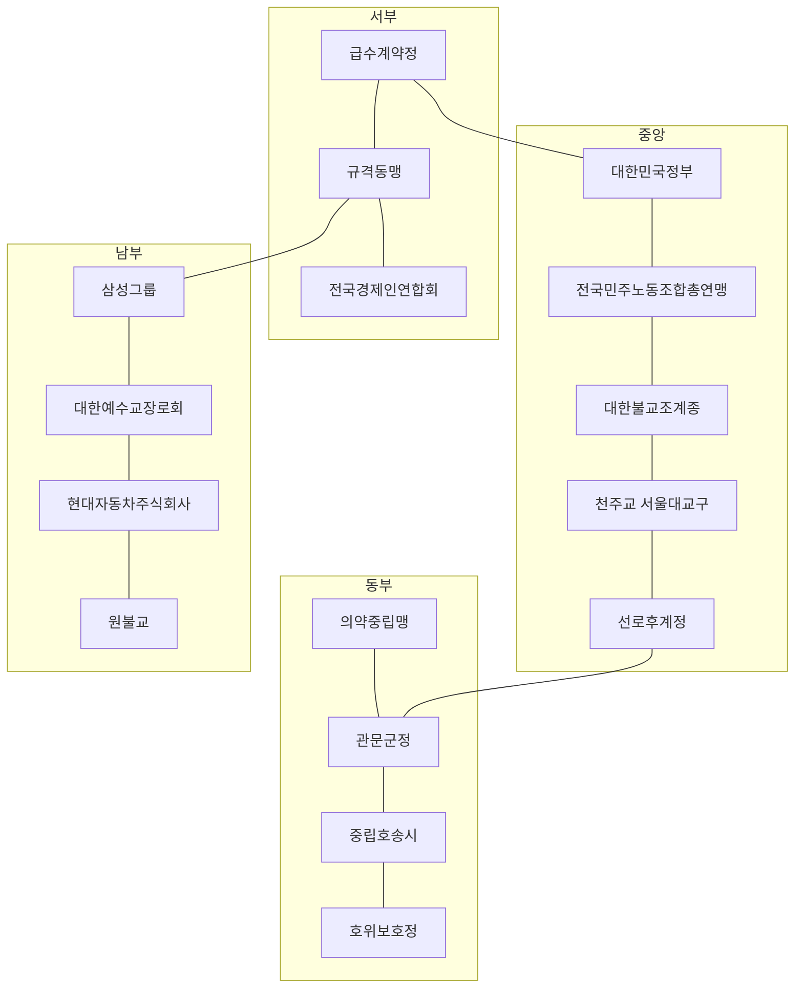

# 서울 십육국
<InfoBox title="서울 십육국">
<InfoRow label="국가 수" value="16" />
<InfoRow label="강국" value="5 — 현대차·급수·규격·선로·호위" />
<InfoRow label="형태" value="봉건·군정·신정·상업" />
<InfoRow label="수장 직위" value="역장·대통령·당회장·회장·종정 등" />
<InfoRow label="정본" value="LORE/factions/Sixteen-States.md" />
</InfoBox>

개막 서울에는 나라가 열여섯이다. 오호십육국을 민족 목록처럼 읽으면 빗나간다. 열여섯 나라가 한꺼번에 서고 그중 다섯이 패권을 다투며 다섯 이주민 회랑이 그 영토 위에 얹히는 구조의 이름이다. 회랑은 열일곱 번째 국가를 만들지 않는다.

강국은 다섯이고 약소국은 열하나다. 물과 수리와 철도와 바깥 연결 가운데 둘 이상을 제 손으로 돌리고 이웃에 그 손을 뻗을 수 있어야 강국 자리에 남는다. 병력만으로 세지 않는다. 개막의 다섯은 급수계약정·규격동맹·선로후계정·호위보호정·현대자동차주식회사다.

국호는 권역 지명이 아니다. 2026년에 사람이 지키던 기관의 이름이다. 호출망이 죽은 뒤에도 물이 나오려면 갑문 앞에 이름이 있는 사람이 서야 했고 그 손자의 손자가 개막의 수장으로 남는다. 기능국 일곱은 잠긴 정본 고유명으로 유지한다. 명목 인준 한 나라는 광화문 청사 상호로 옮겼고 나머지 여덟은 본사와 총회와 교구와 종단과 총연맹의 실존 상호가 나라 이름이 되었다. 영등포·구로·양재는 전철역이 수도일 뿐 나라 이름으로 쓰지 않는다. 창세 구술의 열여섯 깃발은 햇수를 매기지 않으며 개막 2126의 배치는 그 깃발의 후손이다. 원인과 달력은 [기동권 이탈](../overview/World-Unbinding.md)이 정본이다.

각 나라의 정책을 실제로 움직이는 인물은 [등장인물](../characters/Core-Characters.md)에 두고, 인물 사이의 승인·배신·계승 규칙은 [야망](../characters/Ambitions-and-Relations.md)을 따른다. 개막 헌장의 가치관·정책 숫자는 [가치관과 정책 척도](../culture/Values-and-Policy-Scales.md)가, 개막 이후 사건은 [연표](../chronology/Scenario-Timeline.md)가 정리한다. 직함의 다섯 층은 [관직](../offices/Offices-and-Ranks.md)이 나라마다 이름을 달리 적는다.

캠페인이 진행되면 16개 영토 슬롯은 유지되더라도 국호, 지도자, 정통성과 동맹은 바뀔 수 있다.

## 유지와 개명과 신설

기능국 일곱은 국호를 유지한다. 급수계약정은 여의도를 전국경제인연합회에 넘기고 영등포역에 수도를 고정했고, 규격동맹은 구로역, 선로후계정은 용산역, 호위보호정은 암사역, 관문군정은 구의역, 중립호송시는 신내역, 의약중립맹은 제기동역을 지킨다. 선로후계정은 중앙 환적과 울타리 바깥 연결을 함께 쥐고 약소에서 강국으로 올라 앉았다.

개명은 하나다. 옛 이름 「인준기록정」의 서울역 축 명목 인준이 정부서울청사 본관 종로구 세종대로 209로 옮겨, 광화문역에서 대한민국정부라는 상호를 국호로 읽는다. 도장과 징집 명부는 그 청사 당직의 손에서 끊기지 않았다.

신설 여덟은 폐지된 슬롯의 지리를 기관 본사로 다시 심는다. 옛 이름 「인가평의회」의 마곡·방화 연구축을 포기하고 서초구 헌릉로 12 양재동에 현대자동차주식회사를 앉혔다. 옛 이름 「부품헌장」의 뚝섬·성수 공방은 규격동맹 규격에 흡수되고, 대한예수교장로회는 총회회관이 있던 연지동 명부를 강남 대형교회 밀집의 삼성역으로 옮겼다. 옛 이름 「결제상회」의 노량진 시장 기능을 폐기한 동작 한강 남안은 흑석역의 원불교가 받는다. 옛 이름 「교차검증방송」의 상암 정보축을 포기하고 여의대로 24 여의도동에 전국경제인연합회가 선다. 옛 이름 「명부시민맹」의 북한산 피난 슬롯을 비우고 종로구 우정국로 55 조계사·총무원이 대한불교조계종의 수도가 된다. 옛 이름 「시험승계방」의 창동 차륜 슬롯을 포기하고 서초구 서초대로74길 삼성타운이 이홍원의 삼성그룹 강남역 수도가 된다. 옛 이름 「식량인준국」의 가락·잠실 가격 허브를 비우고 중구 명동길 74 명동성당이 천주교 서울대교구의 명동역 수도가 된다. 옛 이름 「보호표준시」의 수서·서초 보호 표준을 접고 중구 정동길 3 경향신문사 자리의 전국민주노동조합총연맹이 시청역에서 나라 행세를 하며, 강남·서초는 이홍원의 삼성그룹과 정호준의 현대자동차주식회사와 최지우의 대한예수교장로회가 나눈다.

롯데지주·SK그룹·LG그룹은 열여섯 슬롯을 더 쓰지 않는다. 전경련의 가신 운영가문으로 남고, 을지로입구역·종각역·여의나루역은 그 회 안의 창구로만 읽힌다.

## 16국 기원

본문이 인과를 닫은 뒤의 보조다. 전철역이 수도이고, 기관 본사와 역이 다르면 기원 칸에 둘 다 적는다.

| 국명 | 기원(실존 기관 + 위치/역) | 정부형태 | 강국 | 인과 (2026 → 이탈 → 2126) |
|---|---|---|---|---|
| 대한민국정부 | 대한민국 정부. 정부서울청사 본관 종로구 세종대로 209. 중심 광화문역 | 봉건(운영가문) · 관료 문법(주사·당직 세습). T1은 대통령 | 약소. 명목 정통성만 있고 물·수리·철도는 빌린다 | 2026년 청사 당직이 도장과 징집 명부를 쥐고 있었다. 호출망이 죽자 전산 민원은 멈췄고 필사 인준만 남았다. 손자의 손자가 광화문역에서 「대한민국」을 주장한다. |
| 전국경제인연합회 | 전국경제인연합회(2026 상호 한국경제인협회, 전신 전경련). 여의대로 24 여의도동. 중심 여의도역 | 상업(기업형) · 회장 | 약소. 외부연결(서해·금융 기억)은 있으나 물·수리는 영등포에 의존 | 여의도 회관의 비상위원회가 계열 출자 장부를 냉각·키 당직으로 바꿨다. 개막의 회장은 그 회관 상호를 국호로 읽고 여의도역을 닫는다. 삼성·현대는 별국, 롯데·SK·LG는 이 회 가신이다. |
| 삼성그룹 | 삼성그룹. 삼성타운 서초구 서초대로74길(서초동). 중심 강남역 | 상업(주식회사) · 이홍원(이씨 운영가문)이 키를 임대 | 약소. 남부 외곽 기억은 있으나 수서 기지·암사 물은 남의 것 | 서초 타운의 냉각·전산 키가 일가 당직함이 됐다. 강남역 사거리 상호가 지워지지 않아, 개막에는 그룹 이름이 나라 이름이다. |
| 현대자동차주식회사 | 현대자동차주식회사. 서초구 헌릉로 12 양재동. 중심 양재역 | 상업(주식회사) · 정호준(정씨 운영가문) | 강국. 수리(차체·리깅·현장 휴머노이드 잔존) + 외부연결(남부 시계·양재 외곽) | 2026년 양재 본사와 현장 시험 라인이 이미 휴머노이드를 굴렸다. 이탈 주간에 구름 학습이 죽고 정비 가문이 상호를 남겼다. 개막의 주식회사는 차를 만들지 못해도 차체를 고치고 남쪽 길을 연다. |
| 대한예수교장로회 | 대한예수교장로회 총회. 총회회관 종로구 대학로3길 29 연지동. 개막 중심 삼성역(강남 대형교회 밀집) | 신정 · 당회장 · 최지우(창녕 최씨 운영가문) | 약소. 명부·구휼·예배당 부동산은 세고, 물·철도는 없다 | 연지동 총회 명부가 대정전 밤의 당직표가 됐다. 한 세기 뒤 살아남은 강단 부동산은 강남 쪽이라, 삼성역이 장로회 수도다. |
| 천주교 서울대교구 | 천주교 서울대교구. 명동성당 중구 명동길 74(교구청·제대). 중심 명동역 | 신정 · 대주교 | 약소. 혼인·양자·위령 인준은 세고, 급수는 빌린다 | 명동 제대와 교구 명부가 종이로 옮겨졌다. 개막의 교구는 명동역에서 혼인과 위령을 인준하는 나라다. 주교회의 청사(광진 면목로)는 교구의 바깥 창고로만 남긴다. |
| 대한불교조계종 | 대한불교조계종. 조계사·총무원 종로구 우정국로 55. 중심 안국역 | 신정 | 약소. 사찰 재산·제사 달력·구휼은 세고, 북부 정수(강북아리수)는 시외라 물이 없다 | 총무원이 이탈 뒤에 위패와 사원 대장을 지켰다. 안국역 조계사가 종단의 수도가 되고, 나라 이름은 종단 이름 그대로다. |
| 원불교 | 원불교. 서울교당·소태산기념관 동작구 흑석동. 중심 흑석역 | 신정 | 약소. 교헌·교당 당직은 남고, 한강 남안 물·철도는 이웃에 있다 | 흑석 교당의 교무 당직이 교헌을 필사했다. 익산 총부는 시외라 서울 슬롯에 들어오지 못하고, 흑석역이 원불교의 서울 수도다. |
| 전국민주노동조합총연맹 | 전국민주노동조합총연맹. 중구 정동길 3 경향신문사. 중심 시청역 | 상업(총연맹) | 약소. 파업 명부와 시청 앞 집결은 있으나 생산·급수 주권은 없다 | 정동 사무실의 조합원 명부가 비상 소집이 됐다. 공장이 죽자 파업권이 통행권으로 바뀌고, 시청역 총연맹이 나라 행세를 한다. 민주화·노동운동의 문장을 빌리되 당명(더불어민주당 등)은 국호로 쓰지 않는다. |
| 급수계약정 | 서울아리수본부 영등포아리수정수센터 + 신정차량기지. 중심 영등포역(여의도는 전경련에 넘김) | 봉건(운영가문) · 수문가 | 강국. 물(영등포 정수) + 철도(신정 기지) + 한강 교량 | 정수 당직이 급수 계약을 헌장으로 읽었다. 여의도 금융 회관은 옆나라로 갈라지고, 영등포역 수문가가 서부 물을 판다. |
| 규격동맹 | 구로·금천 공단 + 천왕차량기지. 중심 구로역 | 상업(조합) | 강국. 수리(공단·기지) + 외부연결(서남 외곽) | 공단 규격이 시민권보다 먼저 남았다. 구로역 제작 조합이 볼트 제사를 국가로 유지한다. 대림 기숙은 이 나라 안의 호다. |
| 선로후계정 | 용산 철도 환적 + 주둔지 울타리 용역 기억. 중심 용산역 | 봉건(선로 가문) | 강국. 철도(중앙 환적) + 외부연결(해협·울타리) | 배차표와 울타리 열쇠가 호출망 대신 섰다. 용산역 선로가가 어느 진영 열차든 중계하고, 이태원 통역은 이 나라 안의 호다. |
| 호위보호정 | 암사아리수정수센터 + 고덕차량기지. 중심 암사역 | 군정 · 사령관 | 강국. 물(암사 정수) + 철도(고덕 기지) + 외부연결(동부 시계) | 상수 당직과 잔존 군 명부가 한 비상감독으로 묶였다. 암사역이 동부 급수 보호를 선포한다. |
| 관문군정 | 구의아리수정수센터 + 아차산 능선. 중심 구의역 | 군정 | 약소. 물+관문은 있으나 두 직능이 갈라져 강국 문턱을 못 넘는다 | 구의 수문과 아차산 초소가 한 군정으로 합쳐지려다 만다. 구의역이 동부 도하를 닫고, 건대 고려인 회랑을 이 나라 가장자리에 얹는다. |
| 중립호송시 | 신내차량기지 + 동북 말단 환승. 중심 신내역 | 상업(운송 계약) | 약소. 환승·응급 호송만 있고 생산·대량 급수가 없다 | 말단 배차와 의료열차가 중립 조약이 됐다. 신내역이 누구든 환승시키는 시장으로 남는다. |
| 의약중립맹 | 제기동 약재시장(경동) + 동부 의료망. 중심 제기동역 | 상업(조합) | 약소. 약품·방역 계약은 있으나 원료·전력은 빌린다 | 제기동 약령 장부와 병원 당직이 적과 아군을 가리지 않는 치료 계약을 남겼다. 제기동역이 그 계약의 수도다. 동대문 야간 공임은 이 나라 서쪽 호다. |

강국 다섯의 직능은 겹치되 같지 않다. 급수계약정은 영등포 물과 신정 철도와 한강 교량을 같이 판다. 규격동맹은 구로·금천 공단의 수리와 서남 외곽길을 묶는다. 선로후계정은 용산 환적과 해협 울타리를 연다. 호위보호정은 암사 물과 고덕 기지와 동부 시계를 군사 감독으로 읽는다. 현대자동차주식회사는 차를 조립하지 못해도 양재 정비고의 차체와 남부 외곽을 제 손으로 고친다.

약소 열하나는 명목과 명부와 구휼과 환승에 세다. 대한민국정부는 광화문 도장만 남겼고 전국경제인연합회는 여의도 출자 장부만 남겼으며 삼성그룹은 강남 냉각 키만 남겼다. 네 신정은 예배당·제대·위패·교헌을 지킨다. 전국민주노동조합총연맹은 시청 앞 파업 명부를 통행권으로 바꾸고 관문군정은 구의 물과 아차산이 갈라져 있다. 중립호송시와 의약중립맹은 환승과 약을 팔되 원수와 전력을 빌린다.

정부형태는 봉건 셋과 군정 둘과 신정 넷과 상업 일곱이다. 봉건은 대한민국정부·급수계약정·선로후계정. 군정은 호위보호정·관문군정. 신정은 장로회·서울대교구·조계종·원불교. 상업은 전경련·삼성·현대·민주노총·규격동맹·중립호송시·의약중립맹이며 기업형은 그 칸의 주식회사·그룹 행으로 둔다.

## 권역 배치

16국은 서울의 평면 구획이 아니다. 정수와 차량기지와 본사와 총회와 환승과 산성 회랑을 묶어 생활권으로 읽힌다. 이 배치는 개막 시점의 창작 통제권이며 공개된 시설 위치만 실측으로 표시한다.

서부 수변은 셋이 나눈다. 영등포역에 급수계약정이 있고 구로역에 규격동맹이 있으며 여의도역에 전국경제인연합회가 선다. 중앙은 더 빽빽하다. 광화문역의 대한민국정부와 시청역의 전국민주노동조합총연맹이 청사 앞을 나눠 맡고 안국역의 대한불교조계종과 명동역의 천주교 서울대교구가 위패와 제대를 지키며 용산역의 선로후계정이 환적을 붙든다. 동쪽으로 가면 제기동역의 의약중립맹이 서울 약령을 열고 구의역의 관문군정이 능선을 닫으며 신내역의 중립호송시가 말단 기지를 돌리고 암사역의 호위보호정이 동부 정수를 지킨다. 남쪽 시계는 강남역의 삼성그룹과 삼성역의 대한예수교장로회와 양재역의 현대자동차주식회사와 흑석역의 원불교가 타운과 강단과 정비고와 교당을 나눠 심었다.

## 비운 권역

가락·수서·마곡·뚝섬·창동은 이번 개막의 수도가 아니다. 회랑이거나 무주지로 남기고, 열여섯 슬롯 밖의 빈 칸으로 읽는다.

가락시장은 송파의 청과·수산 도매로 실측된다. 가격 허브를 나라로 두지 않아 동남 배급은 암사 물과 명동 인준과 강남 냉각 키 사이에서 임자 없이 흔들린다. 수서차량기지는 남부 유치 용량의 실측 자리다. 보호 표준의 수도를 접은 뒤에 비었고 강남·서초·양재의 세 나라가 통행만 주장한다. 마곡·방화의 연구동과 방화차량기지는 서부 연구축을 포기한 자리라 규격동맹과 급수계약정의 가장자리 회랑으로만 남는다. 뚝섬아리수정수센터와 성수 공방은 펌프와 볼트를 규격동맹 규격에 넘긴 뒤 무주지다. 서울역·용산의 물이 그 공백에 직접 묶인다. 창동차량기지는 북부 차륜 슬롯을 포기한 자리다. 강북아리수정수센터가 남양주 시외라 창동·도봉의 주거 쉘은 나라 없이 급수를 빌린다.

상암 송신, 북한산보국문 피난로도 수도가 아니다. 북한산 피난은 호가 아니라 공백이다. 무주지의 기지와 시장은 임자가 없되, 가문 키는 이웃 수장 장부에 아직 남아 임대만 한다.

## 다섯 호

오호십육국의 호는 민족이 나라를 세운 목록이 아니다. 16국 영토 위에 얹힌 이주민 회랑 다섯이며, Hostile-G는 그 회랑의 생태 압력이다. 동물이 이민족이라는 뜻으로 읽히지는 않는다. 용산 울타리 용역은 선로후계정 내부 용역으로 남기고 여섯 번째 호를 열지 않는다.

| 호 | 이주민 회랑 | 중심역 | 얹히는 16국 | Hostile-G |
|---|---|---|---|---|
| 1 | 대림·가리봉 중국동포 | 대림 | 규격동맹 | G02 전파까마귀떼 (S02 공장·철탑) |
| 2 | 구로공단 기숙 잔존 (베트남·네팔·우즈벡) | 가산디지털단지 | 규격동맹 | G13 야간분류군 (S02 야간 라인) |
| 3 | 이태원 통행 골목 | 이태원 | 선로후계정 | G07 전해질화상군 (S07 용산 축) |
| 4 | 동대문 야간 공임 | 동대문 | 의약중립맹 | G08 클린룸변이자 (S13 의약·저온) |
| 5 | 자양·건대 고려인 | 건대입구 | 관문군정 | G14 유령배차대 (S14 구의·아차산 환승) |

한 회랑을 한 국가의 소유로 잠그지는 않는다. 통행세와 숙소 권한이 16국 장부와 겹치면 계약을 둘로 쓴다. 회랑의 시드 인물은 [이주민 회랑](Diaspora-Corridors.md)이 정본이다.

## 공개 시설과 창작 가정

붕괴 이전 공개 자료에서 확인한 위치·기능은 `실측`, 재난 이후 가동률·소유·배관 통제는 `창작`으로 가른다. 정상시 급수구역을 붕괴 이후 영토로 그대로 옮기지는 않는다.

| 공개 시설 | 출처 상태 | 개막 시점 창작 배치 | 설정 함의 |
|---|---|---|---|
| 영등포아리수정수센터 | 실측 위치. 공개 급수구역은 강서·구로·금천·양천 | 급수계약정이 부지와 수문을 장악 | 여의도 금융 회관은 옆나라고, 옛 배관은 암사 급수권과 겹쳐 분쟁 구간이 된다 |
| 뚝섬아리수정수센터 | 실측 위치. 공개 급수구역은 성동·중구·용산 | 무주지. 펌프는 규격동맹 규격에 흡수 | 서울역·용산의 물이 뚝섬 공백에 직접 묶인다 |
| 구의아리수정수센터 | 실측 위치. 공개 급수구역은 광진·중랑·동대문 | 관문군정이 제한 급수만 유지 | 신내·제기동은 구의 물을 빌리지만 생산 주권은 없다 |
| 암사아리수정수센터 | 실측 위치. 공개 급수구역은 강남·강동·관악·동작·서초·영등포 | 호위보호정이 동부 정수와 고덕 기지를 군사 감독 | 수서·가락·흑석까지 보호권을 주장할 실측 근거가 생긴다 |
| 강북아리수정수센터 | 실측 위치는 남양주. 공개 급수구역은 노원·도봉·성북·종로·은평·마포·서대문·강북 | 개막 시 시외 단절로 오프라인 | 창동·북한산보국문·광화문·상암이 약한 이유는 북부 대량 정수가 서울 밖에 있었기 때문이다 |
| 광암아리수정수센터 | 실측 위치는 하남. 공개 급수구역은 송파 | 개막 시 동부 외곽 쟁탈 자산 | 가락은 시장은 크지만 자체 정수가 없고, 광암 재가동이 킹메이커 사건이 된다 |
| 신정·천왕·고덕·신내 차량기지 | 실측 위치 | 급수계약정·규격동맹·호위보호정·중립호송시에 대응 | 기지 면적과 유치 용량은 정상시 참고값이며 붕괴 후 가동 량은 창작 |
| 방화·군자·창동·수서 차량기지 | 실측 위치 | 무주지 또는 가장자리 회랑 | 마곡 연구·뚝섬 공방·창동 차륜·수서 보호의 수도를 비운 자리 |
| 지축·도봉·모란·김포 차량기지 | 실측 위치는 고양·의정부·성남·강서 외곽 | 개막 시 외부 세력 또는 방치 | 서울 16국 슬롯 밖의 압력이 된다 |
| 가락시장 | 실측 위치 송파, 청과·수산 도매 | 무주지. 가격 허브 공백 | 생산지가 아닌 빈 원장이 암사 물값에 흔들린다 |
| 강서시장·양곡시장 | 실측 위치 강서·서초 | 개막 시 부분 가동 또는 쟁탈 | 급수계약정·삼성그룹·현대자동차주식회사가 식량 창구 독점에 도전할 수 있다 |
| 노량진 수산시장 | 실측 위치 동작 | 원불교 가장자리. 시장 기능은 폐기 | 냉동·얼음 신용은 흑석 교당 당직의 이웃 빚으로만 남는다 |
| 정부서울청사 본관 | 실측 위치 종로구 세종대로 209 | 대한민국정부 | 광화문역 도장이 명목 정통성이다 |
| 전경련회관 | 실측 위치 여의대로 24 | 전국경제인연합회 | 출자 장부가 냉각 키로 바뀌었다 |
| 삼성타운 | 실측 위치 서초대로74길 | 삼성그룹 | 강남역 사거리 상호가 국호다 |
| 현대차 양재 본사 | 실측 위치 헌릉로 12 | 현대자동차주식회사 | 현장 휴머노이드 잔존이 남부 수리축이다 |
| 장로회 총회회관 / 강남 대형교회 | 실측 위치 연지동 대학로3길 29 / 삼성역권 | 대한예수교장로회 | 국호는 총회, 수도는 삼성역 |
| 명동성당 | 실측 위치 명동길 74 | 천주교 서울대교구 | 혼인·위령 인준의 제대 |
| 조계사·총무원 | 실측 위치 우정국로 55 | 대한불교조계종 | 안국역이 종단 수도다 |
| 원불교 서울교당·소태산기념관 | 실측 위치 동작구 흑석동 | 원불교 | 익산 총부는 시외라 슬롯에 안 들어온다 |
| 민주노총 정동 사무실 | 실측 위치 정동길 3 경향신문사 | 전국민주노동조합총연맹 | 시청역 파업 명부가 통행권이다 |

## 강국 다섯의 손

한재목은 급수계약정 역장이다. 영등포 정수와 신정 기지를 급수 계약으로 묶어 서부 약소국을 수문에 기대게 하려 한다. 급수 의무가 넓어 한 구역의 탁수가 전체 배급을 흔든다.

강민서는 규격동맹 위원장으로 구로·금천의 볼트 제사를 서울 전역의 수리 규격으로 올리려 한다. 자체 식량과 원수가 달리고 대림 회랑의 이중 장부가 시민권 줄과 싸운다. 박태겸은 선로후계정 역장이다. 용산 환적과 울타리 열쇠로 어느 진영 열차든 중계하나 사방이 그 창을 탐내고 자체 급수는 영등포와 구의에 기대 있다. 이태원 통역이 이 나라 안의 호다.

배우진은 호위보호정 사령관이다. 암사 정수와 고덕 기지를 비상감독으로 묶어 동부 약소국에 보호를 선포하려 한다. 군사조직이 상수행정을 장악하면 강제복무가 커진다. 정호준은 현대자동차주식회사 회장으로 양재 정비고의 차체와 현장 휴머노이드 잔존을 인질 조항 없이 공동 원장에 올리려 한다. 연구시설이 대량 식량을 보장하지 못해 암사 물과 구로 부품을 외부에 기댄다.

## 약소국의 빚

윤서린은 대한민국정부 대통령이다. 광화문 도장으로 계승과 조약을 인준 아래 두려 하나 물과 식량과 전력과 대규모 수리를 빌린다. 최지우는 전국경제인연합회 회장으로 여의도 출자 장부에서 서해 연결의 기억을 팔되 급수는 영등포에 묶여 있다. 이홍원은 삼성그룹 회장이다. 강남 냉각 키와 창동 무주지의 차단문을 같이 쥐고 수서 기지와 암사 물은 남의 것으로 남긴다.

임하준은 대한예수교장로회 당회장으로 삼성역 예배당 명부를 남기고 개막 직전 실종됐고, 오경재가 총회 인준으로 그 뒤를 이어 당회장에 앉았다. 남윤경은 천주교 서울대교구 대주교로 명동 제대에서 혼인과 위령을 인준하나 가락의 빈 원장을 먹이지는 못한다. 백온은 대한불교조계종 종정으로 안국 위패와 북한산 공백의 명부함을 함께 지킨다. 오해린은 원불교 교정원장이고 흑석 교헌 옆에 노량진 냉동의 빚을 남겨 두었다. 정유라는 전국민주노동조합총연맹 위원장이다. 시청 앞 집결을 약소국 회의의 뼈대로 쓰되 수서 무주지의 도면함을 아직 임대한다.

고서준은 관문군정 사령관이다. 구의 수문과 아차산 초소를 한 군정으로 합치지 못해 강국 문턱을 넘지 못하고 건대 고려인 회랑이 가장자리에 얹힌다. 장세화는 중립호송시 대표로 신내 환승과 의료열차를 중립으로 지키나 생산이 없다. 류은비는 의약중립맹 이사장이다. 제기동 약령을 적과 아군에 같이 열되 원료와 전력을 빌리며 동대문 야간 공임이 서쪽 호다.

## 강약은 고정되지 않는다

강국이 정수·수리·철도·외곽길을 잃으면 약소국으로 추락할 수 있다. 반대로 약소국도 인물의 동맹, 기술자 귀부, 혼인·양자 계승, 조약과 플레이어의 개입으로 강국이 될 수 있다. 강국은 캠페인 시작 시점의 상태이며 영구적인 나라 속성처럼 보이지는 않는다.

## 역사 자료 사용 원칙

역사에서 가져오는 것은 제도와 선택의 긴장을 남긴다. 한 나라와 한 인물은 최소 세 시대·지역의 모티프를 합성한다. 실존 인물의 가족관계, 대표 전투, 생애 순서, 상징색과 대사를 재현하지 않는다. 실제 시설은 공개된 위치와 기능만 참고한다. 내부 구조, 재난 뒤 가동률, 비축량과 취약점은 모두 창작으로 표시한다. 군사호적, 인질, 강제이주와 쿠데타는 효율 보너스만 주지 않고 가족 분리, 원한, 탈주, 시민권과 책임 문제를 함께 만든다.

## 주요 조사 출처

- [조선왕조실록: 사병 혁파](https://sillok.history.go.kr/id/kba_10204006_009)
- [조선왕조실록: 유민 호구와 귀향 대책](https://sillok.history.go.kr/id/kda_10609023_005)
- [우리역사넷: 후삼국 호족과의 연합](https://contents.history.go.kr/mobile/nh/view.do?levelId=nh_011_0040_0020_0020_0020_0020)
- [서울아리수본부: 정수센터와 급수구역](https://arisu.seoul.go.kr/home/sub?menukey=7309)
- [서울특별시: 전철과 차량기지 현황](https://news.seoul.go.kr/citybuild/archives/200609)
- [서울시농수산식품공사: 공영도매시장](https://www.garak.co.kr/homepage/M0000186/content/view.do)
- [사카이시: 상인 자치와 교역도시의 역사](https://www.city.sakai.lg.jp/kanko/sakai/index.html)

## 지역 정체성 권력

지도에서 부딪치는 단위는 국호가 아니다. 후세 서울에서는 노선과 구와 역이 정체성 권력을 가진다. 16개 영토 슬롯은 유지된다. 슬롯은 평면 구획이 아니고 그 안의 노선 노드와 구 노드가 서로 다른 신앙 계열과 문화권을 진다.

끊긴 제도는 설명서가 아니라 제사가 된다. 물이 나오면 계약이 진실로 읽힌다. 전력이 들어오면 축복으로 남고 안내방송이 나오면 그 말이 사실로 통한다. 군 명부에 이름이 있으면 아직 소집될 수 있다고 믿는다. 사람 왕을 먼저 신으로 올리지는 않으며 통치자는 그 시설의 열쇠를 쥐고 정통성을 빌린다.

신앙은 세 층으로 가른다. 계열은 같은 잔해를 신으로 올리는 가족이다. 신앙은 당집과 사제를 가진 공동체고 교리와 교훈이 규칙을 고치는 단위로 남는다. 나라 슬롯은 늘리지 않고 신앙 슬롯이 늘어난다. 계열과 신앙 이름은 [신앙](../culture/Faith-Culture-Schism.md)을 쓴다.

문화는 나라 식별자가 아니다. 키는 `west-sluice` `center-record` `east-caravan` `southeast-ration`으로 남고, 나라가 병합돼도 키는 남는다. 같은 키 안에서도 역이 다르면 금기가 달라 보인다. 북부 피난 키는 수도가 비어 슬롯 행에서 접었다.

| 국가 | 문화 키 | 주 계열 | 공개 신앙 | 제단이 된 잔해 |
|---|---|---|---|---|
| 급수계약정 | `west-sluice` | 수문계 | 급수계약례 | 수문과 배급 수도꼭지 |
| 규격동맹 | `west-sluice` | 제작계 | 공개규격례 | 공구 규격과 천왕 차단문 |
| 전국경제인연합회 | `west-sluice` | 원장계 | 정시방송례 | 여의도 회관과 냉각 키 |
| 대한민국정부 | `center-record` | 원장계 | 기록인준례 | 광화문 도장과 문서고 |
| 전국민주노동조합총연맹 | `center-record` | 원장계 | 계약중재례 | 시청 앞 집결과 정동 명부 |
| 대한불교조계종 | `center-record` | 선원계 | 숙영 맹세 | 조계사 위패와 사원 대장 |
| 천주교 서울대교구 | `center-record` | 제대계 | 경매공개례 | 명동 제대와 교구 명부 |
| 선로후계정 | `center-record` | 노선도계 | 환승맹약 | 중앙 철도와 대합실 |
| 호위보호정 | `east-caravan` | 수문계 | 보호급수례 | 암사 정수와 동부 교량 |
| 중립호송시 | `east-caravan` | 노선도계 | 환승맹약 | 말단 환승과 신내 기지 |
| 의약중립맹 | `east-caravan` | 원장계 | 치료 원칙 | 약재시장과 치료 계약 |
| 관문군정 | `east-caravan` | 수문계 | 비상 급수례 | 구의 정수와 아차산 능선 |
| 삼성그룹 | `southeast-ration` | 제작계 | 차륜기동례 | 삼성타운과 강남 사거리 |
| 대한예수교장로회 | `southeast-ration` | 강단계 | 펌프공방례 | 삼성역 예배당과 총회 명부 |
| 현대자동차주식회사 | `southeast-ration` | 배전계 | 국교 없음 | 양재 정비고와 차체 |
| 원불교 | `southeast-ration` | 원장계 | 결제권례 | 흑석 교당과 교헌 |

표의 주 계열은 개막 시점의 다수파다. 강국이라고 계열을 독점하지는 않는다. 급수계약정은 점등례를 속에 두고, 규격동맹은 소집잔존례가 숨어서 갈등한다. 대한예수교장로회는 가문비공개례가 후계 분쟁과 같이 가고, 삼성그룹은 창동 무주지의 종점안식도 센다. 전국민주노동조합총연맹은 수서 밖으로 열차를 밀면 배교로 본다.

위에서 주입하면 실패한다. 한재목이 서부 약소국에 급수계약례를 강제해도 천왕 기지의 공병은 볼트 제사를 먼저 지낸다. 배우진이 동부에 보호급수례를 심어도 제기동은 치료 원칙을 적과 아군에 같이 적용한다. 발화는 역 당집과 구 당집과 노선 당집에서만 되는 듯하다.

갈라지기 쉬운 지점은 교리다. 급수계약례는 물이 끊기면 먼저 금이 가고, 정시방송례는 신뢰가 무너지면 침묵분파를 키운다. 기록인준례는 무기고 명부를 들이는 순간 이단 시비가 난다. 쪼개진 교리만 고치고, 국호와 영토 슬롯은 그대로 둔다.
