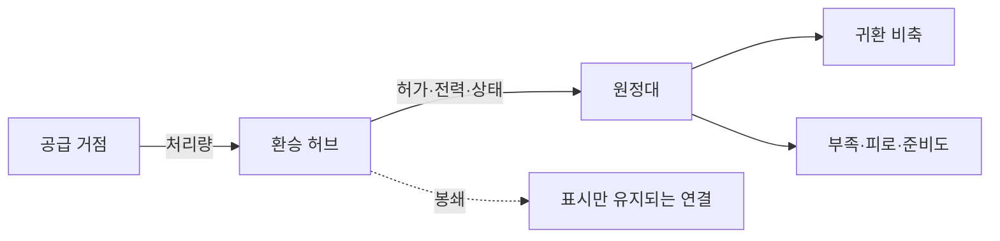

# 물류와 기반 시설

2026-09-07 위키 도표. 4방향 칸 연결은 당시 그림의 문법이며 처리량 공식이 아니다. 문서용 평면도이며 실제 게임 화면이 아니다.

보급 경로의 병목과 처리량을 구간 연결과 지형으로 예측·관리합니다.

물류는 재고가 있다는 사실이 아니라 필요한 종류의 물자가 허가된 경로를 통해 제때 도착하는 능력이다. 표의 수치는 모두 설계 가정으로 둔다.

## 입력과 출력

| 입력 | 범위·기본값 | 출력 |
|---|---:|---|
| 구간 기본 처리량 `B` | 화물점/일 | 실제 처리량 `C` |
| 시설 상태 `I` | 0~1, 기본 1 | 붕괴·수리 효과 |
| 전력 `P` | 0~1 | 견인·환기·펌프 가동 |
| 접근권 `X` | 0~1 | 통행 허용 여부 |
| 위험 `H` | 0~1 | 호송 손실과 지연 |
| 원정대 비축 `Q` | 보급점 | 부족·피로·전투 준비도 |

## 계산 규칙

```text
C_e = clamp(B_e * I_e * P_e * X_e * (1-H_e), 0, B_e)
보급률 = clamp(도착량 / max(감시기간수요, 1), 0, 1)
부족률 = clamp(미충족량 / max(필요량, 1), 0, 1)
부담비율(분자, 분모) = 분모가 0이면 (분자도 0이면 0, 아니면 3), 아니면 분자/분모
과확장 = clamp(max(부담비율(요구처리량, 실제흐름), 부담비율(귀환필요량, Q), 부담비율(통치부담, 행정역량)) - 1, 0, 2)
완전고립 = 고립 단계가 2이면 1, 아니면 0
부하Δ = clamp(20 * 부족률 + 8 * 완전고립 + 6 * 과확장, 0, 35)
부하 A = clamp(A + 부하Δ, 0, 100)
```

`과확장`은 여섯 전략 문서가 공유하는 0~2 척도이며 이 문서의 정의가 기준이다. 물류(요구처리량/실제흐름), 귀환(귀환필요량/Q), 통치(통치부담/행정역량) 세 부담 비율 중 최댓값에서 1을 뺀 값을 0~2로 잘라 사용한다. 부담 비율의 분모가 0인데 분자가 남아 있으면 그 비율을 3으로 정의해 과확장이 즉시 상한 2로 포화하고, 분자도 0이면 그 부담은 0으로 처리하므로 계산은 항상 정의된다.

`고립 단계`도 이 문서가 정의하는 공유 0~2 연속 척도다. 모든 합법 주 경로가 정상이면 0, 일부 경로가 봉쇄되어 우회·경화물만 가능하면 1, 모든 합법 경로가 차단되면 2를 기준점으로 하고, 중간값은 봉쇄된 합법 경로 처리량의 비율로 보간한다.

`부하`는 이 문서가 정의하는 0~100 누적 척도이며 증감 계수와 구간 효과는 설계 가정이다. 감시기간 말에 `부하Δ`를 더하고 0~100으로 자른다. 보급률이 1이고 허가된 안전 거점에서 필요 능력 태그가 있으면 증가 대신 감시기간당 15만큼 회복한다. 0~24 준비는 물류 특화 효과가 없고, 25~49 긴장은 준비도 감소와 여유 용량이 필요한 임의 행동 제한을 적용하며, 50~74 임계는 구간 진입 시 미치료 부상 하나 악화 또는 최하위 상태 장비 하나 손상(둘 다 없으면 지정 화물 손실, 대상은 심각도 다음 영속 ID 순)을 확정하고, 75~99 실패는 후퇴·화물 유기·현지 조달·분할·명시적 고위험 속행 중 결정을 강제하며, 100 붕괴는 전진 개시를 막고 좌초·항복·해산 또는 구조/최후 조우로 넘긴다. 자동 비율 사망은 적용하지 않는다.

보급 배분은 정책 우선순위와 영속 ID 순서로 결정한다. 물자는 능력 태그가 맞는 수요에만 충족하며, 의료·배터리·수리 태그는 일반 보급점이 남아 있어도 서로 바꾸지 않는다.

## 기본 수치

| 항목 | 기본값 | 최소 | 최대 |
|---|---:|---:|---:|
| 일반 허브 유지비 | 5 보급점/일 | 0 | 20 |
| 허브 노동 | 1교대/일 | 0 | 4 |
| 원정대 피로 | 0 | 0 | 100 |
| 원정대 준비도 | 100 | 0 | 100 |
| 과확장 단계 | 지속 0, 노출 0~1, 심각 1~2 | 0 | 2 |
| 고립 단계 | 정상 0, 부분 봉쇄 1, 완전 차단 2 | 0 | 2 |
| 부하 누적 | 준비 0~24, 긴장 25~49, 임계 50~74, 실패 75~99, 붕괴 100 | 0 | 100 |
| 구간 최소 이동시간 | 0.25시간 | 0.25 | 24 |



## 경계 상황

- 경로가 없으면 고립 단계 2이지만 비축이 충분하면 즉시 굶지는 않는다.
- 실제 흐름이나 비축 `Q`가 0인데 해당 수요(요구처리량·귀환필요량)가 남아 있으면 그 부담 비율은 3으로 정의되어 과확장이 즉시 상한 2로 포화하고, 수요도 0이면 그 부담 비율은 0이다.
- 전력 차단 환승역은 양쪽 터널이 멀쩡해도 전동 화물 흐름이 0일 수 있다.
- 임시 복구는 기본적으로 도보·경화물만 통과시키며 중화물·무장 통과는 별도 승인이다.
- 봉쇄 연결은 삭제하지 않고 원인, 수리 자원과 예상 시간을 표시한다.
- 불필요한 중복 허브도 유지비를 내며, 최대 흐름·비축·단일고장 생존성을 늘리지 않으면 효용 0으로 표시한다.

## 계산 예시

기본 처리량 100, 시설 0.8, 전력 0.5, 접근권 1, 위험 0.1이면 `C=clamp(100*0.8*0.5*1*0.9,0,100)=36`이다. 수요 60 중 비축 40과 배송 36으로 60을 모두 충족하면 부족률은 0이다. 과확장의 세 부담 비율은 물류 `60/36=1.667`, 귀환필요량 20과 비축 40으로 귀환 `20/40=0.5`, 통치부담 3과 행정역량 3으로 통치 `3/3=1`이며, 최댓값 1.667을 적용해 `과확장=clamp(1.667-1,0,2)=0.667`이어서 다음 원정의 취약성이 경고된다.

