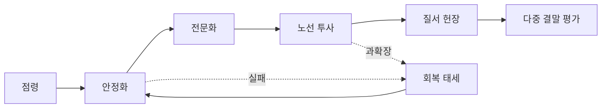

# 캠페인 진행과 위기

진행은 영토 숫자가 아니라 거점의 안정화, 전문화, 연결 투사력과 플레이어가 세운 질서의 정당성으로 측정합니다. 아래 수치는 **설계 가정**입니다.

## 입력과 출력

| 입력 | 범위·기본값 | 출력 |
|---|---:|---|
| 안보 `S_i` | 0~100, 안정 거점 70 | 폭력 억제와 방어 |
| 기능 `F_i` | 0~100, 안정 거점 70 | 시설·생산·피난 서비스 |
| 정통성 `L_i` | 0~100, 안정 거점 60 | 현지 통치 수용 |
| 연결 `K_i` | 0~1 | 구호·교역·증원 가능성 |
| 부족 `x_i` | 0~1 | 회복·산출 감점 |
| 과확장 `O` | 0~2 | 네트워크 전체 부담 |
| 긴장도 `E` | 0~100, 시작 20 | 주간 위기 확률과 강도 |

## 계산 규칙

```text
K_i = clamp(max_path(경로신뢰도), 0, 1)
부족_i = 수요가 0이면 0, 아니면 1 - clamp(가용량 / 수요, 0, 1)
회복 = clamp(10 + 10*위기해결품질, 0, 20)
E' = clamp(E + 시간압력 + 확장충격 + 부족 + 고립 + 과확장 - 회복, 0, 100)
위기확률 = clamp(0.10 + 0.01*(E-50) + 0.15*O + 0.10*평균부족 + 0.10*평균고립, 0.10, 0.75)
```

과확장 `O`와 고립은 [물류와 기반 시설](Logistics-and-Infrastructure.md)에 정의된 공유 0~2 척도를 그대로 사용하며, `평균부족`과 `평균고립`은 거점별 값의 평균입니다. 수요가 0인 항목은 [경제와 생산](Economy-and-Production.md)의 공유 규칙대로 부족 0으로 처리하고 0으로 나누지 않습니다. `회복`은 그 주에 위기를 해결했을 때만 적용하며(해결 품질 0~1), 해결이 없으면 0입니다. 위기 종류와 대상은 캠페인 시드, 주차와 전용 난수 흐름으로 결정하며 원인 가중치를 원장에 기록합니다.

## 기본 수치

| 항목 | 기본값 | 최소 | 최대 |
|---|---:|---:|---:|
| 캠페인 시작 긴장도 | 20 | 0 | 100 |
| 신규 점령 확장 충격 | 5 | 0 | 10 |
| 부족 임계 | 0.25 | 0 | 1 |
| 심각 부족 임계 | 0.75 | 0 | 1 |
| 강제 대응까지 심각 부족 | 3일 | 1일 | 7일 |
| 붕괴 선택까지 심각 부족 | 7일 | 3일 | 14일 |
| 위기 확률 | 10% | 10% | 75% |



## 경계 상황

- 심각 부족 3일은 강제 지역 비상사건, 7일은 철수·배급 강제·항복 협상·지역 붕괴 선택을 엽니다.
- 고립된 거점은 비축으로 버틸 수 있지만 증인·구호·수리 인력이 오지 않아 회복이 느립니다.
- 과확장은 적을 마법처럼 강화하지 않고 모든 거점의 행정·순찰·수리 지연으로 나타납니다.
- 같은 주에 여러 위기가 발생하면 전용 난수 결과를 고정한 뒤 위기 ID 순서로 예약합니다.
- 승리는 서울 통일 하나가 아니라 노선 연합, 독립 역 협약, 교역 질서, 기술 복구 같은 헌장 조건으로 평가합니다.

## 계산 예시

긴장도 58, 과확장 0.5, 평균 부족 0.139, 평균 고립 0.2이면 `위기확률=clamp(0.10+0.08+0.075+0.0139+0.02,0.10,0.75)=0.2889`, 즉 28.89%입니다. 위기가 해결 품질 0.8로 끝나면 그 주의 회복 항은 `회복=clamp(10+10*0.8,0,20)=18`입니다. 이 값은 `E'` 공식에서 차감 항으로만 쓰이며, 같은 주의 시간압력·확장충격·부족·고립·과확장 증가 항이 모두 0일 때만 `E'=E-18`이 됩니다. 성공적인 회복도 캠페인 진행의 실질적 선택이 됩니다.

