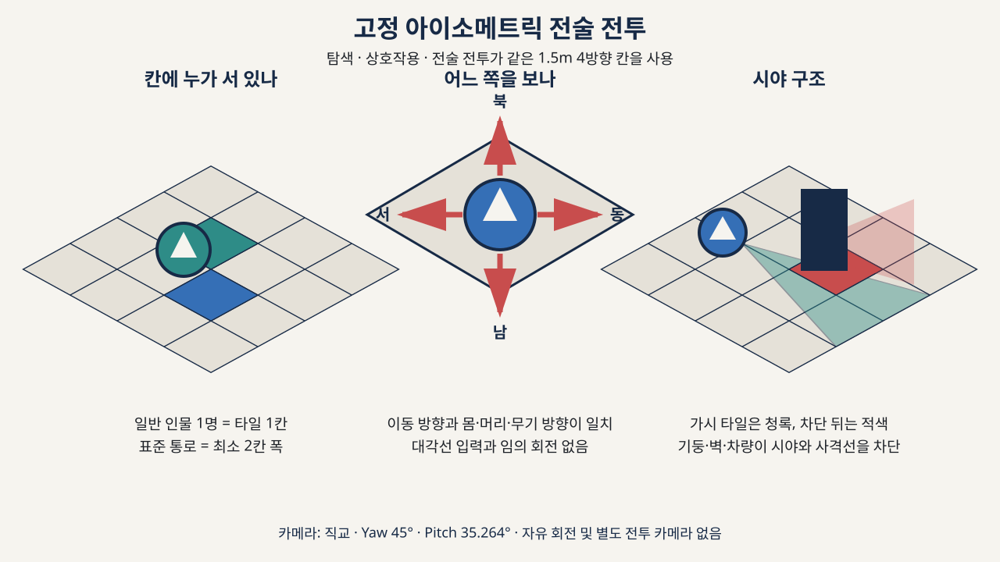

# 캐릭터 미술 방향

## 실루엣

- 2.5등신 SD 비율
- 큰 머리와 분명한 얼굴 면
- 작은 몸통, 읽기 쉬운 어깨와 무기 외곽선
- 동, 서, 남, 북 네 방향 전용 표현
- 한 타일 안에서 직업과 상태를 구분할 수 있는 색과 장비

## 하이브리드 후보

기본 후보는 도트 헤드와 메시 바디의 실시간 결합입니다. 목 소켓, 방향 상태, 조명, 그림자와 가림 순서를 하나의 계약으로 관리합니다.

다음 세 방식을 같은 캐릭터와 조건으로 비교합니다.

1. 도트 헤드와 메시 바디
2. 통합 SD 메시와 포인트 필터 얼굴 아틀라스
3. 통합 4방향 스프라이트

## 탈락 결함

- 목 경계가 벌어지거나 흔들림
- 머리와 몸의 방향 상태가 한 프레임 이상 어긋남
- 머리, 머리카락, 무기와 환경의 깊이 순서 오류
- 조명과 색조가 달라 머리가 붙인 그림처럼 보임
- 정수 배율이 깨져 얼굴 픽셀이 번짐
- 비대칭 장비를 좌우 반전해 형태가 바뀜

실제 Unity Play Mode 캡처에서 결함이 남으면 더 단순한 통합 표현을 선택합니다.

