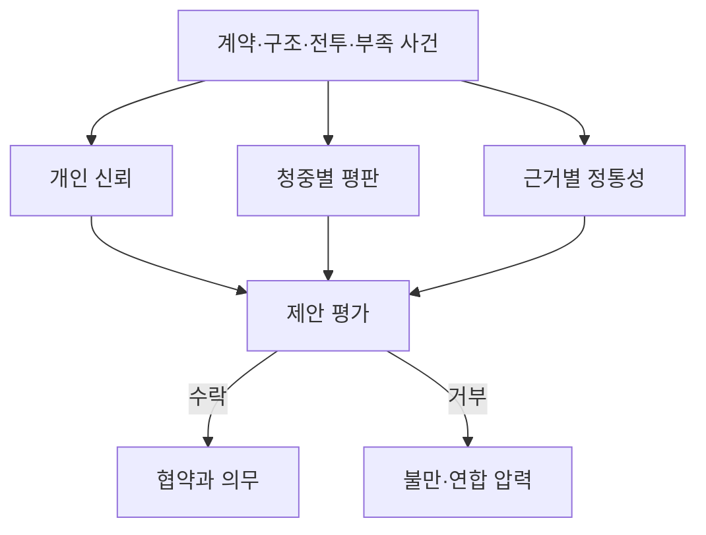

# 세력과 외교


세력 간 협상과 통행권 부여를 위치·방향·시야 기반 관계로 결정합니다.

정치는 하나의 호감도가 아니라 개인 신뢰, 대중 평판, 지역별 정통성, 이행 가능한 약속과 집단 불만의 그래프입니다. 아래 수치는 **설계 가정**입니다.

## 입력과 출력

| 입력 | 범위·기본값 | 출력 |
|---|---:|---|
| 신뢰 `T[A,B]` | -100~100, 기본 0 | 개인·기관 간 협조 |
| 평판 `R[F,a]` | -100~100, 기본 0 | 청중별 공개 평가 |
| 정통성 `L[F,n,k]` | 0~100, 현지 신규 주장 20 | 식량·전력·안전 등 근거별 승인 |
| 정치 자본 `PC` | 0~100, 기본 0 | 회의·보증·연합 행동 비용 |
| 불만 `G` | 0~100, 기본 0 | 청원·파업·봉쇄·분리 압력 |
| 결속 `C` | 0~100, 기본 0 | 집단 행동을 조직하는 능력 |
| 지렛대 `V` | 0~1, 기본 0 | 상대를 강제할 실질 수단 |
| 이행 신뢰도 `Rel` | 0~1 | 제안 수용과 계약 위험 |

## 계산 규칙

```text
Rel = clamp(1 - 0.50*부족 - 0.30*고립 - 0.40*과확장, 0, 1)
신뢰변화 = clamp(sum(사건영향 * 신빙성), -25, 25)
T' = clamp(T + 신뢰변화 + 기준선이동, -100, 100)
압력 = clamp(0.45*불만 + 0.35*결속 + 0.20*(100*지렛대), 0, 100)
```

압력의 세 입력 중 불만과 결속은 0~100 척도이고, 지렛대는 0~1 척도라서 100을 곱해 같은 척도로 정규화한 뒤 가중합합니다. 압력은 0~100 값입니다.

모든 제안은 먼저 실제 경로, 물자, 권한, 배타 계약 충돌을 검사합니다. 불가능한 약속은 높은 교섭 능력으로 통과시킬 수 없습니다.

## 기본 수치

| 항목 | 기본값 | 최소 | 최대 |
|---|---:|---:|---:|
| 일반 회의 비용 | 5 정치 자본 | 0 | 100 |
| 긴급 심의 비용 | 10 정치 자본 | 0 | 100 |
| 연합 전체 안건 | 20 정치 자본 | 0 | 100 |
| 조직화 압력 | 40 | 0 | 100 |
| 위기 압력 | 70 | 0 | 100 |
| 강제 요구 지렛대 | 0.75 | 0 | 1 |
| 일반 협약 재검토 | 3주 | 1주 | 12주 |



## 경계 상황

- 관계 임계치는 신뢰 하나가 아니라 실행 가능성, 이익, 정통성과 협약 충돌을 함께 검사합니다.
- 압력 70 이상, 지렛대 0.75 이상이 2주 연속일 때만 파업·봉쇄·분리 같은 강제 요구가 열립니다.
- 고립은 외부 약속만 약화시키며 현지 통치의 정통성을 자동으로 깎지 않습니다.
- 후계자가 바뀌면 개인 약속과 제도 약속을 구분해 재검토합니다.
- 동시 제안은 같은 주간 스냅샷으로 평가한 뒤 명령 ID 순서로 정산합니다.

## 계산 예시

부족 0.30, 고립 0.40, 과확장 0.50이면 감점은 각각 `0.50*0.30=0.15`, `0.30*0.40=0.12`, `0.40*0.50=0.20`이고 `Rel=clamp(1-0.15-0.12-0.20,0,1)=0.53`입니다. 불만 80, 결속 60, 지렛대 0.8이면 `압력=clamp(0.45*80+0.35*60+0.20*(100*0.8),0,100)=73`이므로, 지렛대 조건(0.75 이상)과 함께 2주 연속 유지되면 강제 요구가 열립니다. 신뢰 60이더라도 실제 배송 성공률이 53%라면 장기 전력 공급 협약은 거부되거나 담보·단계 이행 조건이 붙습니다. 실패 원인이 제3자의 봉쇄이고 사전 통보했다면 신빙성 계수로 신뢰 손실을 줄일 수 있습니다.

