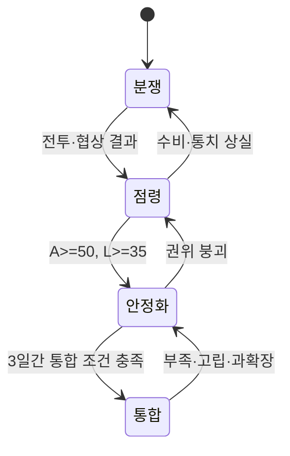

# 거점과 영토

역은 점령 즉시 완성되는 깃발이 아니라 사람, 시설과 연결을 다시 작동시켜야 하는 전략 거점입니다. 아래 수치는 모두 첫 프로토타입용 **설계 가정**이며 플레이테스트로 조정합니다.

## 입력과 출력

| 입력 | 범위·기본값 | 출력 |
|---|---:|---|
| 권위 `A` | 0~100, 점령 직후 최대 45 | 순찰, 협약 집행, 적대 활동 억제 |
| 협력 `L` | 0~100, 강제 점령 기본값 20 | 노동, 정보 제공, 통치 수용 |
| 시설 상태 `R` | 0~100 | 지역 서비스와 노선 서비스 |
| 연결도 `K` | 0~1 | 합법 경로의 최소 처리량 |
| 부족도 `S` | 0~1 | 식량·전력 중 더 심한 결핍 |
| 과확장 `O` | 0~2 | 모든 거점의 안정화와 수송 감점 |

## 계산 규칙

합법적인 보급 경로마다 가장 좁은 연결의 처리율을 구하고 그중 가장 큰 값을 `K`로 사용합니다. 봉쇄된 연결은 삭제하지 않고 `K=0`의 원인과 복구 조건을 보존합니다.

```text
K = clamp(max_path(min_edge_capacity), 0, 1)
충족률(공급, 수요) = 수요가 0이면 1, 아니면 clamp(공급/수요, 0, 1)
S = 1 - min(충족률(식량공급, 식량수요), 충족률(전력공급, 전력수요))
```

수요가 0인 자원은 충족률 1, 즉 부족 기여 0으로 처리합니다. 이는 [경제와 생산](Economy-and-Production.md)의 부족률 규칙과 동일한 공유 규칙이며 어떤 경우에도 0으로 나누지 않습니다.

과확장 `O`는 [물류와 기반 시설](Logistics-and-Infrastructure.md)에 정의된 공유 0~2 척도를 그대로 사용합니다. 이 문서의 통치부담과 행정역량은 그 정의의 통치 부담 비율 `부담비율(통치부담, 행정역량)` 항으로 들어갑니다.

하루 정산 순서는 자원 배분 → 전투 결과 → 권위·협력·시설 → 단계 전이 → 사건 예약입니다. 동일한 입력은 항상 같은 결과를 냅니다.

## 기본 수치

| 규칙 | 기본값 | 최소 | 최대 |
|---|---:|---:|---:|
| 일반 역 시설 슬롯 | 2 | 1 | 4 |
| 환승역 시설 슬롯 | 3 | 1 | 4 |
| 주요 사업 작업량 | 100 | 40 | 240 |
| 통합 권위 | 65 | 0 | 100 |
| 통합 협력 | 55 | 0 | 100 |
| 통합 시설 | 60 | 0 | 100 |
| 통합 유지 기간 | 3일 | 1일 | 7일 |

점령지는 `분쟁 → 점령 → 안정화 → 통합`을 거칩니다. `A>=65`, `L>=55`, `R>=60`, `K>=0.5`, `S<=0.25`를 3일 연속 만족해야 통합됩니다.



## 경계 상황

- 식량 또는 전력이 75% 미만이면 부족 상태가 붙고 권위·협력이 하락합니다.
- 완전 고립이면 수입·수출은 0이지만 현지 비축과 발전은 계속 작동합니다.
- 과확장은 영토 상한이 아니라 담당자, 주둔군과 연결 부족으로 발생합니다.
- 같은 날 여러 거점이 임계치를 넘으면 안정된 거점 ID 순서로 정산합니다.
- 무전력 시설만 있는 역은 전력 수요 0으로 처리하며, 이때 전력 충족률은 1이 되어 부족도 `S`를 올리지 않지만 전력 서비스가 생긴 것으로 보지도 않습니다.

## 계산 예시

식량 40/100, 전력 60/100이면 `S = 1 - min(0.4, 0.6) = 0.6`입니다. 합법 경로가 없으면 `K=0`입니다. 통치부담 4.5와 행정역량 3이면 통치 부담 비율은 `4.5/3=1.5`이고, 물류·귀환 부담 비율이 그보다 작다면 `O=clamp(1.5-1,0,2)=0.5`입니다. 세 조건이 겹친 역은 통합 조건을 만족할 수 없고, 이미 통합된 역이라면 안정화 단계로 후퇴하며, 권위까지 붕괴하면 점령 단계로 더 물러납니다. 그래도 현지 식량·발전·수리반이 남아 있다면 복구는 계속됩니다.

