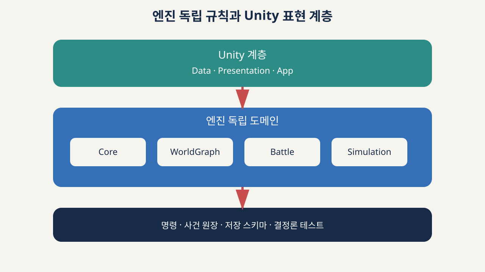

# Unity 아키텍처

## 기준선

현재 기반은 Unity `6000.7.0a5`입니다. 알파 채널이므로 편집기 revision과 package lock을 함께 고정하고 업그레이드 전 별도 검증을 수행합니다.

현재 생성된 기반은 다음뿐입니다.

- Unity 프로젝트
- 장르 계약 JSON과 상수
- EditMode 장르 계약 테스트
- URP, Input System, Test Framework 패키지 기준선

## 목표 모듈

| 모듈 | 책임 | UnityEngine 참조 |
|---|---|---|
| `Janseon.Core` | ID, 시간, 명령, 사건 | 금지 |
| `Janseon.WorldGraph` | 다층 지도와 출처 | 금지 |
| `Janseon.Battle.Contracts` | 전투 입력·결과 | 금지 |
| `Janseon.Battle` | SRPG 규칙 | 금지 |
| `Janseon.Sim` | 캠페인 시뮬레이션 | 금지 |
| `Janseon.Data` | Unity 저작 데이터 | 허용 |
| `Janseon.Presentation` | 화면, 입력, 사운드 | 허용 |
| `Janseon.App` | 조립, 씬, 저장 연결 | 허용 |

## 규칙

- 엔진 독립 모듈에는 전역 가변 상태를 두지 않습니다.
- 화면은 상태를 직접 수정하지 않고 명령을 보냅니다.
- 모든 상태 변화는 사건 원장에 기록합니다.
- 고급 패키지는 실제 사용처와 실패 테스트가 생긴 뒤 추가합니다.

