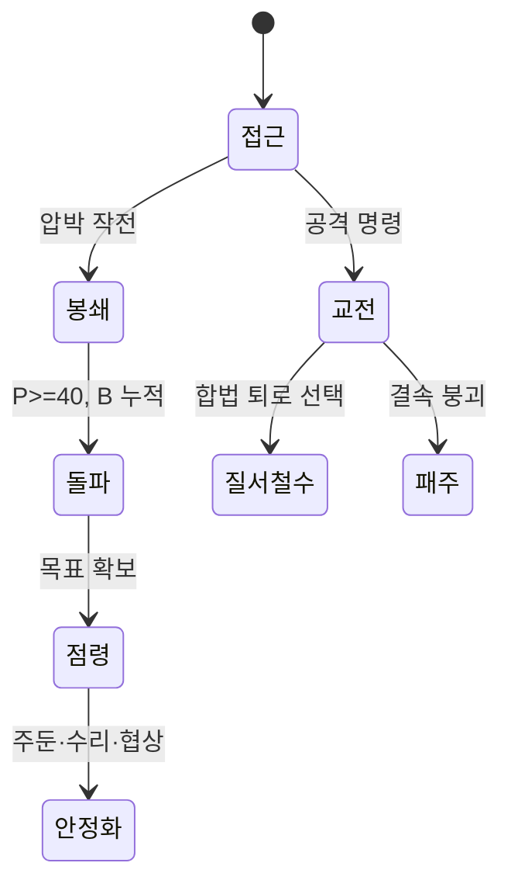

# 전쟁과 공성

전쟁은 병력 수 비교가 아니라 접근로, 보급, 사기, 퇴로와 점령 후 유지 능력을 둘러싼 연속 과정입니다. 아래 수치는 **설계 가정**입니다.

## 입력과 출력

| 입력 | 범위·기본값 | 출력 |
|---|---:|---|
| 전력 `S` | 0~100, 기본 100 | 현재 전투 가능 인원·장비 |
| 결속 `C` | 0~100, 기본 70 | 대형 유지와 철수 통제 |
| 보급일 `D` | 0~6, 기본 3 | 작전 지속 가능 기간 |
| 피로 `F` | 0~100, 기본 0 | 전투 효율·패주 손실 |
| 접근 용량 `A` | 1~3, 기본 2 | 동시에 전력을 투입할 파티 수 |
| 방어 엄폐 `V` | 0~30, 기본 10 | 지형·차단막·고저차 효과 |
| 압박 `P`·돌파 `B` | 0~100, 기본 0 | 봉쇄와 진입 진행도 |

## 계산 규칙

```text
피로계수 = clamp(1 - F/200, 0.5, 1)
적재계수 = clamp(1 - max(0, 적재율-80)/100, 0.8, 1)
압박증가 = clamp(6 + floor((공격작전력-수비작전력)/20) - 고립, 1, 12)
패주손실 = clamp(15 + 5*고립 + floor(F/10), 15, 35)
주둔요구 = clamp(20 + 10*적대접근로수 + floor(5*과확장), 20, 80)
```

`고립`은 [물류](Logistics-and-Infrastructure.md)에 정의된 고립 단계(정상 0, 부분 봉쇄 1, 완전 차단 2)이고, `과확장`도 같은 문서의 공유 0~2 척도를 그대로 사용합니다. 전투는 시작 시 확정된 전투 컨텍스트만 사용하며, 종료 결과는 `ResultId`로 한 번만 캠페인에 반영합니다.

## 기본 수치

| 항목 | 기본값 | 최소 | 최대 |
|---|---:|---:|---:|
| 보급일 | 3일 | 0일 | 6일 |
| 접근 용량 | 2파티 | 1 | 3 |
| 위험 추가 손실 | 0 | 0 | 4 |
| 철수 피로 | +15 | 0 | 100 |
| 압박 일일 증가 | 6 | 1 | 12 |
| 점령 직후 치안 | 20 | 0 | 100 |



## 경계 상황

- 탄약과 식량을 묶은 보급일이 0이면 전투 계수는 0.60이며 다음 무보급 공성일을 지속할 수 없습니다.
- 고립은 압박 증가를 낮추고 철수·패주 손실을 키우며 점령지 수리를 막습니다.
- 퇴로가 봉쇄되면 질서 철수 대신 긴급 탈출, 항복 또는 패주만 가능합니다.
- 점령 승리는 시설 복구와 주민 협력을 자동 부여하지 않습니다.
- 동시 공격은 접근 용량만큼만 완전 전력을 쓰고 나머지는 예비·지원으로 정산합니다.

## 계산 예시

공격 작전력 90, 수비 작전력 78, 고립 0이면 `압박증가=clamp(6+floor(12/20),1,12)=6`입니다. 공격대 피로 40이면 피로계수는 `clamp(1-0.2,0.5,1)=0.8`입니다. 같은 공격대가 고립 2, 피로 70으로 패주하면 `패주손실=clamp(15+10+7,15,35)=32`가 되어 보급로를 지키지 않은 대가가 전투 후에도 남습니다.

