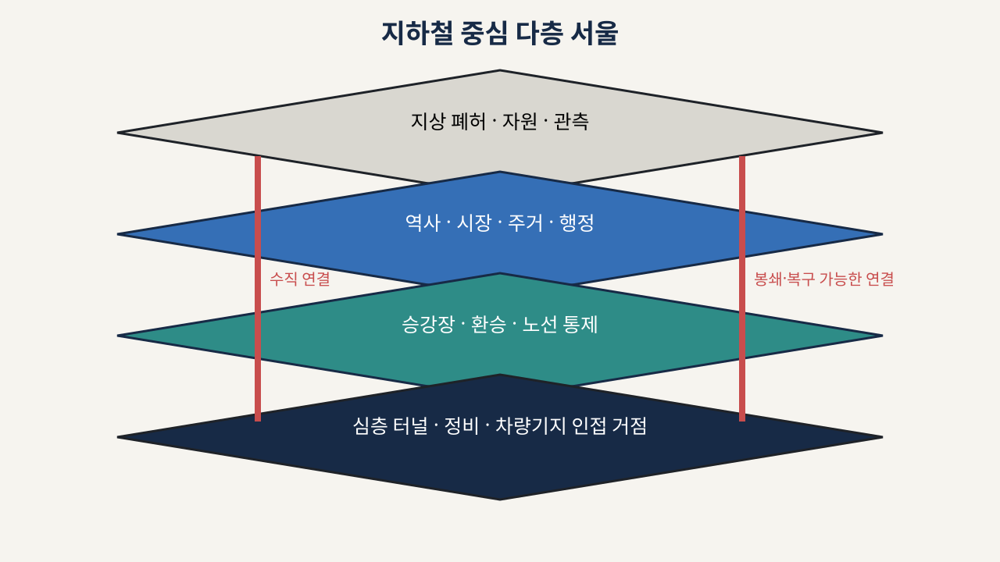

# 서울과 지하철 레이어

## 세계의 수직 구조

서울은 평면 행정구역 지도가 아니라 서로 다른 위험과 기능을 가진 층의 그래프입니다.

| 층 | 주요 기능 | 대표 위험 |
|---|---|---|
| 지상 폐허 | 자원 수집, 태양광, 장거리 관측 | 기후, 붕괴, 노출, 세력 충돌 |
| 역사 대합실 | 시장, 주거, 행정, 정보 | 과밀, 화재, 권력 분쟁 |
| 승강장·선로 | 이동, 방어선, 화물 운송 | 병목, 매복, 전력 차단 |
| 환승 통로 | 노선 간 정치·물류 연결 | 봉쇄, 통행세, 혼잡 |
| 심층 터널 | 은밀 이동, 정비 시설 | 침수, 어둠, 통신 단절 |
| 차량기지 인접 거점 | 수리, 부품, 대규모 저장 | 전략적 공성, 화재 |

## 그래프 구성

세계 진실 그래프는 역, 구역과 연결을 모두 저장합니다. 화면은 그중 현재 필요한 노선과 선택한 역의 상세만 보여 줍니다.

- `Station`: 역 사회와 전략 거점
- `StationLayer`: 대합실, 승강장, 심층 구역
- `SurfaceDistrict`: 역과 연결된 지상 권역
- `TunnelSegment`: 역 사이의 이동 구간
- `VerticalConnector`: 계단, 승강기, 환기구
- `Interchange`: 노선 사이의 환승 연결
- `StrategicSite`: 병원, 시장, 발전, 급수, 정비 거점

## 데이터 출처 구분

모든 노드와 연결에는 다음 출처 상태가 붙습니다.

- `measured`: 공식 자료에서 직접 확인한 값
- `derived`: 확인된 자료에서 계산한 값
- `fictional`: 게임을 위해 창작한 값

현재 검증된 승하차 자료는 역의 활동 가중치를 만드는 참고 자료로만 사용합니다. 실제 역 내부 구조, 붕괴 상태, 세력 배치와 전술 전장은 창작 원형입니다.

## 동적 연결

연결은 삭제되지 않고 상태가 바뀝니다. 정상, 위험, 통제, 봉쇄, 침수, 붕괴, 임시 복구 상태와 원인을 기록합니다. 그래서 플레이어는 “왜 길이 끊겼는지”와 “무엇을 해결하면 다시 열리는지”를 확인할 수 있습니다.

