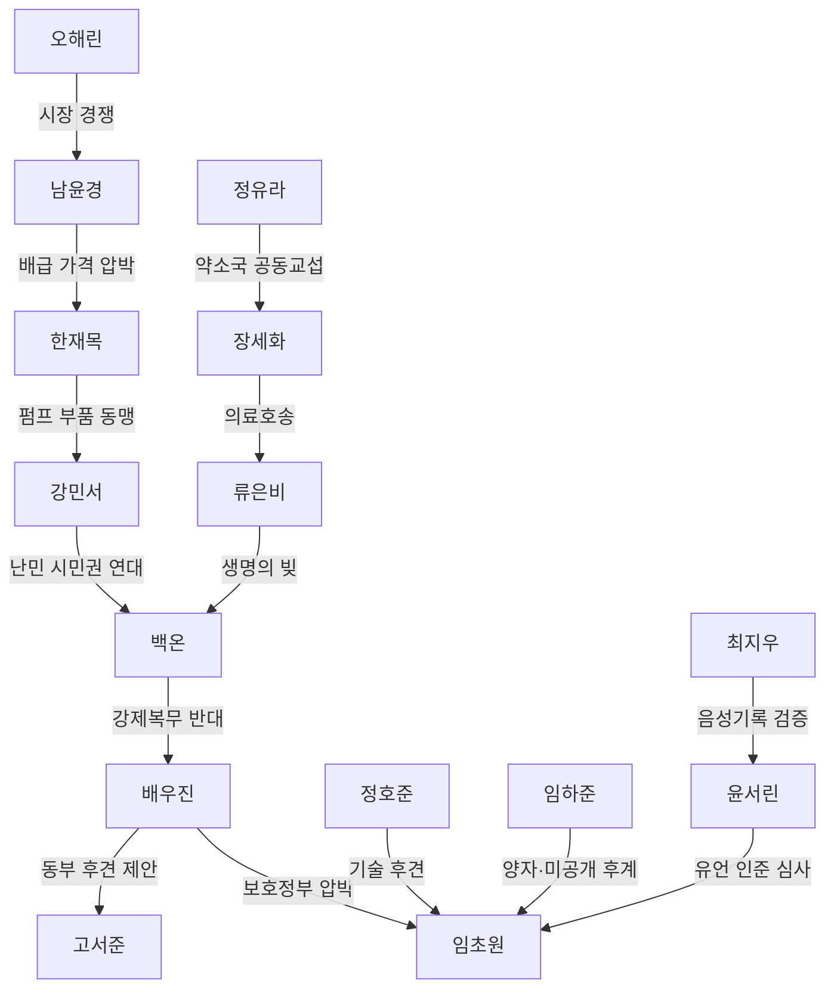

# 야망

## 국가가 아니라 인물이 행동한다

국가는 영토, 자원, 직위, 조약과 정통성을 담는 그릇이다. `호전적인 국가`, `영원한 동맹`, `배신 확률` 같은 고정 성격은 두지 않는다. 같은 국가도 지도자와 핵심 직위자가 바뀌면 팽창국, 교역국, 중립국, 연방국으로 변할 수 있다.

## 정치 결정 흐름

## 인물의 정치 요소

| 요소 | 역할 | 예시 |
|---|---|---|
| 성격 | 선호하는 수단 | 신중함, 대담함, 원칙, 실리, 합의, 지배, 자비, 가혹함, 신의, 기회주의 |
| 가치관 | 쟁점에서 기울는 방향 | [가치관과 정책 척도](../culture/Values-and-Policy-Scales.md) 10칸. 조직 헌장과 어긋나면 사건이 열린다 |
| 활성 야망 | 현재 성공 조건 | 특정 직위 획득, 경쟁자 제거, 노선 확보, 의존 탈피, 연합 창설 |
| 공포 | 피하려는 결과 | 직위 상실, 포위, 비밀 폭로, 특정 인물 사망, 외국 의존, 민심 붕괴 |
| 직위 | 합법적 권한 | 조약 제안, 비준, 선전포고, 배급, 군사 동원, 기록 인준 |
| 관계 | 특정 인물에 대한 판단 | 친족, 양자, 사제, 후견, 빚, 맹세, 경쟁, 원한, 보호체류 |
| 기억 | 인물이 알고 있는 과거 | 구조, 배신, 모욕, 약속 이행, 잘못된 소문, 공식 보고 |

## 희소 관계망

모든 인물 쌍을 저장하지 않는다. 친족, 사제, 지휘, 계약, 생명의 빚, 인질·보호체류, 중대한 배신처럼 결정을 바꾸는 관계만 만든다. 관계는 방향성이 있어 한쪽의 신뢰와 상대의 신뢰가 다를 수 있다.

인물당 일반 관계는 12개 이하로 유지한다. 낮은 강도의 관계가 밀려나도 사건 원장은 남기 때문에 다시 만났을 때 과거를 복원할 수 있다.

## 개막 관계망

## 다섯 패권 의제

패권은 국가의 고정 승리조건이 아니라 인물 연합이 추진하는 현재 의제로 읽힌다.

### 수문헌장

- 주도자: 한재목
- 목표: 급수계약과 배급을 하나의 헌장으로 통합
- 지지: 안정이 필요한 서부 약소국, 일부 기록관
- 반대: 정유라의 공동교섭파, 백온의 이동권파
- 평화적 결과: 최소 급수권과 감사권이 있는 물 연방
- 폭력적 결과: 집단 단수와 보호국 체제

### 제작규격맹

- 주도자: 강민서
- 목표: 부품과 수리 규격, 복구복무 시민권 통일
- 지지: 창동 기술자, 뚝섬 공방 일부, 북한산보국문 난민
- 반대: 군수 독점을 원하는 경비대, 기술 비공개파
- 평화적 결과: 상호 수리권과 노동 이동권
- 폭력적 결과: 부품 봉쇄와 산업 징발

### 공동기술원장

- 주도자: 정호준
- 목표: 연구자 인질 관행 폐지와 검증 자료 공유
- 지지: 정유라, 류은비, 최지우
- 반대: 기술을 보호비로 쓰는 강국과 폐쇄 연구파
- 평화적 결과: 독립 안전심사와 공개 기술원장
- 폭력적 결과: 연구자 납치와 자료 파괴전

### 물·부품 공동규격

- 주도자: 임하준 또는 후계자
- 목표: 물과 펌프 부품을 상호 호환해 단일국가의 생명선 독점을 막음
- 지지: 뚝섬 공방, 제기동 의료파, 중립 환승국
- 반대: 암사 군사파, 독점 계약으로 이익을 얻는 상인
- 평화적 결과: 분산 생명선
- 폭력적 결과: 후계전쟁과 공방 분열

### 동부 상수보호권

- 주도자: 배우진
- 목표: 동부 급수·교량·차량기지를 군사 지휘 아래 통합
- 지지: 치안을 원하는 장교, 일부 가락 상인
- 반대: 장세화의 중립파, 고서준의 공동통치파, 백온의 시민권파
- 평화적 결과: 기간과 감사가 제한된 공동방위
- 폭력적 결과: 보호정부, 강제복무, 장교 쿠데타

## 동맹

동맹은 국가 관계 수치가 아니라 서명자와 조항을 가진 조약으로 선다.

- 양측의 제안자, 서명자와 비준자를 기록한다.
- 방위, 급수, 통행, 의료, 기술처럼 구체 조항을 둔다.
- 조약이 직위에 귀속되는지 인물에게 귀속되는지 정한다.
- 서명자가 죽거나 직위를 잃었을 때 자동 유지, 재비준, 종료 중 하나를 실행한다.
- 플레이어는 서명자를 구조하거나 제거하고, 증거를 전달하고, 직위를 얻어 조약의 운명을 바꿀 수 있다.

## 배신

배신은 다음 세 조건이 모두 있어야 한다.

1. 위반할 조약이나 개인 맹세가 존재한다.
2. 이름 있는 인물이 위반을 명령하거나 독단으로 실행한다.
3. 그 인물이 알고 있던 촉발 사건과 동기가 있다.

## 계승

계승은 혈통만 사용하지 않는다.

- 지정 후계자
- 부수장 또는 대행자
- 선거와 평의회 추대
- 친족과 양자
- 사제와 도제
- 직능 길드 추천
- 군사적 거점 통제

지도자 사망이나 포획은 국가 삭제가 아니라 직위 공석과 계승 쟁점을 연다. 후보가 없으면 새 무명 지도자를 자동 생성하지 않고 대행자, 최고위 관리인, 지도부 공석 순으로 진행한다. 이름 있는 인물을 요구하는 직위인데 후보가 비면 [후계, 이름 로스터, 세계 원장](Heirs-Names-and-World-Ledger.md)이 문화 성명 풀에서 한 명을 만든다. 풀이 바닥나면 공석으로 둔다.
