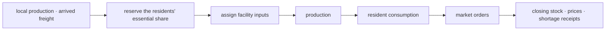

# Economy and Production

A wiki diagram dated 2026-09-07. The direction-by-direction cell placement was the grammar of that day's drawing — a flat diagram for documentation, not an actual game screen.

Labor was placed around production facilities and line capacity matched to stock flows.

The economy was not one money but a combination of survival resources, production resources, labor, power, and actual transport capacity. All numbers were design assumptions for the first prototype.

## Inputs and Outputs

| Input | Unit · default | Output |
|---|---:|---|
| Food · water · medicine | Per-station stock | Resident survival, treatment, labor endurance |
| Power | Power points | Lighting, pumps, production, refrigeration |
| Parts · ammunition | Goods points | Repair and tactical equipment |
| Skilled labor | Work shifts | Execution of production, administration, convoys |
| Link throughput | 0~1 | Caps on inbound and outbound flow |
| scrip | Per-station ledgers | Market trade and contract settlement |

## Calculation Rules

At the start of a day, water, food, and emergency medicine for the residents were reserved first, and facility inputs and market orders were assigned after. Production was limited by the lowest fulfillment rate among labor, inputs, power, and facility state. When a demand was 0 or the required-input set was empty, that fulfillment rate was 1, and in no case was there division by zero.

The daily settlement order was part of the determinism and followed the numbering below.

1. Fix the day's line states, passage rights, unit positions, available labor, policies, demands, and assigned priorities.
2. Compute network overreach and available line capacity.
3. Reserve labor for defense, expedition, treatment, and transport orders.
4. Reserve opening stock and power for the day's essential consumption; facility inputs did not consume this reservation.
5. Assign the remaining labor to facilities by assigned priority, breaking ties by stable facility ID then stable laborer ID.
6. Assign unreserved power and stock inputs to facilities by the same priority and tie rules.
7. Run production per the assignments, consume inputs, and add outputs.
8. Dispatch licensed freight from unreserved departure stock, limited by destination storage headroom, freight labor, line capacity, and passage rights. Arrived stock could be used for the destination's same-day essential consumption.
9. Settle essential consumption from reserved shares, arrived freight, and the day's output at the same consumer priority.
10. Compute shortages, the next day's labor endurance, local buy and sell prices, overflows, and exposed convoy and stockpile facts.
11. Leave cause-by-cause receipts and update the daily totals. The weekly system read these receipts and did not recompute the day.

```text
labor-rate = 1 if required-labor is 0, else clamp(available-skilled-labor / required-labor, 0, 1)
input-rate = 1 if the required-input set is empty, else min_r(1 if required-amount_r is 0, else clamp(allocated-amount_r / required-amount_r, 0, 1))
power-rate = 1 if required-power is 0, else clamp(allocated-power / required-power, 0, 1)
production = base-output * min(labor-rate, input-rate, power-rate) * facility-state
shortage-rate_r = 0 if total-demand_r is 0, else clamp(1 - fulfilled-demand_r / total-demand_r, 0, 1)
labor-endurance = clamp(1 - sum_r(penalty-coefficient_r * shortage-rate_r), 0.2, 1)
```

Price made no stock. A trade stood only with actual goods, purchasing power, access rights, and transport capacity. The price multiplier moved, added onto the scarce item, by the product of isolation sensitivity (design assumption 0.35), the import-dependence term `I = 0 if essential demand is 0, else 1 - clamp(inbound capacity / essential demand, 0, 1)`, and the per-resource import dependence. Isolation erased no production directly; it limited transport, widened the price half-band, and raised the prices only of resources with import dependence above 0.

## Base Numbers

| Item | Default | Min | Max |
|---|---:|---:|---:|
| Normal buy·sell half-band | 10% | 5% | 35% |
| Isolation additional half-band | 0~10% | 0% | 10% |
| Price isolation sensitivity | 0.35 | 0 | 1 |
| Water-shortage labor penalty coefficient | 0.70 | 0 | 1 |
| Food-shortage labor penalty coefficient | 0.50 | 0 | 1 |
| Power-shortage labor penalty coefficient | 0.30 | 0 | 1 |
| Minimum labor endurance | 20% | 0% | 100% |
| Administrative demand per station | 1 point | 0.5 | 3 |



## Boundary Cases

- With demand 0, the shortage rate too was 0; no division by zero.
- With required labor 0, the labor rate was 1; no division by zero.
- With required power 0, the power rate was 1; no division by zero.
- With an individual input's required amount 0, that input's fulfillment rate was set to 1.
- With the required-input set empty, the input rate was set to 1.
- Shortages of water, food, and power lowered the next day's labor; a medicine shortage limited the treatment acts themselves.
- An ammunition shortage limited not residents' labor but tactical equipment and the number of possible sorties.
- Under a labor shortage, no unqualified person was substituted automatically; production orders were partially completed.
- A self-sufficient isolated station took no arbitrary isolation penalty on the price of the resource it produced.
- Under overreach, line output fell by up to 50% and local output by up to 25%. Coordination demand was the per-station administrative demand of 1 point plus 0.5 points per operated line (design assumption), and coordination supply was assigned logistics 2 points, contact 1.5 points, records 1.5 points, and ledger upgrades (design assumption). These two were the governance-burden and administrative-capacity inputs of the overreach formula in [Logistics and Infrastructure](../economy/Logistics-and-Infrastructure.md), and the 50% and 25% reductions above were proportional to clamp(overreach, 0, 1) and never exceeded those caps.

## Worked Example

With only 50 of water demand 100 met and food and power fully met, labor endurance was `clamp(1 - 0.70*0.5, 0.2, 1)=0.65`. With 8 of 10 required shifts, inputs 70%, power 90%, and facility state 80%, production was `100 * min(0.8,0.7,0.9) * 0.8 = 56` of base output 100. With required labor, power, and inputs all 0 and the required-input set empty, production at the same facility state was `100 * min(1,1,1) * 0.8 = 80`.

```json economy-formula-cases
[
  {"name":"labor-zero-requirement","kind":"labor","available":0,"required":0,"expected":1},
  {"name":"labor-partial-requirement","kind":"labor","available":8,"required":10,"expected":0.8},
  {"name":"power-zero-requirement","kind":"power","allocated":0,"required":0,"expected":1},
  {"name":"power-capped-requirement","kind":"power","allocated":12,"required":10,"expected":1},
  {"name":"input-empty-requirement-set","kind":"input","requirements":[],"expected":1},
  {"name":"input-all-zero-requirements","kind":"input","requirements":[{"allocated":0,"required":0},{"allocated":7,"required":0}],"expected":1},
  {"name":"input-zero-and-positive","kind":"input","requirements":[{"allocated":0,"required":0},{"allocated":7,"required":10}],"expected":0.7},
  {"name":"shortage-zero-demand","kind":"shortage","filled":0,"demand":0,"expected":0},
  {"name":"documented-mixed-production","kind":"production","baseOutput":100,"laborAvailable":8,"laborRequired":10,"powerAssigned":90,"powerRequired":100,"inputs":[{"assigned":70,"required":100}],"facility":0.8,"expected":56},
  {"name":"all-zero-requirement-production","kind":"production","baseOutput":100,"laborAvailable":0,"laborRequired":0,"powerAssigned":0,"powerRequired":0,"inputs":[],"facility":0.8,"expected":80}
]
```
