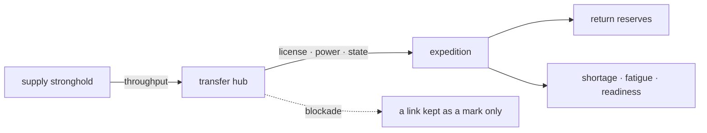

# Logistics and Infrastructure

A wiki diagram dated 2026-09-07. The four-direction cell links were the grammar of that day's drawing, not a throughput formula — a flat diagram for documentation, not an actual game screen.

Supply-line bottlenecks and throughput were predicted and managed from section links and terrain.

Logistics was not the fact that stock existed but the ability of the needed kinds of goods to arrive on time by licensed routes. The numbers in the tables were all design assumptions.

## Inputs and Outputs

| Input | Range · default | Output |
|---|---:|---|
| Section base throughput `B` | freight points/day | Actual throughput `C` |
| Facility state `I` | 0~1, default 1 | Effects of collapse and repair |
| Power `P` | 0~1 | Traction, ventilation, pump operation |
| Access right `X` | 0~1 | Whether passage is permitted |
| Hazard `H` | 0~1 | Convoy loss and delay |
| Expedition reserves `Q` | supply points | Shortage, fatigue, combat readiness |

## Calculation Rules

```text
C_e = clamp(B_e * I_e * P_e * X_e * (1-H_e), 0, B_e)
supply-rate = clamp(arrivals / max(watch-period-demand, 1), 0, 1)
shortage-rate = clamp(unmet / max(requirement, 1), 0, 1)
burden-ratio(numerator, denominator) = if the denominator is 0 then (0 if the numerator is also 0, else 3), else numerator/denominator
overreach = clamp(max(burden-ratio(required-throughput, actual-flow), burden-ratio(return-requirement, Q), burden-ratio(governance-burden, administrative-capacity)) - 1, 0, 2)
full-isolation = 1 if the isolation stage is 2, else 0
loadΔ = clamp(20 * shortage-rate + 8 * full-isolation + 6 * overreach, 0, 35)
load A = clamp(A + loadΔ, 0, 100)
```

`Overreach` was a 0–2 scale shared by the six strategy documents, and this document's definition was the standard. It took the largest of the three burden ratios — logistics (required-throughput/actual-flow), return (return-requirement/Q), governance (governance-burden/administrative-capacity) — minus 1, clamped to 0–2. When a burden ratio's denominator was 0 with a numerator remaining, the ratio was defined as 3 so that overreach saturated instantly at the cap of 2; when the numerator was also 0, that burden was treated as 0 — so the calculation was always defined.

The `isolation stage` too was a shared 0–2 continuous scale this document defined. All legal main routes normal was 0; some routes blockaded so that only detours and light freight were possible was 1; every legal route cut was the anchor point 2; intermediate values interpolated by the fraction of blockaded legal-route throughput.

`Load` was a 0–100 cumulative scale this document defined; its coefficients and band effects were design assumptions. At the end of each watch period `loadΔ` was added and the sum clamped to 0–100. With the supply rate at 1 and the required capability tags present at a licensed safe stronghold, it recovered by 15 per watch period instead of rising. 0–24 readiness carried no logistics-specific effect; 25–49 strain applied readiness decay and a restriction on discretionary actions needing spare capacity; 50–74 critical fixed, on section entry, one untreated injury worsening or one lowest-state item of equipment damaged (with neither present, the loss of a designated cargo, chosen by severity then persistent-ID order); 75–99 failure forced a decision among withdrawal, cargo abandonment, local procurement, splitting, and explicit high-risk continuation; 100 collapse barred starting a forward move and passed to stranding, surrender, dispersal, or rescue/last-stand encounters. No automatic proportional deaths applied.

Supply distribution was decided by policy priority and persistent-ID order. Goods fulfilled only demands whose capability tags matched; the medical, battery, and repair tags were never exchanged for one another even with general supply points left over.

## Base Numbers

| Item | Default | Min | Max |
|---|---:|---:|---:|
| Ordinary hub upkeep | 5 supply points/day | 0 | 20 |
| Hub labor | 1 shift/day | 0 | 4 |
| Expedition fatigue | 0 | 0 | 100 |
| Expedition readiness | 100 | 0 | 100 |
| Overreach stage | sustained 0, exposed 0~1, severe 1~2 | 0 | 2 |
| Isolation stage | normal 0, partial blockade 1, full cutoff 2 | 0 | 2 |
| Load accumulation | readiness 0~24, strain 25~49, critical 50~74, failure 75~99, collapse 100 | 0 | 100 |
| Minimum section travel time | 0.25 hours | 0.25 | 24 |



## Boundary Cases

- With no route, the isolation stage was 2, but with sufficient stock one did not starve at once.
- When the actual flow or the reserves `Q` were 0 while the matching demand (required-throughput · return-requirement) remained, that burden ratio was defined as 3 so that overreach saturated instantly at the cap of 2; with the demand also 0, that burden ratio was 0.
- A transfer station cut from power could have a traction freight flow of 0 with both tunnels sound.
- Provisional repair passed only foot traffic and light freight by default; heavy and armed passage took separate approval.
- A blockaded link was not deleted; its cause, repair resources, and expected time were displayed.
- Needless duplicate hubs also paid upkeep, and were marked utility 0 unless they raised max flow, reserves, or single-failure survivability.

## Worked Example

With base throughput 100, facility 0.8, power 0.5, access right 1, and hazard 0.1, `C=clamp(100*0.8*0.5*1*0.9,0,100)=36`. Of demand 60, meeting all 60 with reserves 40 and delivery 36 gave a shortage rate of 0. The three burden ratios of overreach were logistics `60/36=1.667`, return `20/40=0.5` from return-requirement 20 against reserves 40, and governance `3/3=1` from governance burden 3 against administrative capacity 3; applying the maximum 1.667 gave `overreach=clamp(1.667-1,0,2)=0.667`, so the next expedition's vulnerability stood warned.
