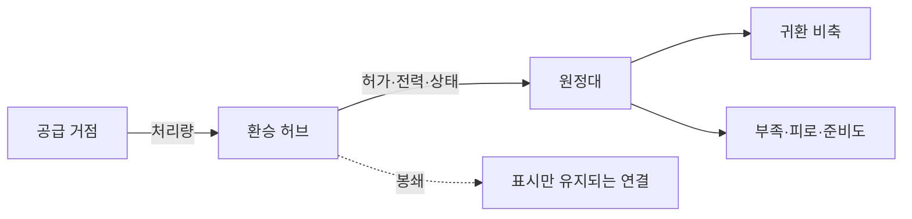

# 물류와 기반 시설

**가. 도표의 지위**

구간 연결과 지형에 따라 보급 경로의 병목과 처리량을 계산한다.

물류는 필요한 종류의 물자를 허가된 경로로 제때 보내는 능력이다.

## 입력과 출력

**가. 구간과 원정대**

| 입력 | 범위·기본값 | 출력 |
|---|---|---|
| 구간 기본 처리량 `B` | 화물점/일 | 실제 처리량 `C` |
| 시설 상태 `I` | 0~1, 기본 1 | 붕괴·수리 효과 |
| 전력 `P` | 0~1 | 견인·환기·펌프 가동 |
| 접근권 `X` | 0~1 | 통행 허용 여부 |
| 위험 `H` | 0~1 | 호송 손실과 지연 |
| 원정대 비축 `Q` | 보급점 | 부족·피로·전투 준비도 |

## 기본 수치

**가. 설계 기본값**

| 항목 | 기본값 | 최소 | 최대 |
|---|---|---|---|
| 일반 허브 유지비 | 5 보급점/일 | 0 | 20 |
| 허브 노동 | 1교대/일 | 0 | 4 |
| 원정대 피로 | 0 | 0 | 100 |
| 원정대 준비도 | 100 | 0 | 100 |
| 과확장 단계 | 지속 0, 노출 0~1, 심각 1~2 | 0 | 2 |
| 고립 단계 | 정상 0, 부분 봉쇄 1, 완전 차단 2 | 0 | 2 |
| 부하 누적 | 준비 0~24, 긴장 25~49, 임계 50~74, 실패 75~99, 붕괴 100 | 0 | 100 |
| 구간 최소 이동시간 | 0.25시간 | 0.25 | 24 |

## 경계 상황

**가. 단절과 복구**

- 경로가 없으면 고립 단계 2이지만 비축이 충분하면 즉시 굶지는 않는다.
- 실제 흐름이나 비축 `Q`가 0인데 해당 수요(요구처리량·귀환필요량)가 남아 있으면 그 부담 비율은 3으로 정의되어 과확장이 즉시 상한 2로 포화하고, 수요도 0이면 그 부담 비율은 0이다.
- 전력 차단 환승역은 양쪽 터널이 멀쩡해도 전동 화물 흐름이 0일 수 있다.
- 임시 복구는 기본적으로 도보·경화물만 통과시키며 중화물·무장 통과는 별도 승인이다.
- 봉쇄 연결은 삭제하지 않고 원인, 수리 자원과 예상 시간을 표시한다.
- 불필요한 중복 허브도 유지비를 내며, 최대 흐름·비축·단일고장 생존성을 늘리지 않으면 효용 0으로 표시한다.

## 계산 예시

**가. 처리량과 과확장**

기본 처리량 100, 시설 0.8, 전력 0.5, 접근권 1, 위험 0.1이면 `C=clamp(100*0.8*0.5*1*0.9,0,100)=36`이다. 수요 60을 비축 40과 배송 36으로 모두 충족하면 부족률은 0이다. 물류 부담 비율은 `60/36=1.667`이다. 귀환필요량 20과 비축 40이면 귀환 부담 비율은 `20/40=0.5`이다. 통치부담 3과 행정역량 3이면 통치 부담 비율은 `3/3=1`이다. 최댓값 1.667을 적용하면 `과확장=clamp(1.667-1,0,2)=0.667`이다. 다음 원정의 취약성을 경고한다.
