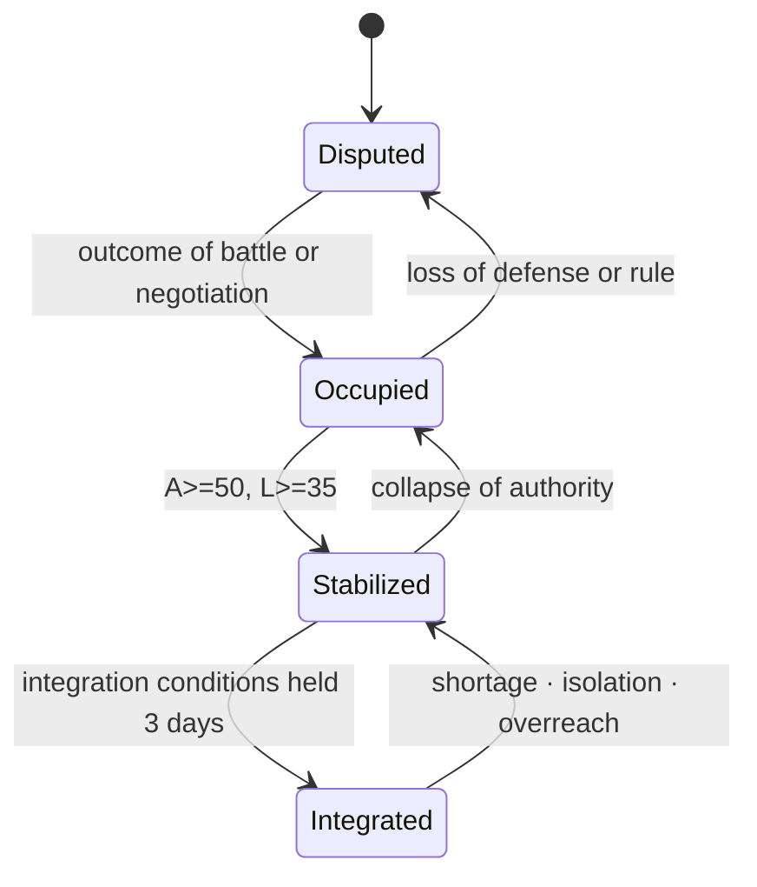

# Strongholds and Territory

A wiki diagram dated 2026-09-07. The isometric occupancy cells were the explanation of that day, not a battlefield grid — a flat diagram for documentation, not an actual game screen.

The stabilization of strongholds after occupation and the integration of territory were managed with strategy-map links and terrain.

A station was not a flag completed at occupation but a strategic stronghold whose people, facilities, and connections had to be set running again. The administrative dong was area; the minimum unit a power could take was the building. Where a dong had a subway station, that station remained the core facility. The power name and influence floated over an area in play were that dong's `territory` cell, and influence equaled dominance. Building, river, and gu rules followed [River, Gu, and Dong Building Reuse](../places/Building-Reuse-Geography.md). The numbers in the tables were design assumptions for the first prototype, to be tuned in playtests.

## Dominance

Dominance `C` ran 0–100. The sum of the holding powers in one dong did not exceed 100, and the influence number on screen was `C`.

| Dong state | Condition |
|---|---|
| Territory `held` | One power at `C>=50` |
| Dispute `contested` | Two holding powers, or the strongest power at `C<50` |
| Vacancy `vacant` | No holding power |

A power that lost its station had its dominance in that dong halved. A power holding only schools remained as a support-building occupant and did not change the dong's flag.

## Inputs and Outputs

| Input | Range · default | Output |
|---|---:|---|
| Authority `A` | 0~100, at most 45 right after occupation | Patrols, pact enforcement, suppression of hostile activity |
| Cooperation `L` | 0~100, default 20 under forced occupation | Labor, information, acceptance of rule |
| Facility state `R` | 0~100 | Local and line services |
| Connectivity `K` | 0~1 | The minimum throughput of legal routes |
| Shortage `S` | 0~1 | The worse deficit of food and power |
| Overreach `O` | 0~2 | Stabilization and transport penalties at every stronghold |

## Calculation Rules

For each legal supply route, the throughput rate of the narrowest link was taken and the largest of them used as `K`. Blockaded links were not deleted; their cause as `K=0` and their restoration conditions were preserved.

```text
K = clamp(max_path(min_edge_capacity), 0, 1)
fulfillment-rate(supply, demand) = 1 if the demand is 0, else clamp(supply/demand, 0, 1)
S = 1 - min(fulfillment-rate(food-supply, food-demand), fulfillment-rate(power-supply, power-demand))
```

A resource with zero demand was treated as fulfillment 1, i.e. zero shortage contribution. This was the same shared rule as the shortage rule of [Economy and Production](../economy/Economy-and-Production.md), and in no case did it divide by zero.

Overreach `O` used the shared 0–2 scale defined in [Logistics and Infrastructure](../economy/Logistics-and-Infrastructure.md) as it stood. This document's governance burden and administrative capacity entered as the governance burden-ratio term `burden-ratio(governance-burden, administrative-capacity)` of that definition.

The daily settlement order was resource distribution → combat results → authority·cooperation·facilities → stage transition → event reservation. Identical inputs always produced identical results.

## Base Numbers

| Rule | Default | Min | Max |
|---|---:|---:|---:|
| Ordinary-station facility slots | 2 | 1 | 4 |
| Transfer-station facility slots | 3 | 1 | 4 |
| Major-venture workload | 100 | 40 | 240 |
| Integration authority | 65 | 0 | 100 |
| Integration cooperation | 55 | 0 | 100 |
| Integration facilities | 60 | 0 | 100 |
| Integration holding period | 3 days | 1 day | 7 days |

Occupied ground passed through `dispute → occupation → stabilization → integration`. Integration required `A>=65`, `L>=55`, `R>=60`, `K>=0.5`, and `S<=0.25` to hold for 3 consecutive days.



## Boundary Cases

- With food or power below 75%, a shortage state attached and authority and cooperation fell.
- In full isolation, imports and exports were 0, but local reserves and generation kept working.
- Overreach arose not as a territory cap but from shortage of staff, garrisons, and links.
- When several strongholds crossed a threshold on the same day, settlement ran in stabilized-stronghold ID order.
- A station with only unpowered facilities was treated as power demand 0; its power fulfillment became 1, raising the shortage `S` not at all, but it was not read as having gained power service either.
- Pressure debt (`PressureDebt`) was the accumulation of external event pressure — a design assumption with default 0 and range 0~100. It piled up through authority and cooperation decay, visibility, hostile adjacency, and overreach, and shrank with garrison cover and connectivity `K`; when the debt reached 100, one event matching the cause was reserved and 100 subtracted.

## Worked Example

With food 40/100 and power 60/100, `S = 1 - min(0.4, 0.6) = 0.6`. With no legal route, `K=0`. With governance burden 4.5 and administrative capacity 3, the governance burden-ratio was `4.5/3=1.5`; with the logistics and return burden ratios smaller, `O=clamp(1.5-1,0,2)=0.5`. A station where the three conditions overlapped could not meet the integration conditions; an already integrated station fell back to the stabilization stage, and with authority collapsed too, it retreated further to occupation. Even so, with local food, generation, and repair crews remaining, recovery continued.
