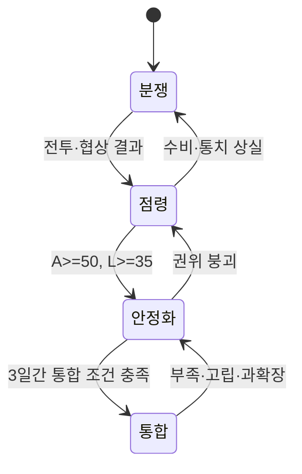

# 거점과 영토

**가. 도표의 지위**

2026-09-07 위키 도표의 아이소 점유 칸은 당시 설명에 쓰였다. 전장 격자 규칙은 아니다. 도표는 문서용 평면도이며 실제 게임 화면이 아니다.

거점 점유 이후의 안정화와 영토 통합은 전략맵 연결과 지형에 따라 관리한다.

역은 점령 뒤 사람, 시설과 연결을 다시 작동시켜야 하는 전략 거점이다. 행정동은 면적 단위이다. 세력이 점유하는 최소 단위는 건물이다. 동에 지하철역이 있으면 그 역이 핵심 시설이다. 플레이 중 표시하는 세력 이름과 영향력은 그 동의 `territory` 칸에 있다. 영향력은 지배력과 같다. 건물·강·구 규칙은 [강·구·동 건물 재사용](../places/Building-Reuse-Geography.md)을 따른다. 표의 수치는 첫 프로토타입용 설계 가정이며 플레이테스트로 조정한다.

## 지배력

**가. 동별 보유 세력**

동별 지배력 `C`(이하 '지배력'이라 한다)는 0~100이다. 한 동의 보유 세력별 지배력 합은 100을 넘지 않는다. 화면의 영향력 숫자는 `C`이다.

| 동 상태 | 조건 |
|---|---|
| 영토 `held` | 한 세력 `C>=50` |
| 분쟁 `contested` | 보유 세력이 둘이거나, 최강 세력 `C<50` |
| 공백 `vacant` | 보유 세력 없음 |

역을 잃은 세력의 동별 지배력은 절반으로 줄인다. 학교만 가진 세력은 지원 건물 점유자로 남는다. 학교만 점유해서는 동 깃발을 바꾸지 않는다.

## 입력과 출력

**가. 거점 상태**

| 입력 | 범위·기본값 | 출력 |
|---|---:|---|
| 권위 `A` | 0~100, 점령 직후 최대 45 | 순찰, 협약 집행, 적대 활동 억제 |
| 협력 `L` | 0~100, 강제 점령 기본값 20 | 노동, 정보 제공, 통치 수용 |
| 시설 상태 `R` | 0~100 | 지역 서비스와 노선 서비스 |
| 연결도 `K` | 0~1 | 합법 경로의 최소 처리량 |
| 부족도 `S` | 0~1 | 식량·전력 중 더 심한 결핍 |
| 과확장 `O` | 0~2 | 모든 거점의 안정화와 수송 감점 |

## 계산 규칙

**가. 연결도와 부족도**

합법 보급 경로마다 처리율이 가장 낮은 연결을 찾는다. 경로별 최솟값 가운데 최댓값을 `K`로 사용한다. 봉쇄된 연결은 기록에 남긴다. `K=0`의 원인과 복구 조건도 보존한다.

```text
K = clamp(max_path(min_edge_capacity), 0, 1)
충족률(공급, 수요) = 수요가 0이면 1, 아니면 clamp(공급/수요, 0, 1)
S = 1 - min(충족률(식량공급, 식량수요), 충족률(전력공급, 전력수요))
```

수요가 0인 자원의 충족률은 1이고 부족 기여는 0이다. [경제와 생산](../economy/Economy-and-Production.md)의 부족률 규칙과 같은 공유 규칙이다. 0으로 나누는 계산은 하지 않는다.

**나. 과확장과 정산**

과확장 `O`(이하 '과확장'이라 한다)는 [물류와 기반 시설](../economy/Logistics-and-Infrastructure.md)에 정의된 공유 0~2 척도를 사용한다. 이 문서의 통치부담과 행정역량은 통치 부담 비율 `부담비율(통치부담, 행정역량)` 항에 들어간다.

하루 정산은 자원 배분 → 전투 결과 → 권위·협력·시설 → 단계 전이 → 사건 예약 순서로 진행한다. 동일한 입력에는 항상 같은 결과를 낸다.

## 기본 수치

**가. 시설과 통합 기준**

| 규칙 | 기본값 | 최소 | 최대 |
|---|---:|---:|---:|
| 일반 역 시설 슬롯 | 2 | 1 | 4 |
| 환승역 시설 슬롯 | 3 | 1 | 4 |
| 주요 사업 작업량 | 100 | 40 | 240 |
| 통합 권위 | 65 | 0 | 100 |
| 통합 협력 | 55 | 0 | 100 |
| 통합 시설 | 60 | 0 | 100 |
| 통합 유지 기간 | 3일 | 1일 | 7일 |

점령지는 `분쟁 → 점령 → 안정화 → 통합` 순서로 전이한다. `A>=65`, `L>=55`, `R>=60`, `K>=0.5`, `S<=0.25`를 3일 연속 만족하면 통합된다.



## 경계 상황

**가. 부족과 사건 압박**

- 식량 또는 전력이 75% 미만이면 부족 상태가 붙고 권위·협력이 하락한다.
- 완전 고립이면 수입·수출은 0이지만 현지 비축과 발전은 계속 작동한다.
- 과확장은 영토 상한이 아니라 담당자, 주둔군과 연결 부족으로 발생한다.
- 같은 날 여러 거점이 임계치를 넘으면 안정된 거점 ID 순서로 정산한다.
- 무전력 시설만 있는 역은 전력 수요 0으로 처리하며, 이때 전력 충족률은 1이 되어 부족도 `S`를 올리지 않지만 전력 서비스가 생긴 것으로 보지도 않는다.
- 압박 부채(`PressureDebt`)는 외부 사건 압박의 누적치이며, 설계 가정으로 기본값 0·범위 0~100이다. 권위·협력 저하와 가시성·적대 인접·과확장으로 쌓이고 주둔 커버와 연결도 `K`로 줄어들며, 부채가 100에 도달하면 원인에 맞는 사건을 하나 예약하고 부채 100을 뺀다.

## 계산 예시

**가. 부족과 통합 후퇴**

식량 40/100, 전력 60/100이면 `S = 1 - min(0.4, 0.6) = 0.6`이다. 합법 경로가 없으면 `K=0`이다. 통치부담 4.5와 행정역량 3이면 통치 부담 비율은 `4.5/3=1.5`이다. 물류·귀환 부담 비율이 더 작으면 `O=clamp(1.5-1,0,2)=0.5`이다. 이 역은 통합 조건을 만족할 수 없다. 통합된 역에서는 안정화 단계로 후퇴한다. 권위까지 붕괴하면 점령 단계로 후퇴한다. 현지 식량·발전·수리반이 남아 있으면 복구를 계속한다.

