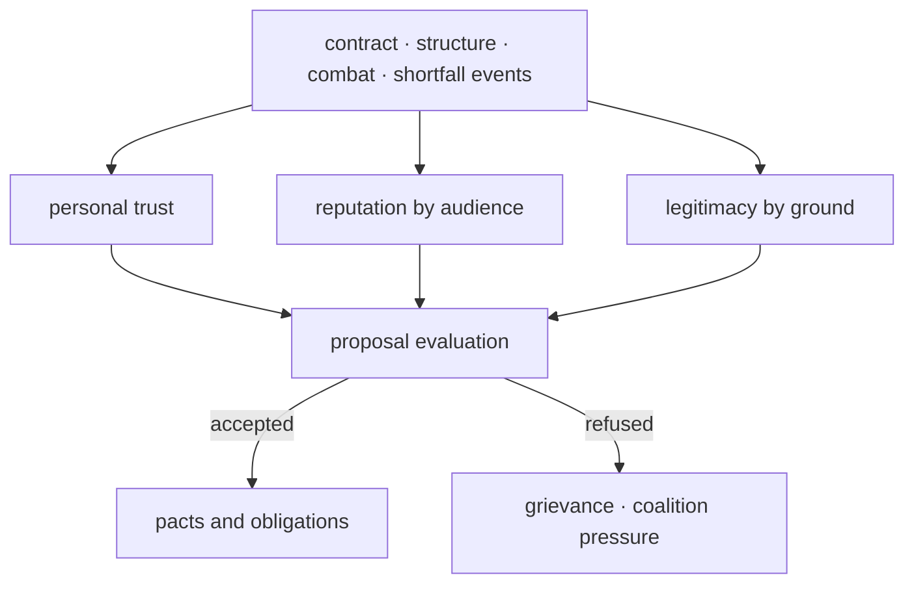

# Powers and Diplomacy

A wiki diagram dated 2026-09-07. The position, direction, and field-of-view cell drawings were the explanation of that day — a flat diagram for documentation, not an actual game screen.

Negotiation between powers and the grant of passage rights were decided by the trust, reputation, and legitimacy of the route and station nodes.

Politics was not one favorability number but a graph of personal trust, public reputation, local legitimacy, deliverable promises, and collective grievances. The numbers in the tables were design assumptions.

## Inputs and Outputs

| Input | Range · default | Output |
|---|---:|---|
| Trust `T[A,B]` | -100~100, default 0 | Cooperation between persons and organs |
| Reputation `R[F,a]` | -100~100, default 0 | Public evaluation by audience |
| Legitimacy `L[F,n,k]` | 0~100, new local claim 20 | Approval by ground — food, power, safety |
| Political capital `PC` | 0~100, default 0 | Cost of councils, guarantees, coalition action |
| Grievance `G` | 0~100, default 0 | Petition, strike, blockade, secession pressure |
| Solidarity `C` | 0~100, default 0 | Capacity to organize collective action |
| Leverage `V` | 0~1, default 0 | Real means to coerce the counterpart |
| Reliability `Rel` | 0~1 | Proposal acceptance and contract risk |

## Calculation Rules

```text
Rel = clamp(1 - 0.50*shortfall - 0.30*isolation - 0.40*overreach, 0, 1)
trust-change = clamp(sum(event-impact * credibility), -25, 25)
T' = clamp(T + trust-change + baseline-shift, -100, 100)
pressure = clamp(0.45*grievance + 0.35*solidarity + 0.20*(100*leverage), 0, 100)
```

Of pressure's three inputs, grievance and solidarity sat on 0–100 scales while leverage sat on 0–1, so leverage was multiplied by 100 to normalize it onto the same scale before the weighted sum. Pressure remained a 0–100 value.

Every proposal first checked actual routes, goods, authority, and exclusive-contract conflicts. An impossible promise could not be pushed through with high negotiating skill.

## Base Numbers

| Item | Default | Min | Max |
|---|---:|---:|---:|
| Ordinary council cost | 5 political capital | 0 | 100 |
| Emergency review cost | 10 political capital | 0 | 100 |
| Coalition-wide agenda | 20 political capital | 0 | 100 |
| Organizing pressure | 40 | 0 | 100 |
| Crisis pressure | 70 | 0 | 100 |
| Coercive-demand leverage | 0.75 | 0 | 1 |
| Ordinary pact review | 3 weeks | 1 week | 12 weeks |

Spending political capital did not itself change trust or legitimacy; those values changed only through the recorded outcomes of the actions the spending had backed.



## Boundary Cases

- The threshold of a relationship checked not trust alone but feasibility, interest, legitimacy, and pact conflicts together.
- Strike, blockade, and secession-type coercive demands opened only when pressure stayed at 70 or above and leverage at 0.75 or above for two consecutive weeks.
- Isolation weakened only outside promises; it did not automatically erode the legitimacy of local rule.
- When a successor changed, personal promises and institutional promises were re-examined separately. The names of new heirs followed [the heir, name-roster, and world ledger](../characters/Heirs-Names-and-World-Ledger.md).
- Simultaneous proposals were evaluated on the same weekly snapshot and then settled in command-ID order.

## Worked Example

With shortfall 0.30, isolation 0.40, and overreach 0.50, the deductions were `0.50*0.30=0.15`, `0.30*0.40=0.12`, and `0.40*0.50=0.20` respectively, so `Rel=clamp(1-0.15-0.12-0.20,0,1)=0.53`. With grievance 80, solidarity 60, and leverage 0.8, `pressure=clamp(0.45*80+0.35*60+0.20*(100*0.8),0,100)=73`, so a coercive demand opened once the leverage condition (0.75 or above) also held for two consecutive weeks. Even with trust at 60, an actual delivery success rate of 53% got a long-term power-supply pact refused, or accepted only with collateral and phased-fulfillment conditions. When the failure was caused by a third party's blockade and notice had been given in advance, the credibility factor could reduce the loss of trust.

## Local-Identity Power

Powers did not negotiate under their state names alone. In the Seoul of later days the counterparts at the table were route nodes, gu nodes, and station nodes. Personal trust `T` attached to pairs of persons; reputation `R` and legitimacy `L` attached to the lineages and doctrines of those nodes.

Faith divided into three strata. A lineage was a family raising the same wreckage into godhead; a faith was a community with a chapel and priests. Doctrine and teaching remained the units that changed the rules. Even within one lineage, differing doctrines produced different arms on the passage rights. The state name was not the editing unit; the names belonged to [Faith](../culture/Faith-Culture-Schism.md).

Lineages did not grow in courts. The sluice lineage grew at the lock gates, and the fabrication lineage grew in the workshops. The announcement-voice lineage grew in the broadcast rooms, the ledger lineage at the notarization windows, the route-map lineage in the concourses, and the distribution lineage in the switchgear rooms. The mobilization-register lineage grew in the armory duty rooms.

The culture key was the living sphere, not a flat partition. `west-sluice` bound sluices, fabrication, and broadcasting into one corridor; `center-record` bound records, transshipment, and workshops. `north-refuge` bound refuge and wheels, `east-caravan` water, transfers, and herbs, and `southeast-ration` rations and contracts. Powers inside the same key heard passage proposals first; across keys, collateral attached.

| Lineage | Place nodes | Where negotiation snagged | Legitimacy ground `k` |
|---|---|---|---|
| Route-map lineage | Transfer stations · terminals · depots | Transfer pacts and terminal rest | Safety |
| Sluice lineage | Sluices · pumps · water districts | Water compacts and protected supply | Water |
| Distribution lineage | Switchgear rooms · emergency-light stations | Lighting watches and the capacitor taboo | Power |
| Fabrication lineage | Workshops · depot districts | Open-standards rites and house secrets | Technology |
| Announcement-voice lineage | Transmission towers · broadcast stations | On-time broadcasts and cross-verification | Legitimacy |
| Mobilization-register lineage | Armory duty rooms | Muster reading and key drill | Safety |
| Ledger lineage | Notary windows · auction houses · the Jegi-dong district | Accreditation, auctions, and treatment order | Trade |

Powers of the same lineage read proposals first. A heretic was read as the side that had changed doctrine inside the same lineage. When the Open-Standards rite called the House-Secret rite heretical, the two were not bundled into one passage right; signatures were collected station by station.

Hidden faith was a pressure valve. When a great power forced public rites, residents went down into the festival-relic faction, the silent faction, the dual-ledger rite, or the route-color faction. Discovery moved only that station's grievance `G` and reputation `R`. Isolation weakened outside promises; it did not automatically erode the legitimacy of the local chapel.

Grievance `G` did not pile up by state name. When a station watch judged its own teaching ignored, grievance rose at that station alone, and the same held for solidarity `C`. When lodging oaths gathered in one gu, only that gu's solidarity strengthened. Leverage `V` was a place asset. The power to lock a sluice was leverage before the sluice lineage, and the power to cut a broadcast was leverage before the announcement-voice lineage. When the retrieval squad set out with the rite calendar in hand, passage on that section stopped.

The pressure formula was as before; only the inputs were cut per node. When one state held two doctrines, two pressure lines came out in the same week, and coercive demands opened only on the higher-pressure node. High trust in another gu did not cover that node.

Reliability `Rel` read doctrine conflicts once more over paths, goods, and authority. In weeks when the treatment principle refused a great power's exclusive purchase, Jegi-dong's treatment contracts stalled; when the On-Time-Broadcast rite recognized only one announcement as fact, Sangam's verification contracts stalled. Which of the Records Bureau seal, Sangam cross-verification, or Suseo mediation was mandatory for treaty accreditation was decided by doctrine. An impossible promise could not be pushed through with high negotiating skill.
