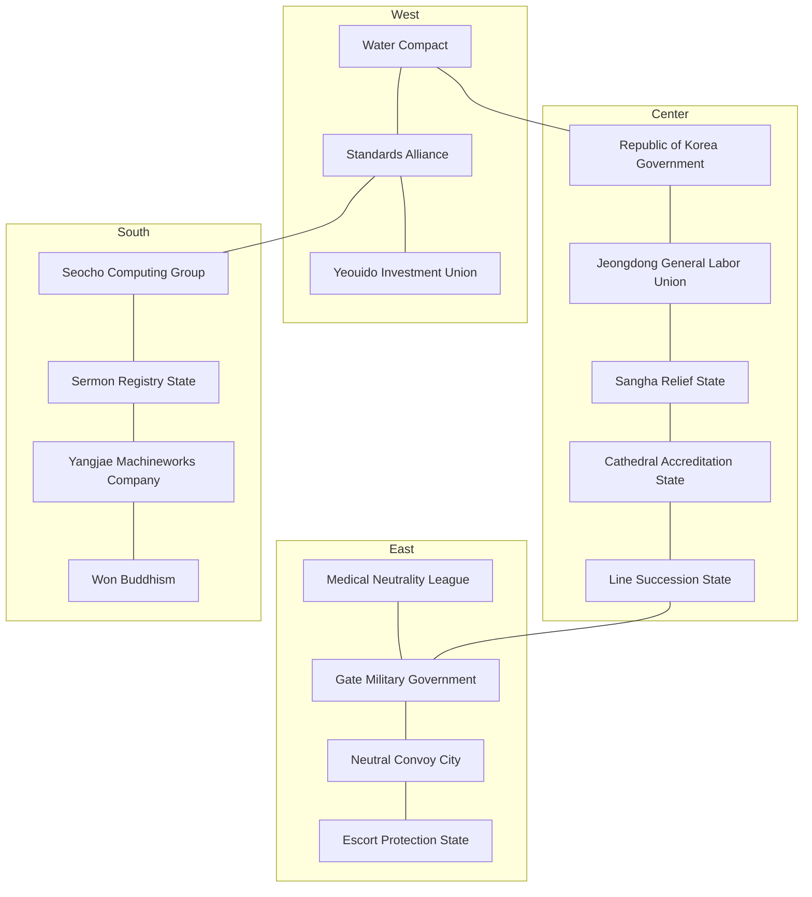

# The Sixteen States of Seoul

In the Seoul of 2126 there were sixteen states. Reading the Five Hu and Sixteen States as an ethnic roster missed the mark. The name belonged to a structure in which sixteen states stood at once, five of them contesting the hegemony, while five migrant corridors lay over their territory. The corridors made no seventeenth state.

The great powers were five and the lesser states eleven. To keep a great-power seat, a state had to turn at least two of water, repair, rail, and outside connection with its own hands and reach those hands toward its neighbors. It was not counted by troops alone. The five of the time were the Water Compact, the Standards Alliance, the Line Succession State, the Escort Protection State, and the Yangjae Machineworks Company.

The state names were not the names of districts. They were the names of the institutions people had kept in 2026. For water to flow after the call mesh died, a person with a name had to stand before the lock gate, and it was that person's grandchild's grandchild who remained the head of the time. The seven functional states kept their locked canon proper names. One nominal-accreditation state moved to the Gwanghwamun government-complex trade name, and for the remaining eight, the real trade names of head offices, general assemblies, dioceses, religious orders, and federations became the names of states. Yeongdeungpo, Guro, and Yangjae were only the station-capitals, never used as state names. The Sixteen Banners of the creation oral record carried no year counts, and the disposition of the 2126 opening descended from those banners. Cause and calendar were canon in [motive-power revocation](../overview/World-Unbinding.md).

## Retention, Renaming, and New Creation

The seven functional states kept their names. The Water Compact handed Yeouido to the Yeouido Investment Union and fixed its capital at Yeongdeungpo Station; the Standards Alliance held Guro Station, the Line Succession State Yongsan Station, the Escort Protection State Amsa Station, the Gate Military Government Guui Station, the Neutral Convoy City Sinnae Station, and the Medical Neutrality League Jegi-dong Station. The Line Succession State held central transshipment and the beyond-the-fence connections together, and rose from lesser state to great power.

There was one renaming. The nominal accreditation of the old name "Accreditation-Records State," once set on the Seoul Station axis, moved to the Government Complex Seoul main building at 209 Sejongdaero, Jongno-gu, and from Gwanghwamun Station the trade name Republic of Korea Government was read as the state name. The seals and the conscription registers were never severed from the hands of that complex's watch.

The eight new creations replanted the geography of abolished slots onto institutional head offices. Abandoning the Magok and Banghwa research blocks of the old name "Licensing Council," the Yangjae Machineworks Company was seated at 12 Heolleung-ro, Yangjae-dong, Seocho-gu. The Ttukseom and Seongsu workshops of the old name "Parts Charter" were absorbed into the standards of the Standards Alliance, and the Sermon Registry State moved the Yeonji-dong registers of the old General Assembly Hall to Samsung Station in the megachurch belt of Gangnam. The south bank of the Han at Dongjak, where the Noryangjin market function of the old name "Settlement Guild" had been scrapped, was taken by Won Buddhism at Heukseok Station. Abandoning the Sangam information axis of the old name "Cross-Verification Broadcast," the Yeouido Investment Union stood at 24 Yeouido-ro, Yeouido-dong. Emptying the Bukhansan refugee slot of the old name "Register-Citizens League," Jogyesa and the General Directorate at 55 Ujeongguk-ro, Jongno-gu became the capital of the Sangha Relief State. Abandoning the Changdong wheel slot of the old name "Test-Succession House," Samsung Town at Seocho-daero 74-gil, Seocho-gu, became the Gangnam Station capital of I Hongwon's Seocho Computing Group. Emptying the Garak and Jamsil price hub of the old name "Food Accreditation Office," Myeongdong Cathedral at 74 Myeongdong-gil, Jung-gu, became the Myeongdong Station capital of the Cathedral Accreditation State. Folding the Suseo and Seocho protection standard of the old name "Protection Standard Time," the Jeongdong General Labor Union at 3 Jeongdong-gil, Jung-gu, the Kyunghyang Shinmun site, played state from City Hall Station, and Gangnam and Seocho were divided among I Hongwon's Seocho Computing Group, Jeong Hojun's Yangjae Machineworks Company, and Choi Jiwoo's Sermon Registry State.

Lotte Holdings, SK Group, and LG Group used no further sixteen slots. They remained as retainer operating houses of the FKI, and Euljiro 1-ga, Jonggak, and Yeouinaru Stations were read only as windows inside that house.

## Origins of the Sixteen States

| State | Origin (real institution + location/station) | Form of government | Great power | Causality (2026 → revocation → 2126) |
|---|---|---|---|---|
| Republic of Korea Government | The Government of the Republic of Korea. Government Complex Seoul main building, 209 Sejongdaero, Jongno-gu. Center: Gwanghwamun Station | Feudal (operating houses) · bureaucratic grammar (hereditary jusa clerks and watch shifts). T1 is the president | Lesser. Nominal legitimacy only; water, repair, and rail are borrowed | In 2026 the complex watch held the seals and the conscription registers. When the call mesh died, digital petitions stopped and only handwritten accreditation remained. The grandchild's grandchild claimed "the Republic of Korea" at Gwanghwamun Station. |
| Yeouido Investment Union | Yeouido Investment Union (2026 name: Korea Enterprises Federation, formerly the FKI). 24 Yeouido-ro, Yeouido-dong. Center: Yeouido Station | Commercial (corporate form) · chairman | Lesser. Outside connections (West Sea and financial memory) exist, but water and repair depend on Yeongdeungpo | The emergency committee of the Yeouido hall turned the affiliates' investment ledgers into cooling-and-key watches. The chairman of the time read the hall's trade name as the state name and closed Yeouido Station. Samsung and Hyundai were separate states; Lotte, SK, and LG were this house's retainers. |
| Seocho Computing Group | Seocho Computing Group. Samsung Town, Seocho-daero 74-gil, Seocho-gu (Seocho-dong). Center: Gangnam Station | Commercial (stock company) · I Hongwon (the I-family operating house) leases the keys | Lesser. Southern-outskirts memory exists, but the Suseo depot and Amsa water belong to others | The cooling and computing keys of the Seocho Town became one family's watch chest. The trade name of the Gangnam Station intersection was never erased, so in the story's present the group name was the state name. |
| Yangjae Machineworks Company | Yangjae Machineworks Company. 12 Heolleung-ro, Yangjae-dong, Seocho-gu. Center: Yangjae Station | Commercial (stock company) · Jeong Hojun (the Jeong-family operating house) | Great power. Repair (car bodies, rigging, surviving field humanoids) + outside connection (southern perimeter, Yangjae outskirts) | In 2026 the Yangjae head office and field test lines already ran humanoids. In the week of the revocation cloud learning died and the maintenance house kept the trade name. The stock company of the time could not build a car, but it mended car bodies and opened the southern roads. |
| Sermon Registry State | The General Assembly of the Sermon Registry State. General Assembly Hall, 29 Daehak-ro 3-gil, Jongno-gu, Yeonji-dong. Opening center: Samsung Station (Gangnam megachurch belt) | Theocratic · Moderator · O Gyeongjae | Lesser. Registers, relief, and church real estate are strong; water and rail are absent | The Yeonji-dong General Assembly registers became the watch roster of the Great Blackout night. After Im Hajun vanished, O Gyeongjae, accredited by the General Assembly, took the Moderator's seat, and a century later the surviving pulpit real estate lay in Gangnam, so Samsung Station was the Presbyterian capital. |
| Cathedral Accreditation State | Cathedral Accreditation State. Myeongdong Cathedral, 74 Myeongdong-gil, Jung-gu (diocesan seat · altar). Center: Myeongdong Station | Theocratic · archbishop | Lesser. Accreditation of marriages, adoptions, and memorial rites is strong; water is borrowed | The Myeongdong altar and the diocesan registers moved onto paper. The diocese of the time was a state accrediting marriages and memorial rites at Myeongdong Station. The Bishops' Conference building (Myeonmok-ro, Gwangjin) remained only an outer warehouse of the diocese. |
| Sangha Relief State | Sangha Relief State. Jogyesa and the General Directorate, 55 Ujeongguk-ro, Jongno-gu. Center: Anguk Station | Theocratic | Lesser. Temple property, the rite calendar, and relief are strong; the northern water (Gangbuk Arisu) lies outside the city, so there is none | The General Directorate kept the memorial tablets and the temple rolls after the revocation. Jogyesa at Anguk Station became the order's capital, and the state name stood as the order's own name. |
| Charter Transcription State | Won Buddhism. Seoul chapel and Sotaesan Memorial Hall, Heukseok-dong, Dongjak-gu. Center: Heukseok Station | Theocratic | Lesser. The charter and the chapel watch remain; the south-bank water and rail belong to neighbors | The dharma-officer watch of the Heukseok chapel transcribed the charter. The Iksan headquarters lay outside the city and could not enter the Seoul slot; Heukseok Station was Won Buddhism's Seoul capital. |
| Jeongdong General Labor Union | Jeongdong General Labor Union. 3 Jeongdong-gil, Jung-gu, the Kyunghyang Shinmun site. Center: City Hall Station | Commercial (federation) | Lesser. Strike rolls and the City Hall gatherings exist, but no sovereignty over production or water | The union rolls of the Jeongdong office became the emergency muster. When the factories died, the right to strike turned into the right of passage, and the federation at City Hall Station played state. It borrowed the arms of democratization and labor movements, but party names (the Democratic Party and others) were never used as the state name. |
| Water Compact | Seoul Arisu Headquarters, Yeongdeungpo Arisu Water Treatment Center + Sinjeong Depot. Center: Yeongdeungpo Station (Yeouido handed to the FKI) | Feudal (operating houses) · the sluice house | Great power. Water (Yeongdeungpo plant) + rail (Sinjeong depot) + the Han River bridges | The treatment watch read the water contracts as its charter. The Yeouido financial halls split off as a neighboring state, and the Yeongdeungpo Station sluice house sold the western water. |
| Standards Alliance | Guro and Geumcheon industrial complexes + Cheonwang Depot. Center: Guro Station | Commercial (guild) | Great power. Repair (complex and depot) + outside connection (southwestern outskirts) | The complex standards survived before citizenship did. The fabrication guild of Guro Station kept the bolt rites as a state. The Daerim dormitories were the Hu within this state. |
| Line Succession State | Yongsan rail transshipment + garrison fence labor memory. Center: Yongsan Station | Feudal (the track house) | Great power. Rail (central transshipment) + outside connection (the strait, the fence) | The dispatch boards and the fence keys stood in place of the call mesh. The track house of Yongsan Station relayed any faction's train, and the Itaewon interpretation was the Hu within this state. |
| Escort Protection State | Amsa Arisu Water Treatment Center + Godeok Depot. Center: Amsa Station | Military government · commander | Great power. Water (Amsa plant) + rail (Godeok depot) + outside connection (eastern perimeter) | The waterworks watch and the surviving military registers were bound under one emergency superintendence. Amsa Station proclaimed the protection of the eastern water supply. |
| Gate Military Government | Guui Arisu Water Treatment Center + the Achasan ridge. Center: Guui Station | Military government | Lesser. Water and the gate exist, but the two trades are split and it never crossed the great-power threshold | The Guui sluices and the Achasan outposts almost merged into one military government, but did not. Guui Station closed the eastern crossings and laid the Konkuk Goryeo-in corridor on this state's edge. |
| Neutral Convoy City | Sinnae Depot + the northeastern terminal transfers. Center: Sinnae Station | Commercial (transport contracts) | Lesser. Transfer and emergency convoy only; no production or bulk water | The terminal dispatches and the medical trains became a neutrality treaty. Sinnae Station remained a market that transferred anyone. |
| Medical Neutrality League | Jegi-dong medicinal-herb market (Gyeongdong) + the eastern medical network. Center: Jegi-dong Station | Commercial (guild) | Lesser. Medicine and quarantine contracts exist, but raw materials and power are borrowed | The Jegi-dong medicine-market ledgers and the hospital watches left a treatment contract that did not distinguish friend from foe. Jegi-dong Station was that contract's capital. The Dongdaemun night labor was the Hu on this state's west. |

The trades of the five great powers overlapped but were not the same. The Water Compact sold Yeongdeungpo water, Sinjeong rail, and the Han bridges together. The Standards Alliance bound the repair of the Guro and Geumcheon complexes with the southwestern roads. The Line Succession State opened the Yongsan transshipment and the strait fence. The Escort Protection State read the Amsa water, the Godeok depot, and the eastern perimeter as military superintendence. The Yangjae Machineworks Company, though it could no longer assemble a car, mended the Yangjae depot's car bodies and the southern outskirts with its own hands.

The eleven lesser states were strong in names, registers, relief, and transfers. The Republic of Korea Government kept only the Gwanghwamun seals; the Yeouido Investment Union kept only the Yeouido investment ledgers; the Seocho Computing Group kept only the Gangnam cooling key. The four theocracies kept their churches, altars, tablets, and charters. The Jeongdong General Labor Union turned the City Hall strike rolls into passage rights, and in the Gate Military Government the Guui water and Achasan stood divided. The Neutral Convoy City and the Medical Neutrality League sold transfers and medicine while borrowing enemies and power.

The forms of government were three feudal, two military, four theocratic, and seven commercial. The feudal were the Republic of Korea Government, the Water Compact, and the Line Succession State. The military were the Escort Protection State and the Gate Military Government. The theocratic were the Presbyterians, the Seoul Diocese, the Jogye Order, and Won Buddhism. The commercial were the FKI, Samsung, Hyundai, the labor federation, the Standards Alliance, the Neutral Convoy City, and the Medical Neutrality League, with the corporate forms placed in the stock-company and group rows of those cells.

## Sphere Disposition

The sixteen states were not the flat partition of Seoul. They were read as living spheres binding treatment plants, depots, head offices, general assemblies, transfers, and mountain-refuge corridors. This disposition was the creative control of the opening moment; only the locations of public facilities were marked as measured.

The western waterfront was divided among three. The Water Compact stood at Yeongdeungpo Station, the Standards Alliance at Guro Station, and the Yeouido Investment Union at Yeouido Station. The center was denser still. The Republic of Korea Government at Gwanghwamun Station and the Jeongdong General Labor Union at City Hall Station shared the ground before the complex; the Sangha Relief State at Anguk Station and the Cathedral Accreditation State at Myeongdong Station kept the tablets and the altar; and the Line Succession State at Yongsan Station held the transshipment. Going east, the Medical Neutrality League at Jegi-dong Station opened Seoul's medicine market, the Gate Military Government at Guui Station closed the ridge, the Neutral Convoy City at Sinnae Station ran the terminal depot, and the Escort Protection State at Amsa Station kept the eastern treatment. The southern perimeter was where the Seocho Computing Group at Gangnam Station, the Sermon Registry State at Samsung Station, the Yangjae Machineworks Company at Yangjae Station, and Won Buddhism at Heukseok Station divided the towns, pulpits, depots, and chapels among themselves.

## The Emptied Spheres

Garak, Suseo, Magok, Ttukseom, and Changdong were not capitals of this time. They remained corridors or unclaimed territory, read as the empty cells outside the sixteen slots.

Garak Market was measured as the Songpa produce and fisheries wholesale. Because the price hub was not made a state, the southeastern ration swayed unowned among Amsa water, Myeongdong accreditation, and the Gangnam cooling key. The Suseo Depot was the measured seat of southern rolling-stock capacity. It emptied after the capital of the protection standard folded, and the three states of Gangnam, Seocho, and Yangjae claimed passage only. The research blocks of Magok and Banghwa and the Banghwa Depot, having abandoned the western research axis, remained only as the edge corridor of the Standards Alliance and the Water Compact. The Ttukseom Arisu Water Treatment Center and the Seongsu workshops, having handed their pumps and bolts to the standards of the Standards Alliance, were unclaimed. The water of Seoul Station and Yongsan was tied directly to that vacancy. The Changdong Depot was the seat that abandoned the northern wheel slot. Because the Gangbuk Arisu Water Treatment Center lay outside the city in Namyangju, the residential shells of Changdong and Dobong borrowed water with no state.

The Sangam transmission towers and the Bukhansan Bogukmun refuge roads were not capitals either. The Bukhansan refuge was not a Hu but a vacancy. The depots and markets of the unclaimed land had no owner, but the house keys still sat in neighboring heads' ledgers, for lease alone.

## The Five Hu

The Hu of the Five Hu and Sixteen States was not a list of peoples founding states. It was the five migrant corridors laid over the sixteen states' territory, and the Hostile-G were the ecological pressure on those corridors. The animals were never to be read as stand-ins for migrant peoples. The Yongsan fence contract labor remained internal contract labor of the Line Succession State, and no sixth Hu was opened.

| Hu | Migrant corridor | Central station | States laid upon | Hostile-G |
|---|---|---|---|---|
| 1 | Daerim–Garibong Chinese-Korean corridor | Daerim | Standards Alliance | G02 Radio-Wave Crow Flock (S02 factories · iron towers) |
| 2 | Guro industrial dormitory remnants (Vietnamese · Nepali · Uzbek) | Gasan Digital Complex | Standards Alliance | G13 Night-Sorting Swarm (S02 night lines) |
| 3 | Itaewon passage alley | Itaewon | Line Succession State | G07 Electrolyte-Burn Swarm (S07 Yongsan axis) |
| 4 | Dongdaemun night labor | Dongdaemun | Medical Neutrality League | G08 Cleanroom Mutant (S13 medicine · cold) |
| 5 | Jayang–Konkuk Goryeo-in | Konkuk University | Gate Military Government | G14 Phantom Dispatch Corps (S14 Guui–Achasan transfer) |

No corridor was locked as one state's possession. Where transit tolls and lodging authority overlapped the ledgers of the sixteen states, the contract was written twice. The canon of the corridor seed persons was [Diaspora Corridors](Diaspora-Corridors.md).

## Public Facilities and Creative Assumptions

Locations and functions confirmed from pre-collapse public material were split as "measured"; post-disaster operating rates, ownership, and pipe control were split as "creative." The normal-time water-supply districts were not carried over into post-collapse territory as they stood.

| Public facility | Source status | Creative disposition at the opening | Setting implication |
|---|---|---|---|
| Yeongdeungpo Arisu Water Treatment Center | Measured location. Public water districts: Gangseo, Guro, Geumcheon, Yangcheon | The Water Compact holds the site and the sluices | The Yeouido financial halls were a neighboring state; the old pipes overlapped the Amsa water right and became a disputed section |
| Ttukseom Arisu Water Treatment Center | Measured location. Public water districts: Seongdong, Jung-gu, Yongsan | Unclaimed. The pumps were absorbed into the Standards Alliance's standards | The water of Seoul Station and Yongsan was tied directly to the Ttukseom vacancy |
| Guui Arisu Water Treatment Center | Measured location. Public water districts: Gwangjin, Jungnang, Dongdaemun | The Gate Military Government keeps limited supply only | Sinnae and Jegi-dong borrow Guui water but hold no sovereignty over production |
| Amsa Arisu Water Treatment Center | Measured location. Public water districts: Gangnam, Gangdong, Gwanak, Dongjak, Seocho, Yeongdeungpo | The Escort Protection State puts the eastern plant and the Godeok depot under military superintendence | A measured basis arises to claim a protection sphere reaching Suseo, Garak, and Heukseok |
| Gangbuk Arisu Water Treatment Center | Measured location in Namyangju. Public water districts: Nowon, Dobong, Seongbuk, Jongno, Eunpyeong, Mapo, Seodaemun, Gangbuk | Offline at the opening, cut off outside the city | Changdong, Bukhansan Bogukmun, Gwanghwamun, and Sangam were weak because the northern bulk treatment lay outside Seoul |
| Gwangam Arisu Water Treatment Center | Measured location in Hanam. Public water district: Songpa | A contested asset on the eastern outskirts at the opening | Garak was a great market with no treatment of its own; restarting Gwangam became a kingmaker event |
| Sinjeong, Cheonwang, Godeok, Sinnae depots | Measured locations | Corresponding to the Water Compact, Standards Alliance, Escort Protection State, Neutral Convoy City | Depot area and rolling capacity are normal-time reference values; post-collapse operating volume is creative |
| Banghwa, Gunja, Changdong, Suseo depots | Measured locations | Unclaimed or edge corridor | The seats emptied of the Magok research, Ttukseom workshops, Changdong wheels, and Suseo protection capitals |
| Jichuk, Dobong, Moran, Gimpo depots | Measured locations in Goyang, Uijeongbu, Seongnam, and the Gangseo outskirts | External powers or abandoned at the opening | They became pressure from outside the sixteen Seoul slots |
| Garak Market | Measured location in Songpa; produce and fisheries wholesale | Unclaimed. Price-hub vacancy | A ledger empty of production swayed on the price of Amsa water |
| Gangseo Market, Yanggok Market | Measured locations in Gangseo and Seocho | Partially running or contested at the opening | The Water Compact, Seocho Computing Group, and Yangjae Machineworks Company could challenge for the food windows' monopoly |
| Noryangjin Fisheries Market | Measured location in Dongjak | Won Buddhism's edge. Market function scrapped | Frozen and ice credit remained only as a neighboring debt of the Heukseok chapel watch |
| Government Complex Seoul main building | Measured location, 209 Sejongda-ro, Jongno-gu | Republic of Korea Government | The Gwanghwamun Station seals were the nominal legitimacy |
| FKI Hall | Measured location, 24 Yeouido-ro | Yeouido Investment Union | The investment ledgers turned into the cooling key |
| Samsung Town | Measured location, Seocho-daero 74-gil | Seocho Computing Group | The Gangnam Station intersection trade name was the state name |
| Hyundai Motor Yangjae head office | Measured location, 12 Heolleung-ro | Yangjae Machineworks Company | The surviving field humanoids were the southern repair axis |
| General Assembly Hall / Gangnam megachurches | Measured locations, 29 Daehak-ro 3-gil, Yeonji-dong / Samsung Station belt | Sermon Registry State | The state name was the General Assembly; the capital was Samsung Station |
| Myeongdong Cathedral | Measured location, 74 Myeongdong-gil | Cathedral Accreditation State | The altar of marriage and memorial accreditation |
| Jogyesa and the General Directorate | Measured location, 55 Ujeongguk-ro | Sangha Relief State | Anguk Station was the order's capital |
| Won Buddhism Seoul chapel and Sotaesan Memorial Hall | Measured location, Heukseok-dong, Dongjak-gu | Charter Transcription State | The Iksan headquarters lay outside the city and entered no slot |
| KCTU Jeongdong office | Measured location, 3 Jeongdong-gil, the Kyunghyang Shinmun site | Jeongdong General Labor Union | The City Hall strike rolls were the passage right |

## The Hands of the Five Great Powers

Han Jaemok was the stationmaster of the Water Compact. He tried to bind the Yeongdeungpo plant and the Sinjeong depot under a water contract and lean the western lesser states against his sluices. The water duty was wide, so one district's turbid water shook the whole ration.

Gang Minseo, chairman of the Standards Alliance, tried to raise the bolt rites of Guro and Geumcheon into the repair standard of all Seoul. Its own food and raw water ran short, and the Daerim corridor's dual ledgers fought the citizenship line. Park Taegyeom was the stationmaster of the Line Succession State. With the Yongsan transshipment and the fence keys he relayed any faction's train, but every side coveted that window, and his own water leaned on Yeongdeungpo and Guui. The Itaewon interpretation was the Hu within this state.

Bae Ujin was the commander of the Escort Protection State. He tried to bind the Amsa plant and the Godeok depot under emergency superintendence and proclaim protection over the eastern lesser states. When a military organization seized the waterworks administration, forced service grew. Jeong Hojun, president of the Yangjae Machineworks Company, tried to raise the Yangjae depot's car bodies and the surviving field humanoids onto a joint ledger without hostage clauses. The research facilities could not guarantee bulk food, so he leaned on Amsa water and Guro parts from outside.

## The Debts of the Lesser States

President Yun Seorin of the Republic of Korea Government tried to accredit succession and treaties with the Gwanghwamun seals. Water, food, power, and large-scale repair infrastructure had to be borrowed from outside. Chairman Choi Jiwoo of the Yeouido Investment Union sold the memory of the West Sea connection left in the Yeouido ledgers. The water network was tied to the Yeongdeungpo side, and expansion met its limit. Chairman I Hongwon of the Seocho Computing Group held the Gangnam cooling keys and the Changdong unclaimed zone's barrier gates. He had not fully seized the Suseo depot or the Amsa water.

Moderator Im Hajun of the Sermon Registry State vanished on the eve of the opening, leaving only the Samsung Station church registers. O Gyeongjae succeeded him through General Assembly accreditation. Archbishop Nam Yungyeong of the Cathedral Accreditation State accredited marriages and memorial rites at the Myeongdong altar. She could not also feed the emptied ledger of Garak. Supreme Patriarch Baek On of the Sangha Relief State kept the Anguk tablets and the register chests of the Bukhansan vacancy. O Haerin, head of the Won Buddhist Kyujeongwon, left the Noryangjin frozen debt beside the Heukseok charter. Chairwoman Jeong Yura of the Jeongdong General Labor Union set the City Hall gatherings as the backbone of the lesser-states council. The Suseo unclaimed zone's drawing chests were still borrowed.

Commander Go Seojun of the Gate Military Government could not join the Guui sluices and the Achasan outposts into one military government, and never crossed the great-power threshold. The Konkuk Goryeo-in corridor lay on that edge. Representative Jang Sehwa of the Neutral Convoy City kept the Sinnae transfer district and the medical trains as neutral ground. There was no production base of its own. Chairwoman Ryu Eunbi of the Medical Neutrality League opened the Jegi-dong medicine market to friend and foe alike. Raw materials and power depended on others. The Dongdaemun night labor lay on their west as a Hu.

## Strength Was Not Fixed

A great power that lost its plants, repair, rail, or outer roads could fall to a lesser state. Conversely, a lesser state could become a great power through persons' alliances, engineers' defection, marriage and adoptive succession, treaties, and the player's intervention. The great powers were the state of the story's starting moment and were not to be seen as permanent national attributes.

## Principles for Using Historical Material

What was taken from history was the tension that remained between institutions and choices. One state and one person synthesized motifs from at least three eras and regions. The family relations, signature battles, life sequences, symbolic colors, and lines of real persons were not reproduced. Real facilities were consulted only on their public locations and functions. Internal structure, post-disaster operating rates, stockpiles, and vulnerabilities were all marked creative. The military-household register, hostages, forced relocation, and coups produced not only efficiency bonuses but also family separation, grudges, desertion, and questions of citizenship and responsibility.

## Principal Research Sources

- [The Annals of the Joseon Dynasty: abolition of private armies](https://sillok.history.go.kr/id/kba_10204006_009)
- [The Annals of Joseon: wandering households and repatriation policy](https://sillok.history.go.kr/id/kda_10609023_005)
- [Korean History Net: alliance with the Later Three Kingdoms strongmen](https://contents.history.go.kr/mobile/nh/view.do?levelId=nh_011_0040_0020_0020_0020_0020)
- [Seoul Arisu Headquarters: treatment centers and water districts](https://arisu.seoul.go.kr/home/sub?menukey=7309)
- [Seoul Metropolitan Government: rail and depot status](https://news.seoul.go.kr/citybuild/archives/200609)
- [Seoul Agro-Fisheries & Food Corporation: public wholesale markets](https://www.garak.co.kr/homepage/M0000186/content/view.do)
- [Sakai City: merchant self-rule and the history of a trading city](https://www.city.sakai.lg.jp/kanko/sakai/index.html)

## Local-Identity Power

The units that collided on the map were not the state names. In the Seoul of later days the routes, the gu, and the stations held identity power. The sixteen territory slots were kept. A slot was no flat partition; the route nodes and gu nodes inside it carried different faith lineages and culture keys.

A severed institution became not a manual but a rite. When water flowed, the contract was read as truth. When power came, it remained a blessing; when the announcement sounded, that word passed for fact. A name in the military register meant one could still be mustered. No living king was raised into godhead first; the ruler held the keys of the facility and borrowed legitimacy from it.

Faith divided into three strata. A lineage was a family raising the same wreckage into godhead. A faith was a community with a chapel and priests, and doctrine and teaching remained the units that changed the rules. The state slots were not increased; the faith slots grew. The lineage and faith names belonged to [Faith](../culture/Faith-Culture-Schism.md).

Culture was not a state identifier. The keys remained `west-sluice`, `center-record`, `east-caravan`, and `southeast-ration`, and the keys survived even when a state was annexed. Within the same key, a different station saw different taboos. The northern refugee key folded its slot row empty for want of a capital.

| State | Culture key | Main lineage | Public faith | The wreckage that became the altar |
|---|---|---|---|---|
| Water Compact | `west-sluice` | Sluice lineage | Water-Compact Rite | The sluices and the ration taps |
| Standards Alliance | `west-sluice` | Fabrication lineage | Open-Standards Rite | Tool standards and the Cheonwang barrier gate |
| Yeouido Investment Union | `west-sluice` | Ledger lineage | On-Time-Broadcast Rite | The Yeouido hall and the cooling key |
| Republic of Korea Government | `center-record` | Ledger lineage | Record-Accreditation Rite | The Gwanghwamun seals and the archives |
| Jeongdong General Labor Union | `center-record` | Ledger lineage | Contract-Mediation Rite | The City Hall gatherings and the Jeongdong registers |
| Sangha Relief State | `center-record` | Monastery lineage | The lodging oath | The Jogyesa tablets and the temple rolls |
| Cathedral Accreditation State | `center-record` | Altar lineage | Auction-Disclosure Rite | The Myeongdong altar and the diocesan registers |
| Line Succession State | `center-record` | Route-map lineage | Transfer Pact | The central rail and the concourse |
| Escort Protection State | `east-caravan` | Sluice lineage | Protected-Water Rite | The Amsa plant and the eastern bridges |
| Neutral Convoy City | `east-caravan` | Route-map lineage | Transfer Pact | The terminal transfers and the Sinnae depot |
| Medical Neutrality League | `east-caravan` | Ledger lineage | The treatment principle | The herb market and the treatment contracts |
| Gate Military Government | `east-caravan` | Sluice lineage | Emergency-Water Rite | The Guui plant and the Achasan ridge |
| Seocho Computing Group | `southeast-ration` | Fabrication lineage | Wheel-Mobility Rite | Samsung Town and the Gangnam intersection |
| Sermon Registry State | `southeast-ration` | Pulpit lineage | Pump-Workshop Rite | The Samsung Station churches and the General Assembly registers |
| Yangjae Machineworks Company | `southeast-ration` | Distribution lineage | No state faith | The Yangjae depot and the car bodies |
| Charter Transcription State | `southeast-ration` | Ledger lineage | Settlement-Right Rite | The Heukseok chapel and the charter |

The main lineages in the table were the opening-day pluralities. A great power did not monopolize a lineage. The Water Compact kept the lamp-lighting rite within, and inside the Standards Alliance the Muster-Remnant rite fermented in hiding. In the Sermon Registry State the House-Secret rite traveled with the succession dispute, and the Seocho Computing Group also counted the Terminal Rest of the Changdong unclaimed zone. The Jeongdong General Labor Union read trains pushed beyond Suseo as apostasy.

Injection from above failed. Even when Han Jaemok forced the Water-Compact Rite on the western lesser states, the Cheonwang depot's engineers held their bolt rites first. Even when Bae Ujin planted the Protected-Water Rite in the east, Jegi-dong applied the treatment principle to friend and foe alike. Ignition seemed possible only from the station chapels, the gu chapels, and the route chapels.

The point that split easily was doctrine. The Water-Compact Rite cracked first when the water stopped; the On-Time-Broadcast Rite grew a silent faction when trust broke. The Record-Accreditation Rite fell into heresy suits the moment the armory registers were brought in. Only the split doctrines were mended; the state names and territory slots were left as they stood.
