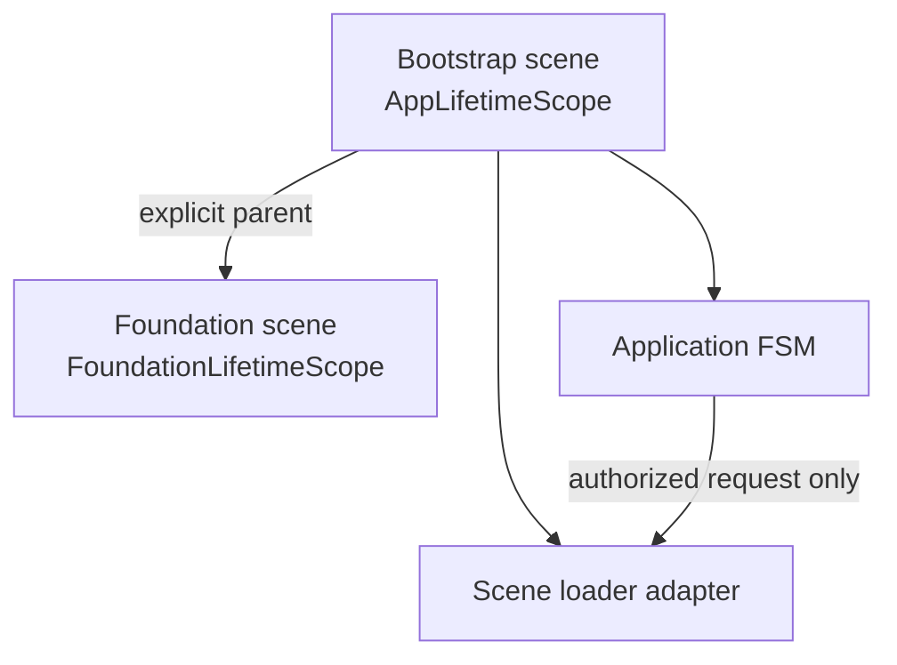
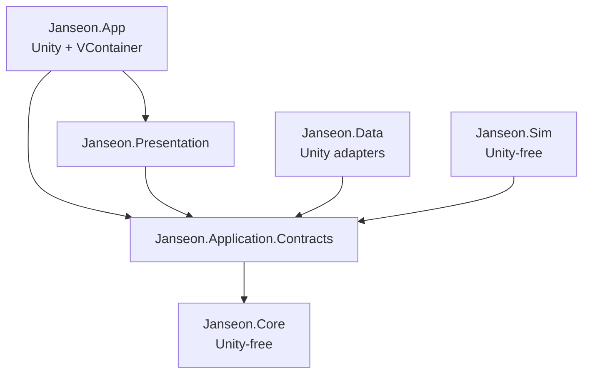

이 문서는 코드를 만들기 전에 고정한 아키텍처 계약입니다. 계약 키워드(FSM, VContainer, Singleton, Repository, 저장과 결정성, 실패와 취소, 품질 게이트)는 그대로입니다. 이 문서의 증분 표는 Foundation 분리 계약을 설명합니다.

새 전투 문서의 권장 기본값은 3D 자유 지휘 카메라와 파티별 닫힌 전투 일시정지입니다. 카메라 수치를 새로 만들지 않으며, 일시정지는 캠페인 월드나 다른 파티의 scope를 멈추지 않습니다. 일시정지 중 수락된 교체 명령은 안정된 순서를 갖고 재개 뒤 다음 시뮬레이션 스텝에서 적용됩니다. 이 문서 개정은 런타임 구현 완료를 뜻하지 않습니다.

## 설계 목표와 비목표

목표는 씬 하나가 앱 수명주기, 화면, 게임 상태와 저장을 모두 소유하지 않게 만드는 것입니다. 앱 흐름은 명시적인 **FSM**만 변경하고, 객체 수명은 **VContainer** scope가 소유합니다.

첫 증분의 목표:

- `Bootstrap.unity`와 `Foundation.unity`의 책임 분리
- 단일 전환 권한을 가진 앱 FSM
- App scope와 화면 child scope의 명시적 부모 관계
- 불법·중복·실패·재시도 결과의 typed contract
- static Singleton과 service locator를 막는 자동 품질 게이트

첫 증분의 비목표:

- 캠페인, 세계 지도, 전투 또는 실제 저장 기능 구현
- 미래 모듈의 빈 assembly 생성
- Makcha 프로젝트의 모든 패키지 복사

## 씬 소유권

| 씬 | 소유 범위 | 가져도 되는 것 | 가지면 안 되는 것 |
|---|---|---|---|
| `Bootstrap.unity` | 프로세스 | App FSM, scene catalog, scene loader, logger, App `LifetimeScope` | 화면 카메라, 화면 UI, 월드·전투 상태 |
| `Foundation.unity` | 화면 | 카메라, 조명, 화면 presenter, Foundation `LifetimeScope` | 전역 앱 상태, 저장 구현, 다른 씬의 객체 |

빌드 순서는 Bootstrap 0, Foundation 1로 고정합니다. Bootstrap만 프로세스 root를 소유합니다. Foundation은 명시적으로 App scope를 부모로 삼는 child scope이며 unload 전에 폐기합니다.



`SceneManager.LoadScene*`는 App의 scene loader adapter만 호출할 수 있습니다. presenter, view, domain service가 직접 씬을 바꾸면 품질 게이트가 실패합니다.

## FSM 계약

### 상태와 트리거

| 현재 상태 | 트리거 | 다음 상태 | 결과 |
|---|---|---|---|
| `Booting` | `OpenFoundation` | `Transitioning` | Foundation staging load 시작 |
| `Transitioning` | `SceneLoadSucceeded` | `Foundation` | 준비된 scene lease commit |
| `Transitioning` | `SceneLoadFailed` | `Faulted` | staging 폐기, 오류와 재시도 정보 보존 |
| `Faulted` | `Retry` | `Transitioning` | 새 transition ID로 같은 목적지 재시도 |

표에 없는 조합은 `Rejected(IllegalTransition)`이며 상태, 씬과 저장을 바꾸지 않습니다. `Transitioning` 중 다른 요청은 `Rejected(Busy)`이고 두 번째 load를 시작하지 않습니다. 이미 Foundation에 도달한 동일 목적지 요청은 현재 receipt를 반환합니다.

### 전환 순서

1. 상태, guard와 active transition을 부작용 없이 검사합니다.
2. transition ID와 generation을 만들고 입력을 차단합니다.
3. 대상 씬을 staging으로 load합니다.
4. VContainer parent enqueue를 사용해 App scope 아래에 화면 scope를 만듭니다.
5. 필수 camera, presenter와 scope의 ready signal을 기다립니다.
6. generation이 현재 요청과 같을 때만 안정 상태와 scene lease를 commit합니다.
7. 이전 child scope를 폐기하고 이전 씬을 unload합니다.
8. 입력을 복원하고 receipt를 반환합니다.

ready 전에 안정 상태를 바꾸지 않습니다. 고정 sleep과 polling 대신 completion/readiness 구독을 먼저 만든 뒤 정확한 signal을 기다립니다.

## VContainer 계약

```text
AppLifetimeScope (Bootstrap, process)
└── FoundationLifetimeScope (Foundation scene)
```

- Makcha에서 확인한 `jp.hadashikick.vcontainer` `1.19.0`을 고정합니다.
- 한 production 씬에는 `LifetimeScope`가 정확히 하나입니다.
- mutable application service의 기본 lifetime은 `Scoped`입니다.
- child는 parent contract를 resolve할 수 있지만 parent는 child 구현을 resolve하거나 보관하지 않습니다.
- 필수 serialized reference가 없으면 scope build가 즉시 실패합니다.
- scene unload 전에 child cancellation token, 구독, task와 resource를 정리하고 scope를 폐기합니다.
- 제품 코드에서 `Container.Resolve`를 호출하지 않고 constructor injection을 기본으로 합니다.

## Singleton 계약

**Singleton**은 static 전역 객체가 아니라 현재 VContainer scope 안의 단일 인스턴스입니다.

허용:

- 깊게 불변인 상수와 값 표
- App scope의 scene catalog, logger, scene loader와 FSM coordinator
- 향후 campaign scope의 campaign truth와 ledger
- scene scope의 presenter와 input router

금지:

- mutable static `Instance`, `Current`, 전역 collection/cache
- 현재 campaign, 선택 유닛, 현재 battle 또는 scene view를 App Singleton으로 등록
- scene service를 `DontDestroyOnLoad`로 유지
- service locator나 runtime object search로 의존성을 찾기

`DontDestroyOnLoad`는 Bootstrap ownership 파일 한 곳에서만 허용합니다.

## Repository 경계

**Repository** interface와 DTO는 Unity-free inward assembly에 둡니다. Unity/App adapter가 filesystem이나 Unity API를 사용해 이를 구현합니다.

```csharp
public interface ICampaignRepository
{
    ValueTask<CampaignLoadResult> LoadAsync(
        SaveSlotId slot,
        CancellationToken cancellationToken);

    ValueTask<CampaignCommitResult> CommitAsync(
        CampaignSnapshot expected,
        CampaignMutation mutation,
        CancellationToken cancellationToken);
}
```

- interface에는 `GameObject`, `Transform`, `Vector*`, `ScriptableObject`, `Scene` 또는 VContainer 타입을 넣지 않습니다.
- mutable collection이나 live Unity object 대신 versioned snapshot과 receipt를 반환합니다.
- presentation은 command/query contract만 보고 concrete Repository와 저장 API를 보지 않습니다.
- 동일 request/result ID와 동일 payload는 기존 receipt를 반환합니다. 같은 ID의 다른 payload는 conflict로 거부합니다.
- 향후 Battle은 불변 `BattleContext`만 받고 campaign Repository를 resolve하지 않습니다.

첫 Foundation 증분에서는 campaign Repository를 구현하지 않습니다. 품질 게이트로 경계만 먼저 보호합니다.

## 저장과 결정성

향후 저장 envelope에는 format/rules/content version, campaign seed, integer world tick, canonical snapshot revision, event-ledger hash, 목적별 RNG stream 상태, pending battle과 settlement receipt, checksum을 둡니다.

- temp 작성, flush, 재읽기 검증, backup 보존, 원자적 교체 순서를 지킵니다.
- domain에서 `PlayerPrefs`나 `File.*`를 직접 호출하지 않습니다.
- RNG는 WorldEvents, Encounters, BattleHit처럼 목적별 stream으로 분리합니다.
- wall clock, frame order, instance ID, `GetHashCode`와 collection iteration order를 규칙 입력으로 사용하지 않습니다.
- 같은 seed와 canonical command log는 같은 state/ledger hash를 만들어야 합니다.
- 씬 load 완료 시점은 domain 결과에 영향을 주지 않습니다.

## 실패와 취소

전환 결과는 `Completed`, `Rejected`, `Cancelled`, `Failed`를 구분합니다. null이나 조용한 무시는 허용하지 않습니다.

- guard 실패와 불법 전이는 side effect 전에 거부합니다.
- load/scope/readiness 실패는 staging만 정리하고 이전 안정 씬을 유지합니다.
- 준비 단계 취소는 `Cancelled`이며 load failure로 표시하지 않습니다.
- commit 단계 취소는 commit 또는 rollback이 결정적으로 끝날 때까지 지연합니다.
- retry는 새 transition ID를 사용하되 같은 domain request의 중복 효과를 만들지 않습니다.
- late callback은 generation을 비교해 교체된 화면을 갱신하지 못하게 합니다.

수명주기 규칙:

- `OnEnable +=`에는 `OnDisable -=`가 같은 타입에 있어야 합니다.
- 주입 시 구독에는 `Dispose` 또는 `OnDestroy` 해제가 있어야 합니다.
- scope dispose는 명령 차단, token 취소, event 분리, task 관찰, resource release, child scope 폐기, scene unload 순서입니다.
- 관찰되지 않는 fire-and-forget task와 business flow의 `async void`를 금지합니다.

## 모듈 의존성



Unity-free assembly는 `noEngineReferences: true`이고 UnityEngine, VContainer, App, Presentation을 참조하지 않습니다. 현재는 `Janseon.Foundation` 한 모듈에서 시작하며 실제 두 번째 책임과 호출자가 생기기 전에는 빈 미래 assembly를 만들지 않습니다.

## 테스트 전략

EditMode FSM 테스트:

1. Booting에서 OpenFoundation은 load를 정확히 한 번 시작합니다.
2. ready 전에는 Foundation으로 commit하지 않습니다.
3. 성공 signal 이후에만 Foundation과 receipt가 생깁니다.
4. 불법 전이는 상태 불변, scene 호출 0회입니다.
5. 진행 중 중복 요청은 Busy이며 추가 load가 없습니다.
6. load 실패는 staging을 폐기하고 Faulted와 retry 정보를 남깁니다.
7. Retry는 새 transition ID로 복구합니다.

PlayMode 테스트와 수동 QA는 실제 Bootstrap에서 Foundation으로 진입하고 public flow 표면에서 허용 전환과 거부 결과를 관찰합니다. 테스트는 fixed sleep을 쓰지 않고 fake completion source나 실제 readiness signal을 먼저 구독합니다.

## 품질 게이트

`node tools/architecture/check-unity-architecture.mjs`가 다음을 검사합니다.

- 승인 파일 밖의 `SceneManager.LoadScene*`와 `DontDestroyOnLoad`
- runtime의 `FindObject*`, `GameObject.Find`, mutable static `Instance`/`Current`
- Repository/Core 경로의 UnityEngine/VContainer 참조
- Bootstrap 0, Foundation 1의 build order와 scene 파일 존재
- content scene의 production `LifetimeScope` 수

게이트 자체도 임시 금지 샘플로 RED가 되는 mutation proof를 통과해야 합니다. 그 뒤 Unity import, compile, EditMode, PlayMode와 실제 Editor screenshot을 검증합니다.

## 완료 계약

Bootstrap과 Foundation의 책임이 분리되고, FSM만 전환을 승인하며, ready 이전에는 안정 상태가 바뀌지 않아야 합니다. App/child scope 경계, 불법·중복·실패·재시도, static Singleton 금지와 Unity-free Repository 경계가 자동 테스트와 품질 게이트에서 확인돼야 합니다.
